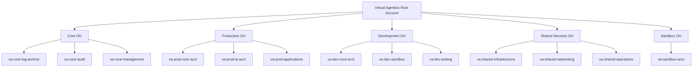

# AWS Control Tower Setup: Virtual Agentics

## Purpose

This document defines the step-by-step process for deploying and configuring the AWS Control Tower landing zone for Virtual Agentics. It details account/OUs, governance, initial guardrails, email, and DNS integration per the project’s requirements.

---

## 1. Prerequisites

- Access to AWS root/management account and ability to deploy Control Tower in supported region (`eu-central-1`)
- Organization-wide domain available (e.g., `virtualagentics.ai`)
- Naming, OU, and account plan per [Naming_Conventions.md](../Naming_Conventions.md)
- Email aliases for all AWS accounts per naming plan (e.g., `prod@virtualagentics.ai`, `audit@virtualagentics.ai`)

---


## 2. Landing Zone Deployment

### c) Organizational Structure Diagram
The following diagram outlines the Virtual Agentics AWS account hierarchy and organizational units:


### a) Enable AWS Control Tower

1. Log in to root/management account.
2. Navigate to AWS Control Tower service.
3. Launch Landing Zone setup wizard.
4. Select **Home region:** `eu-central-1` (Frankfurt).
5. Accept default log archive and audit account creation.

### b) Core Account/OUs

| OU Name         | Description                             | Accounts Created                              |
|-----------------|-----------------------------------------|-----------------------------------------------|
| Root            | Top-level OU, anchors all other OUs     | Management, Log Archive, Audit (by default)   |
| Prod            | Production workloads                    | va-prod-core-acct, va-prod-ai-acct, ...       |
| Dev             | Development/test workloads              | va-dev-core-acct                              |
| Shared          | Shared infrastructure/services          | va-sharedservices-acct                        |
| Sandbox         | Experimental, isolated                  | va-sandbox-acct                               |

**Account emails must use project domain aliases.**

---


## 3. Guardrails & Governance

### Explicit Terraform Configuration for Guardrails

Guardrails are explicitly managed via Terraform to ensure compliance and consistency across accounts.

**Example Preventive Guardrail (Disallow Public S3 Buckets):**
```hcl
resource "awscc_controltower_control" "disallow_public_s3" {
  control_identifier = "AWS-GR_RESTRICTED_PUBLIC_BUCKETS"
  target_identifier  = aws_organizations_organizational_unit.prod_ou.id
}
```

**Example Detective Guardrail (Detect Root Account Usage):**
```hcl
resource "awscc_controltower_control" "detect_root_usage" {
  control_identifier = "AWS-GR_DETECT_ROOT_USER_LOGIN"
  target_identifier  = aws_organizations_organizational_unit.core_ou.id
}
```

### Terraform Account Creation & Baseline Setup Example
```hcl
resource "aws_organizations_account" "prod_agents" {
  name      = "va-prod-agents"
  email     = "prod-agents@virtualagentics.ai"
  parent_id = aws_organizations_organizational_unit.prod_ou.id
}

resource "aws_iam_role" "baseline_admin_role" {
  name = "VAProdBaselineAdminRole"

  assume_role_policy = jsonencode({
    Version = "2012-10-17",
    Statement = [{
      Effect = "Allow",
      Principal = {
        AWS = "arn:aws:iam::<Control Tower Management Account ID>:root"
      },
      Action = "sts:AssumeRole"
    }]
  })

  inline_policy {
    name = "BaselineAdminPermissions"
    policy = jsonencode({
      Version = "2012-10-17",
      Statement = [{
        Effect = "Allow",
        Action = ["*"],
        Resource = ["*"]
      }]
    })
  }
}
```


- **Preventive Guardrails:** (Enabled by default in Control Tower)
  - Disallow root access keys
  - Enforce MFA for privileged users
  - Restrict resource deployment to allowed regions only (`eu-central-1`)
  - Require encryption for S3, EBS, RDS, etc.
- **Detective Guardrails:**
  - Ensure CloudTrail enabled for all accounts
  - Detect publicly readable S3 buckets
  - Monitor for untagged resources (enforce tags: Name, Project, Owner, Environment, Purpose)
- **Mandatory Controls:**
  - AWS Config enabled in all accounts/OUs
  - All CloudTrail logs centralized to Log Archive account
  - SSO provisioned for centralized user management

---

## 4. Account Creation and Aliasing

- All Control Tower-created accounts must use [Naming_Conventions.md](../Naming_Conventions.md)
- Example mapping:

| Account Logical Name      | AWS Account Email                |
|--------------------------|-----------------------------------|
| va-prod-core-acct        | prod@virtualagentics.ai           |
| va-dev-core-acct         | dev@virtualagentics.ai            |
| va-sharedservices-acct   | shared@virtualagentics.ai         |
| va-sandbox-acct          | sandbox@virtualagentics.ai         |
| Log Archive              | logarchive@virtualagentics.ai      |
| Audit                    | audit@virtualagentics.ai           |
| Management               | management@virtualagentics.ai      |

- Aliases set up via WorkMail or mail routing

---

## 5. DNS and Email Integration

- **Domain must be added and verified** in Route53 and/or WorkMail before account creation to allow proper alias setup.
- **MX and TXT records** added for email verification (see [DNS_Zones.md](../DNS_Zones.md) and [Route53_and_WorkMail_Setup.md](Route53_and_WorkMail_Setup.md)).
- Each account’s root email must be monitored and routable for AWS notifications.

---

## 6. SSO and User Access

- AWS SSO (Identity Center) enabled and integrated with organization directory
- User groups/permissions mapped per department (Engineering, Audit, Finance, etc.)
- MFA enforced for all users with privileged access

---

## 7. Monitoring, Logging, and Compliance

- **CloudTrail**: Organization-wide trail enabled, logs sent to Log Archive
- **AWS Config**: All required config rules enabled by Control Tower baseline
- **Cost/Budget**: Set initial budgets and enable cost anomaly alerts for all accounts
- **Compliance**: SCPs and detective controls reviewed and documented per [Compliance_and_Security_Policies.md](../Compliance_and_Security_Policies.md)

---

## 8. Change Management

- All Landing Zone/OUs/account changes are made via Control Tower (not console)
- Document changes as PRs to documentation/IaC repos (full traceability)
- Any deviations from naming or policy must be recorded in this file, with rationale and approver

---

## 9. References

- [Naming_Conventions.md](../Naming_Conventions.md)
- [AWS_Addressing_Plan.md](../AWS_Addressing_Plan.md)
- [DNS_Zones.md](../DNS_Zones.md)
- [Route53_and_WorkMail_Setup.md](Route53_and_WorkMail_Setup.md)
- [Compliance_and_Security_Policies.md](../Compliance_and_Security_Policies.md)
- Source: "AWS Control Tower Setup for VirtualAgentics.docx"

---

*End of document*
