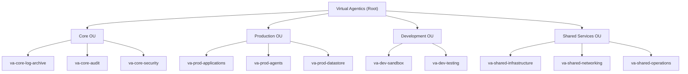

# AWS Control Tower Setup

## Prerequisites
- AWS root account.
- Administrator access.
- Verified domain and email addresses.

## Organizational Structure Diagram
The following diagram outlines the Virtual Agentics AWS account hierarchy and organizational units:



## Terraform Integration for Guardrails

Guardrails are enforced explicitly via Terraform. Below are examples for enabling common preventive and detective controls:

### Preventive Guardrail Example: Disallow Public S3 Buckets
```hcl
resource "awscc_controltower_control" "disallow_public_s3" {
  control_identifier = "AWS-GR_RESTRICTED_PUBLIC_BUCKETS"
  target_identifier  = aws_organizations_organizational_unit.prod_ou.id
}
```

### Detective Guardrail Example: Detect Root Account Usage
```hcl
resource "awscc_controltower_control" "detect_root_usage" {
  control_identifier = "AWS-GR_DETECT_ROOT_USER_LOGIN"
  target_identifier  = aws_organizations_organizational_unit.core_ou.id
}
```

### Terraform Account Creation & Baseline Setup
```hcl
resource "aws_organizations_account" "prod_agents" {
  name      = "va-prod-agents"
  email     = "va-prod-agents@virtualagentics.ai"
  parent_id = aws_organizations_organizational_unit.prod_ou.id
}

resource "aws_iam_role" "baseline_admin_role" {
  name = "VAProdBaselineAdminRole"

  assume_role_policy = jsonencode({
    Version = "2012-10-17",
    Statement = [{
      Effect = "Allow",
      Principal = {
        AWS = "arn:aws:iam::<Control Tower Management Account ID>:root"
      },
      Action = "sts:AssumeRole"
    }]
  })

  inline_policy {
    name = "BaselineAdminPermissions"
    policy = jsonencode({
      Version = "2012-10-17",
      Statement = [{
        Effect = "Allow",
        Action = ["*"],
        Resource = ["*"]
      }]
    })
  }
}
```

## Next Steps
- Validate Terraform code in a sandbox environment.
- Confirm permissions and guardrail effectiveness.
- Document any manual steps explicitly.
