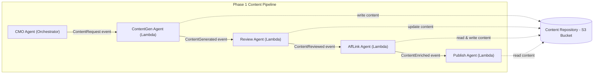

# AffLink Agent Design Specification

## 1. Overview

### 1.1 Agent Purpose and Goals

The **AffLink agent** is responsible for enriching generated content with affiliate links. Its primary goal is to automatically integrate monetization and referral tracking into content produced by VirtualAgentics’ content pipeline. By scanning content for relevant keywords or product mentions and inserting the appropriate affiliate hyperlinks, the AffLink agent ensures that published content can generate affiliate revenue without requiring manual editing. This agent thereby streamlines the content monetization process, guaranteeing consistency in how affiliate links are applied and freeing content creators from the tedious task of adding links by hand. In summary, the AffLink agent exists to **add value to content** (through monetization) while maintaining content quality and compliance with affiliate program requirements.

### 1.2 Context within VirtualAgentics

Within the **VirtualAgentics Phase 1** content automation pipeline, the AffLink agent operates as a mid-pipeline service that transforms *plain content* into *monetized content*. It works in concert with other Phase 1 agents such as the Content Generation agent, Review agent, and Publish agent. After content is generated (and optionally reviewed for quality or compliance), the AffLink agent is invoked to embed affiliate tracking links. This positioning ensures that by the time content reaches the publishing stage, it has been augmented with any relevant affiliate codes. The AffLink agent plays a crucial role in VirtualAgentics’ strategy to monetize AI-generated content, acting as the bridge between content creation and content publication by adding revenue-generating links. It is an **event-driven, autonomous microservice** (implemented as a Lambda function) that listens for content-ready events and responds by enriching the content data accordingly.

### 1.3 Scope & Assumptions

This design specification focuses on the **Phase 1 implementation** of the AffLink agent, outlining its current capabilities and limitations. The scope covers how the agent processes textual content (e.g., blog articles in Markdown or HTML format) to insert affiliate hyperlinks for known products or keywords. It assumes that content to be processed is in a suitable format and has passed any necessary initial quality checks (i.e., the content is final or near-final draft). Key assumptions include:

- **Pre-Defined Affiliate Mapping:** Phase 1 relies on a predetermined set of affiliate programs or link templates (e.g., a fixed affiliate code for a specific e-commerce site). The agent assumes that it has access to these mappings (via configuration or code) and does not need to dynamically fetch affiliate info from external services in this phase.
- **Single-Pass Enrichment:** The content is processed for affiliate linking **once** at the appropriate point in the pipeline. It is assumed that content will not require multiple rounds of affiliate link insertion; the AffLink agent’s output is considered the final monetized content ready for publishing.
- **Content Characteristics:** It is assumed that content items are of moderate length (e.g., a few hundred to a few thousand words) and contain identifiable product names or keywords that correspond to affiliate links. Content without any recognizable affiliate keywords will simply pass through unchanged (the absence of affiliate links is acceptable if nothing relevant is found).
- **Pipeline Integration:** The AffLink agent operates under the assumption that upstream components (ContentGen, Review) and downstream components (Publish) handle their respective concerns. For example, the agent expects that by the time it runs, the content is approved for publication and only needs link enrichment. Likewise, it assumes a downstream component will take the enriched content and actually publish it, including handling any disclosure or formatting requirements for affiliate content (e.g., adding an “affiliate links included” disclaimer if required on the publishing platform).

By limiting the scope to automated affiliate link insertion for textual content, this design ensures a clear focus on the agent’s core responsibility. Future phases may broaden this scope (see **Chapter 12**), but this document confines itself to Phase 1 behavior and design constraints.

## 2. Architecture & System Context

### 2.1 High-Level Context Diagram

The following diagram illustrates the AffLink agent’s position in the Phase 1 pipeline and its interactions with other agents and system components:

In this context:

- **The CMO (Orchestrator) agent** initiates the workflow by dispatching a **ContentRequest** event to generate new content.
- **The ContentGen agent** (content generator) produces a draft and stores the content (e.g., a Markdown file) in an S3 bucket. It then emits a **ContentGenerated** event.
- **The Review agent** (optional in Phase 1) receives the generated content event. It may perform automated quality checks or adjustments, then updates the content in S3 (if necessary) and emits a **ContentReviewed** event to signal that the content is ready for monetization.
- **The AffLink agent** (the focus of this document) is triggered by the reviewed-ready event. It retrieves the content from S3, inserts affiliate links, saves the enriched version back to S3, and emits a **ContentEnriched** event.
- Finally, **the Publish agent** picks up the enriched content event and reads the final content from S3 for publication (e.g., posting to a website or CMS). It may then emit a **ContentPublished** event for confirmation or analytics.

All agents are event-driven AWS Lambda functions, and S3 serves as the content repository through which the content state (draft, reviewed, enriched) is persisted between stages. The arrows in the diagram indicate the flow of events (solid lines between agents) and the interactions with the content store (dotted lines to/from S3). This architecture ensures a loosely coupled pipeline where each agent focuses on a specific responsibility and communicates via events and shared storage.

### 2.2 Deployment Target

The AffLink agent is deployed as an **AWS Lambda function (Python 3.11 runtime)** in the VirtualAgentics cloud environment. As a Lambda, it operates within a stateless, managed compute container and scales automatically with the incoming event load. Key details of the deployment context include:

- **AWS Environment:** The function runs in the **VirtualAgentics production AWS account**, within the same region and resource group as the content S3 bucket and event bus. This proximity ensures low-latency access to content objects and reliable event delivery. (Separate instances of the AffLink Lambda exist for non-production environments like dev or staging, following the same design but segregated resources.)
- **Event Triggers:** The AffLink Lambda is configured to be invoked by two mechanisms:
  - An **EventBridge rule** listens for the relevant pipeline event (e.g., `ContentReviewed` indicating content ready for affiliate linking) and triggers the Lambda with the event payload.
  - Additionally, an **S3 PutObject event** on the content repository bucket (for example, a new or updated content file in a specific “reviewed” prefix) can trigger the Lambda. This S3 event acts as a backup trigger or alternate mechanism to initiate processing whenever a content file is finalized in the repository.
  
  In practice, the system may use one or the other (or both) trigger methods depending on the orchestration preference. In Phase 1, the design leans toward using the EventBridge event as the primary trigger (since it carries explicit metadata about the content), while the S3 event ensures **idempotency** and catches any cases where the event bus might miss an update.
- **Networking and Dependencies:** The AffLink Lambda does not require access to any internal network resources (it primarily accesses S3 and AWS services over the AWS network). If external affiliate APIs were needed, the Lambda would either have outbound internet access (through a NAT gateway if placed in a VPC) or use hosted APIs via the internet. In Phase 1, no VPC integration is required, and the Lambda uses the default AWS Lambda internet access to communicate with AWS services (S3, EventBridge, CloudWatch, etc.).
- **Configuration:** Deployment includes setting environment variables or configurations for the Lambda, such as the S3 bucket name, target S3 key prefix for enriched content, and any affiliate program identifiers (for example, an affiliate tag or tracking ID used in constructing links). These values are injected at deploy time (via Terraform or AWS SAM templates) rather than hard-coded, allowing flexibility across environments.
- **Lifecycle Management:** The Lambda is deployed and managed via the VirtualAgentics CI/CD pipeline. New versions of the code (for improvements or bug fixes) are released by updating the Lambda function code (or Lambda container image) and updating the associated infrastructure (event triggers, IAM role, etc.) through infrastructure-as-code definitions. This is covered in more detail in **Chapter 6: Lifecycle Management**.

By deploying the AffLink agent as an AWS Lambda, the system benefits from automatic scaling, high availability, and managed runtime without the need to provision servers. The Lambda’s ephemeral nature (spinning up on demand in response to events) aligns well with the sporadic, event-driven workload of content processing in the Phase 1 pipeline.

