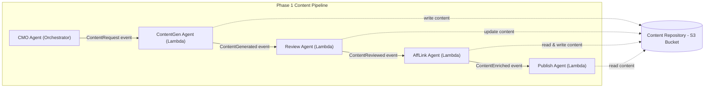
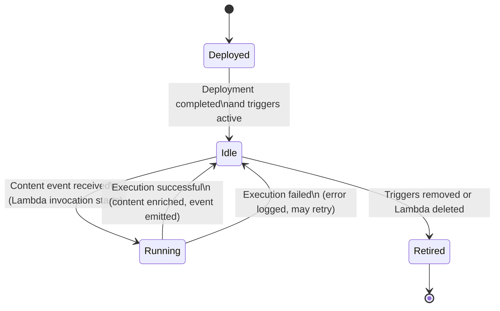

# AffLink Agent Design Specification

## 1. Overview

### 1.1 Agent Purpose and Goals

The **AffLink agent** is responsible for enriching generated content with affiliate links. Its primary goal is to automatically integrate monetization and referral tracking into content produced by VirtualAgentics’ content pipeline. By scanning content for relevant keywords or product mentions and inserting the appropriate affiliate hyperlinks, the AffLink agent ensures that published content can generate affiliate revenue without requiring manual editing. This agent thereby streamlines the content monetization process, guaranteeing consistency in how affiliate links are applied and freeing content creators from the tedious task of adding links by hand. In summary, the AffLink agent exists to **add value to content** (through monetization) while maintaining content quality and compliance with affiliate program requirements.

### 1.2 Context within VirtualAgentics

Within the **VirtualAgentics Phase 1** content automation pipeline, the AffLink agent operates as a mid-pipeline service that transforms *plain content* into *monetized content*. It works in concert with other Phase 1 agents such as the Content Generation agent, Review agent, and Publish agent. After content is generated (and optionally reviewed for quality or compliance), the AffLink agent is invoked to embed affiliate tracking links. This positioning ensures that by the time content reaches the publishing stage, it has been augmented with any relevant affiliate codes. The AffLink agent plays a crucial role in VirtualAgentics’ strategy to monetize AI-generated content, acting as the bridge between content creation and content publication by adding revenue-generating links. It is an **event-driven, autonomous microservice** (implemented as a Lambda function) that listens for content-ready events and responds by enriching the content data accordingly.

### 1.3 Scope & Assumptions

This design specification focuses on the **Phase 1 implementation** of the AffLink agent, outlining its current capabilities and limitations. The scope covers how the agent processes textual content (e.g., blog articles in Markdown or HTML format) to insert affiliate hyperlinks for known products or keywords. It assumes that content to be processed is in a suitable format and has passed any necessary initial quality checks (i.e., the content is final or near-final draft). Key assumptions include:

- **Pre-Defined Affiliate Mapping:** Phase 1 relies on a predetermined set of affiliate programs or link templates (e.g., a fixed affiliate code for a specific e-commerce site). The agent assumes that it has access to these mappings (via configuration or code) and does not need to dynamically fetch affiliate info from external services in this phase.
- **Single-Pass Enrichment:** The content is processed for affiliate linking **once** at the appropriate point in the pipeline. It is assumed that content will not require multiple rounds of affiliate link insertion; the AffLink agent’s output is considered the final monetized content ready for publishing.
- **Content Characteristics:** It is assumed that content items are of moderate length (e.g., a few hundred to a few thousand words) and contain identifiable product names or keywords that correspond to affiliate links. Content without any recognizable affiliate keywords will simply pass through unchanged (the absence of affiliate links is acceptable if nothing relevant is found).
- **Pipeline Integration:** The AffLink agent operates under the assumption that upstream components (ContentGen, Review) and downstream components (Publish) handle their respective concerns. For example, the agent expects that by the time it runs, the content is approved for publication and only needs link enrichment. Likewise, it assumes a downstream component will take the enriched content and actually publish it, including handling any disclosure or formatting requirements for affiliate content (e.g., adding an “affiliate links included” disclaimer if required on the publishing platform).

By limiting the scope to automated affiliate link insertion for textual content, this design ensures a clear focus on the agent’s core responsibility. Future phases may broaden this scope (see **Chapter 12**), but this document confines itself to Phase 1 behavior and design constraints.

## 2. Architecture & System Context

### 2.1 High-Level Context Diagram

The following diagram illustrates the AffLink agent’s position in the Phase 1 pipeline and its interactions with other agents and system components:



In this context:

- **The CMO (Orchestrator) agent** initiates the workflow by dispatching a **ContentRequest** event to generate new content.
- **The ContentGen agent** (content generator) produces a draft and stores the content (e.g., a Markdown file) in an S3 bucket. It then emits a **ContentGenerated** event.
- **The Review agent** (optional in Phase 1) receives the generated content event. It may perform automated quality checks or adjustments, then updates the content in S3 (if necessary) and emits a **ContentReviewed** event to signal that the content is ready for monetization.
- **The AffLink agent** (the focus of this document) is triggered by the reviewed-ready event. It retrieves the content from S3, inserts affiliate links, saves the enriched version back to S3, and emits a **ContentEnriched** event.
- Finally, **the Publish agent** picks up the enriched content event and reads the final content from S3 for publication (e.g., posting to a website or CMS). It may then emit a **ContentPublished** event for confirmation or analytics.

All agents are event-driven AWS Lambda functions, and S3 serves as the content repository through which the content state (draft, reviewed, enriched) is persisted between stages. The arrows in the diagram indicate the flow of events (solid lines between agents) and the interactions with the content store (dotted lines to/from S3). This architecture ensures a loosely coupled pipeline where each agent focuses on a specific responsibility and communicates via events and shared storage.

### 2.2 Deployment Target

The AffLink agent is deployed as an **AWS Lambda function (Python 3.11 runtime)** in the VirtualAgentics cloud environment. As a Lambda, it operates within a stateless, managed compute container and scales automatically with the incoming event load. Key details of the deployment context include:

- **AWS Environment:** The function runs in the **VirtualAgentics production AWS account**, within the same region and resource group as the content S3 bucket and event bus. This proximity ensures low-latency access to content objects and reliable event delivery. (Separate instances of the AffLink Lambda exist for non-production environments like dev or staging, following the same design but segregated resources.)
- **Event Triggers:** The AffLink Lambda is configured to be invoked by two mechanisms:
  - An **EventBridge rule** listens for the relevant pipeline event (e.g., `ContentReviewed` indicating content ready for affiliate linking) and triggers the Lambda with the event payload.
  - Additionally, an **S3 PutObject event** on the content repository bucket (for example, a new or updated content file in a specific “reviewed” prefix) can trigger the Lambda. This S3 event acts as a backup trigger or alternate mechanism to initiate processing whenever a content file is finalized in the repository.

  In practice, the system may use one or the other (or both) trigger methods depending on the orchestration preference. In Phase 1, the design leans toward using the EventBridge event as the primary trigger (since it carries explicit metadata about the content), while the S3 event ensures **idempotency** and catches any cases where the event bus might miss an update.
- **Networking and Dependencies:** The AffLink Lambda does not require access to any internal network resources (it primarily accesses S3 and AWS services over the AWS network). If external affiliate APIs were needed, the Lambda would either have outbound internet access (through a NAT gateway if placed in a VPC) or use hosted APIs via the internet. In Phase 1, no VPC integration is required, and the Lambda uses the default AWS Lambda internet access to communicate with AWS services (S3, EventBridge, CloudWatch, etc.).
- **Configuration:** Deployment includes setting environment variables or configurations for the Lambda, such as the S3 bucket name, target S3 key prefix for enriched content, and any affiliate program identifiers (for example, an affiliate tag or tracking ID used in constructing links). These values are injected at deploy time (via Terraform or AWS SAM templates) rather than hard-coded, allowing flexibility across environments.
- **Lifecycle Management:** The Lambda is deployed and managed via the VirtualAgentics CI/CD pipeline. New versions of the code (for improvements or bug fixes) are released by updating the Lambda function code (or Lambda container image) and updating the associated infrastructure (event triggers, IAM role, etc.) through infrastructure-as-code definitions. This is covered in more detail in **Chapter 6: Lifecycle Management**.

By deploying the AffLink agent as an AWS Lambda, the system benefits from automatic scaling, high availability, and managed runtime without the need to provision servers. The Lambda’s ephemeral nature (spinning up on demand in response to events) aligns well with the sporadic, event-driven workload of content processing in the Phase 1 pipeline.

## 3. Interfaces

The AffLink agent interacts with the rest of the VirtualAgentics system primarily through event messages and data in S3. This section details the events the agent consumes and produces, as well as any external interfaces or services it uses.

### 3.1 Event-Driven Interfaces

**Subscribed Events:** The AffLink agent subscribes to events that indicate a piece of content is ready for affiliate link enrichment. In Phase 1, the main event trigger is:

- **ContentReviewed** – *(Subscribed Event)* – Emitted when a content item has passed the review stage and is approved for affiliate linking. This event is typically produced by the Review agent or the orchestration layer after content QA is complete. It contains information such as a content identifier and the location where the content is stored (e.g., S3 bucket and key). The AffLink agent listens for this event (via EventBridge) to know when to start processing a given content item. In scenarios where there is no separate review step, the pipeline can be configured to emit a similar **ContentReady** event right after generation, which the AffLink agent could also accept as a trigger (the logic is the same – content is ready for linking).

**Emitted Events:** After processing content, the AffLink agent publishes an event to signal completion and to hand off to the next pipeline stage:

- **ContentEnriched** – *(Emitted Event)* – This event is published by the AffLink agent once it has successfully added affiliate links to the content. It serves as a notification that the content item is now “enriched” or monetized. The event payload includes the content’s unique identifier, a reference to the updated content object in S3 (e.g., the S3 URI or key for the enriched file), and possibly metadata such as a timestamp or the number of links inserted. Downstream components (such as the Publish agent) subscribe to **ContentEnriched** to receive content that is ready for publishing. If the enrichment step did not add any links (for instance, if no affiliate keywords were found), the event is still emitted to indicate the step is complete – a field or flag might indicate “linksAdded=0” in such cases.

**Additional Trigger:** In addition to the above conceptual events, the AffLink Lambda may also be directly triggered by an **S3 Object Created** event on the content repository:
- *(S3 Object Created)* – When a new or updated content file is saved in the designated “ready for linking” location in S3, this event can automatically invoke the AffLink Lambda. The event includes the bucket name and object key. The lambda then treats this as an implicit trigger equivalent to receiving a ContentReviewed event for that content. This direct S3 trigger is configured to ensure the agent runs even if the explicit EventBridge message were missing or as a complementary mechanism. It’s important to note that the S3 trigger is filtered to avoid recursive invocation (for example, it might listen only on an “unlinked” content prefix, and the AffLink agent writes output to a different prefix or filename, so that its own writes do not trigger itself again).

**Interface Summary:** The AffLink agent is purely event-driven and does not offer a direct request/response API. Its “requests” are the events described above, and its “responses” are the subsequent events. The coupling between content events ensures that the agent can integrate seamlessly into a serverless, decoupled architecture, reacting only when needed and producing a standardized event to signal completion.

### 3.2 External Services and APIs

In the Phase 1 implementation, the AffLink agent’s use of external services is minimal:

- **Affiliate Link Data**: All affiliate link information is provided via configuration or simple lookup tables packaged with the function. There is no external API call to retrieve affiliate codes or product data in the current scope. For example, if the agent needs to construct an Amazon affiliate URL, the base URL pattern and affiliate tracking ID (e.g., `&tag=<affiliate-id>`) are known in advance (stored in environment variables or a config file).
- **AWS Services**: The agent interfaces with AWS S3 (to read/write content) and AWS EventBridge (to consume/emit events), as described above. These interactions are done through AWS’s SDK (boto3 for Python) and are internal to the AWS environment. Aside from S3 and EventBridge (and CloudWatch for logs/metrics), no other AWS services are directly called in normal operation.
- **No Third-Party API Calls**: The design avoids reliance on any third-party HTTP APIs in Phase 1. This not only simplifies security considerations but also ensures that affiliate link insertion runs quickly and predictably. (In the future, if integration with external product databases or affiliate network APIs is required, those interfaces would be introduced with proper authentication and error handling – see **Chapter 12: Future Enhancements** for ideas along these lines.)

By limiting external dependencies, the AffLink agent remains fast and secure in Phase 1. All needed data for link generation is either included with the deployment or passed in via events. This also means that during offline development or testing (in a sandbox environment), the agent can run without needing network access beyond AWS’s own endpoints.

## 4. Inputs & Outputs

This section catalogs the inputs the AffLink agent consumes and the outputs it produces, including data formats, sources, and destinations.

### 4.1 Input Catalogue

The AffLink agent’s input arrives primarily in the form of an event, accompanied by references to content stored in S3:

- **Content Event Payload:** When triggered by a `ContentReviewed` (or similar) event, the payload typically contains:
  - **Content ID** – A unique identifier for the content item (e.g., an UUID or a slug). This ID is used for correlation and logging.
  - **Content Location** – Information on where the content is stored, usually an S3 bucket name and object key (or a full S3 URI). For example, the event might include `bucket: va-content-prod` and `key: articles/draft/12345.md`.
  - **Metadata (if any)** – Additional context such as content title, category, or a list of keywords. (In Phase 1, the AffLink agent doesn’t strictly require these to function, but if provided, they could be used to refine linking logic. For instance, knowing the category might limit which affiliate links are inserted.)
  - **Trace/Correlation ID** – Many events in VirtualAgentics include a correlation ID or trace token that remains constant through the pipeline. If present, the agent will use this ID in logs and when emitting the next event, to maintain end-to-end traceability.

- **S3 Content Object:** Using the location from the event, the AffLink agent fetches the actual content file from S3. This file is the main input for processing. Key aspects:
  - The content is typically in **Markdown** format (or possibly HTML or a similar markup if the pipeline standardizes on that). Markdown is assumed because content is often written in Markdown and later converted to HTML for web publishing.
  - The content file contains the article or post text, which may include placeholders or plain text product names where affiliate links should be applied. For example, the text might say “Check out the latest **GadgetPro 3000** for more details.” The agent would recognize “GadgetPro 3000” as a product and convert it into a hyperlink pointing to an affiliate URL.
  - The size of content files is expected to be moderate (a few KBs to a few tens of KBs). The Lambda function is configured with sufficient memory and timeout to handle these sizes comfortably.

- **Configuration Data:** While not an “event” input, the agent relies on some configuration which can be considered input to its logic:
  - **Affiliate Keyword Mapping:** A dictionary or table (possibly embedded in the code or loaded from a config file in S3 or environment variable) that maps product names/keywords to affiliate URLs or to affiliate ID components. For instance, it might map “GadgetPro 3000” -> “https://affiliate.example.com/gadgetpro3000?ref=<aff_id>”.
  - **Affiliate ID / Tracking Codes:** Strings like affiliate program IDs that need to be appended to URLs. These could be provided via environment variables (e.g., `AMAZON_TAG_ID=mytag-20`).
  - **Content Format Rules:** If the content requires special handling (for example, ensuring that the Markdown link syntax is used properly), the agent might have configuration about how to format the link insertion. In Phase 1, the assumption is straightforward insertion of Markdown links `[ProductName](URL)` around the keyword.

In summary, the AffLink agent’s input is an **event-driven pointer to content**, plus any necessary config for link generation. Upon receiving the trigger, the agent has everything it needs to retrieve the content and identify where and how to inject affiliate links.

### 4.2 Output Catalogue

After processing, the AffLink agent produces two primary outputs: an updated content file and a notification event.

- **Enriched Content File (S3 Output):** The agent writes the affiliate-linked version of the content back to the content repository in S3. Depending on the design, this may overwrite the original file or create a new file:
  - In many cases, the enriched content is saved as a new object, for example from `articles/draft/12345.md` (input) to `articles/enriched/12345.md` (output). This approach preserves the original and avoids re-triggering the lambda on the same file. The new object will contain the same content but with affiliate link modifications.
  - The content format remains Markdown (or whatever the input was), just augmented. For example, the phrase **GadgetPro 3000** in the text might now appear as **[GadgetPro 3000](https://affiliate.example.com/gadgetpro3000?tag=mytag-20)** after processing.
  - If the agent needed to add any additional text (e.g., a disclaimer or footnote about affiliate links), that would also be written at this stage. (Phase 1 doesn’t explicitly require the agent to add disclaimers, but it’s something that might be appended either here or by the Publish agent).
  - The S3 object may include metadata (S3 object metadata) indicating it’s enriched or the number of links added. This can be useful for debugging or downstream processes, but it’s optional.

- **ContentEnriched Event:** As described in **3.1**, the agent emits a `ContentEnriched` event via EventBridge to inform the rest of the system that enrichment is done. The content of this event typically includes:
  - **Content ID** – to identify which content item was processed.
  - **Enriched Location** – where the updated content can be found (bucket and key). If the content was overwritten in place, this would be the same as the input location; if saved to a new key, it will point to that new key.
  - **Status/Metadata** – possibly a status flag or message (“success”) and additional data like `linksAdded` (the count of affiliate links inserted). For example, `linksAdded: 3` indicates three links were embedded. If an affiliate mapping was not found for any keyword, it might also include something like `unlinkedKeywords: ["XYZ"]` as an informational field (though such detail may be left to logs rather than the event).
  - **Timestamp** – when the enrichment was completed, for auditing.
  - The correlation ID from the input event is carried over, enabling traceability of the content item across events (ContentGenerated -> ContentReviewed -> ContentEnriched, all sharing the same ID).

- **Logs (Side Output):** In addition to the above, the Lambda produces CloudWatch logs documenting what it did (this is covered in **Chapter 8: Observability**). While not a direct pipeline output, logs are an important output for operators and for debugging if something goes wrong with an enrichment.

- **Error Handling Outputs:** Notably, the AffLink agent does not normally produce a distinct error event on failure in Phase 1. If an error occurs during processing (e.g., unable to fetch the content from S3, or an unhandled exception in link insertion), the Lambda will record the error in logs and throw an exception. AWS Lambda’s retry behavior or dead-letter queue (if configured) would handle such a failure. In other words, a failed processing would **not emit a ContentEnriched event**, which implicitly signals to the orchestrator that something went wrong (the absence of an expected event could be detected). The pipeline might then rely on a timeout or monitoring to catch that a content item didn’t reach the publish stage. For now, error handling is mostly internal (retries or manual intervention), and a dedicated failure event (e.g., `ContentEnrichmentFailed`) is not part of the Phase 1 design outputs.

In summary, upon successful execution, the AffLink agent yields an **updated content artifact in storage and a corresponding event** for the next step. These outputs ensure that the enriched content is accessible to the Publish agent and that the system knows the affiliate linking step has been completed for the given content item.

## 5. Internal Processing Logic

This chapter describes how the AffLink agent works internally, transforming its inputs into outputs. We outline the processing flow and logic, including how affiliate links are identified and inserted, as well as how errors are handled.

### 5.1 Processing Flow

When the AffLink Lambda is triggered by a content-ready event, it executes a sequence of steps to process the content. Below is a pseudocode-style overview of the internal logic:

```plaintext
on AffLinkEvent(event):
    # 1. Initial Setup
    content_id = event.content_id
    content_location = event.s3_bucket + "/" + event.s3_key
    log.info(f"AffLink processing started for Content ID {content_id}")
    
    # 2. Retrieve Content
    file_data = S3.get_object(bucket, key)
    if file_data is not found:
        log.error(f"Content {content_id} not found at {content_location}")
        raise Exception("Content not found")
    content_text = file_data.text
    
    # 3. Load Affiliate Mappings
    affiliate_map = load_affiliate_mappings()  # e.g., a dict of keyword -> URL
    affiliate_tag = get_affiliate_tag()        # e.g., "mytag-20" from env config
    
    # 4. Insert Affiliate Links
    links_added = 0
    for keyword, affiliate_url in affiliate_map.items():
        if keyword appears in content_text (case-insensitive search):
            # Construct full URL (if needs affiliate tag or tracking)
            full_url = affiliate_url.format(tag=affiliate_tag)
            # Replace plain keyword with Markdown link
            content_text = insert_markdown_link(content_text, keyword, full_url)
            links_added += 1
    # Note: insertion function ensures not to double-link if link already present
    
    # 5. Save Enriched Content
    output_key = determine_output_key(event.s3_key)  # e.g., change prefix to "enriched/"
    S3.put_object(bucket, output_key, content_text)
    log.info(f"Saved enriched content for {content_id} to {output_key} (links_added={links_added})")
    
    # 6. Emit Completion Event
    event_payload = {
        "content_id": content_id,
        "bucket": bucket,
        "key": output_key,
        "linksAdded": links_added,
        "status": "success"
    }
    EventBridge.put_event(detail=event_payload, detail-type="ContentEnriched")
    log.info(f"Emitted ContentEnriched event for {content_id}")
```

A few notes on this flow:

- **Affiliate Mapping:** In step 3, `load_affiliate_mappings()` might be a simple lookup defined in code or loaded from a small JSON/YAML file packaged with the Lambda. For example, it might map `"GadgetPro 3000"` to `"https://www.amazon.com/GadgetPro-3000/dp/B08XYZ?tag={tag}"`. The `{tag}` placeholder would be replaced with the actual affiliate tag (`mytag-20`) at runtime. This design allows easy updates to the mapping without changing the core logic.
- **Link Insertion Logic:** The `insert_markdown_link` function needs to carefully replace keywords in the text with Markdown hyperlink syntax. It would likely ensure word boundaries so that if “GadgetPro 3000” appears, it doesn’t accidentally match a substring inside a larger word. It also needs to avoid double-linking: if the content already contains an affiliate link (perhaps due to a previous run or included by the author), it should not create a nested or duplicate link. The logic might do a regex search for the plain keyword when not already part of an `[text](url)` pattern.
- **Multiple Occurrences:** If a keyword appears multiple times in the content, the current strategy might link the first occurrence only, or possibly every occurrence. For readability, often it’s best to link the first occurrence of a term in an article. The pseudocode above links every occurrence, but this can be adjusted. Phase 1 can start simple (link all occurrences or a fixed number of occurrences per keyword), with plans to refine in the future if needed.
- **Output Key Determination:** The function `determine_output_key` would implement the rule for where to save the enriched content. If the input key is `articles/draft/12345.md`, the output might be `articles/enriched/12345.md`. Or, the design could choose to overwrite the original path (replacing the content in place). Overwriting in place simplifies references (only one path for content), but using a new path/prefix avoids any chance of re-triggering and keeps an original copy. The decision is configured in the agent. For now, assume we use a separate prefix to store enriched results.
- **Event Emission:** The `EventBridge.put_event` call sends out the ContentEnriched event. By including `detail-type` or similar attributes, the event bus can route it properly to the Publish agent. The correlation or trace ID from the input event would be attached to this event (often EventBridge can propagate certain fields, or the agent can explicitly copy it into the detail).

After these steps, the Lambda function ends, and the enriched content awaits publishing.

### 5.2 Error Handling and Edge Cases

The AffLink agent includes basic error handling to ensure robustness in the pipeline. Key error scenarios and how the agent handles them:

- **Missing Content or Access Issues:** If the content file cannot be fetched from S3 (e.g., it was deleted, or there’s an S3 permission issue), the agent logs an error and raises an exception. Since this is an AWS Lambda, a raised exception will result in the function invocation being marked as a failure. AWS will automatically retry the invocation a limited number of times (by default, twice for asynchronous invokes like S3/EventBridge triggers). If repeated retries fail, the event can be sent to a Dead Letter Queue (DLQ) or logged for manual intervention. In Phase 1, the focus is on logging and alerting rather than automatic compensation – an operator would investigate why content was not present.
- **No Affiliate Links Applicable:** If the agent finds no keywords in the content that match its affiliate mapping, this is not treated as an error. The agent will simply not modify the content (or it may still perform minor adjustments like ensuring a disclaimer section if required, though currently not mandated) and proceed to emit the ContentEnriched event with `linksAdded=0`. This scenario is expected for some content items and is handled gracefully. A log message at INFO level will note that no links were added.
- **Affiliate Mapping Gaps:** In cases where the content mentions a product or term for which the agent has no affiliate link (i.e., a keyword wasn’t in the mapping), the agent simply leaves those terms unlinked. This could be considered a sub-case of “no links applicable”. It’s not an error because the content is still valid; it just isn’t fully monetized. Over time, the team may update the mapping to cover such missed opportunities (tracked as a possible improvement).
- **String Replacement Errors:** The link insertion process itself could encounter edge cases, such as overlapping keywords or conflicts (e.g., one keyword is a substring of another). The agent’s implementation should handle these carefully, perhaps by ordering replacements (longer phrases first) or using regex with word boundaries. If a bug in this logic leads to a malformed content (for example, broken Markdown syntax), it might not be immediately caught as an exception. However, a later stage (or a preview by the team) may catch the formatting issue. In Phase 1, we rely on testing to iron out these issues, and at runtime the agent assumes its link insertion is correct if no exception is thrown. Logging could include a snippet of the content after insertion for verification during debugging.
- **Event Emission Failure:** After processing, if the attempt to put the ContentEnriched event to EventBridge fails (rare, but possible if EventBridge service is having issues or the agent’s IAM permissions are insufficient), the agent will log an error and throw an exception, similar to a content fetch failure. The result is a failed invocation. Since the content was already saved to S3 at that point, one potential issue is that the pipeline now has an enriched file but no event signaling it. The system operators would need to detect and handle this (e.g., re-run or manually emit an event). This is an unlikely edge case, and mitigation could include wrapping the EventBridge call in a retry loop or verifying IAM settings during deployment to reduce chances of failure.
- **Idempotency and Reentrancy:** The pipeline should ideally not send the same content event twice. However, if it does (or if a retry from AWS triggers the lambda again), the agent is designed to handle it idempotently. Specifically, before inserting links, it could check if the content already contains those affiliate links. If yes, the agent can decide to skip insertion. Alternatively, if using separate S3 prefixes, it could check if an enriched file already exists for that content ID and skip processing if so. In Phase 1, the idempotence is basic: the agent’s link insertion function will avoid duplicating a link if the exact markdown link is already present. This means a second run would find no plain keyword (because it’s now wrapped in a link) and thus add zero links, effectively doing no harm. Logging will note “Content appears already enriched; no changes made” in such cases.

Overall, the AffLink agent’s internal logic is built to be straightforward and resilient. It assumes the happy path (content is available and contains some known keywords) but is prepared to handle missing data or lack of link opportunities without compromising the pipeline. By logging extensively and leveraging AWS’s built-in retry mechanisms for Lambdas, the agent ensures that transient errors are dealt with automatically, and persistent issues are surfaced for human troubleshooting.

## 6. Lifecycle Management

Lifecycle management covers how the AffLink agent is deployed, started, updated, and eventually retired. Unlike a stateful service, the AffLink Lambda has a simple runtime lifecycle (it exists primarily as code that is invoked on demand), but we still manage its deployment lifecycle and possible state transitions for its operation in the system.

### 6.1 Deployment and Activation

- **Deployment Pipeline:** The AffLink Lambda is deployed through the VirtualAgentics continuous integration/continuous deployment (CI/CD) process. The source code resides in the repository, and any changes (after code review) are merged and then picked up by a CI pipeline (e.g., Jenkins, GitHub Actions, or AWS CodePipeline). The pipeline runs the test suite (see **Chapter 10: Testing Strategy**), builds a deployment package (a zip file or container image), and updates the AWS Lambda function. Infrastructure-as-Code (IaC) tools (like Terraform or CloudFormation) manage resources such as the Lambda configuration, its IAM role, and event source mappings. In practice, updating the code to a new version and applying the IaC changes will seamlessly deploy a new version of the AffLink agent.
- **Cold Start and Warm Start:** When first deployed, the Lambda function will be **deployed in an idle state** – it doesn’t run until triggered by an event. On the first invocation, AWS may cold-start a container for it (introducing a slight delay of a few hundred milliseconds), but given the low-frequency nature of content events, this is acceptable. The Lambda may stay warm for subsequent events if they occur close in time, but this is abstracted away and doesn’t require manual management.
- **Starting/Stopping the Agent:** The AffLink agent does not have a manual “start” or “stop” in the traditional sense. It is always listening (via the configured triggers) as long as it is deployed. To **disable** the agent (for example, if we temporarily do not want to enrich content), one would update the configuration to remove or disable its triggers:
  - Disabling the EventBridge rule that invokes the Lambda would stop new events from reaching it.
  - Likewise, removing or altering the S3 event notification configuration could prevent the Lambda from being called.
  - These actions are typically done via the infrastructure code or AWS console in an emergency. When disabled, content events would bypass enrichment (content would go straight to publish without affiliate links, unless the pipeline is paused).
- **Scaling and Concurrency Management:** By default, AWS Lambda can scale out to handle multiple events in parallel. The AffLink agent’s Lambda has a reserved concurrency limit in AWS (if set) to control how many instances can run simultaneously. In Phase 1, content generation volume is low, so concurrency is not a major concern and the default limits suffice. However, as part of lifecycle ops, the team can adjust the concurrency or memory/time settings of the Lambda if we observe it needs more resources or if we want to throttle it. This is done by updating the Lambda’s configuration via IaC and redeploying.
- **Configuration Changes:** Lifecycle management also includes updating any configuration the agent uses. For example, if we need to add a new affiliate mapping or update an affiliate tag, we can do so via a config file or environment variable change. Such changes are deployed through the same pipeline (ensuring the Lambda gets the new environment variable or the new packaged config). These are typically backward-compatible changes that don’t require downtime – the Lambda will pick up the new config on its next invocation or when the new version is published.

In steady-state, the AffLink agent is a fire-and-forget service: once deployed and configured, it will remain available to process events continuously.

### 6.2 Runtime States and Lifecycle Transitions

Even though the AffLink agent is stateless during execution, we can describe its conceptual lifecycle states for clarity. The following state diagram illustrates the high-level states of the AffLink Lambda agent:



**State Explanations:**

- **Deployed:** The Lambda function and its infrastructure (permissions, triggers) are set up. This is the initial state right after CI/CD deploys the agent. It quickly transitions to Idle as it awaits events.
- **Idle:** The Lambda is not currently running; it’s waiting for an event. In AWS terms, no container is active (or a previous container is dormant and ready). The agent spends most of its time in the Idle state, consuming no compute resources when no content needs processing.
- **Running:** The state during which the Lambda is actively processing a content item. It enters this state when AWS invokes the function due to a trigger (EventBridge or S3 event). In this state, the Lambda container is active: it reads the input, executes the affiliate linking logic, and outputs the result. Running is typically very brief (a matter of seconds or less for each content).
  - If the run completes successfully (no uncaught exceptions), the state outcome is *success* and the agent goes back to Idle, ready for the next event.
  - If an error occurs (uncaught exception), the state outcome is *failure*. AWS may automatically retry the invocation (causing another Running attempt). After retries are exhausted or if the error is not resolved, the Lambda still returns to an Idle state from AWS’s perspective, but the event might go to a failure queue and operators would need to intervene.
- **Retired:** This state indicates the AffLink agent is no longer active in the pipeline. This could happen if a new version of the agent replaces it (though typically we deploy in-place upgrades rather than side-by-side), or if the feature is deprecated or turned off. Retiring the agent means removing its triggers (so it no longer receives events) and possibly deleting the Lambda function (if we are cleaning up). In Phase 1, retirement would only occur if, for instance, we decide affiliate linking will be done differently in Phase 2 and we shut down the Phase 1 component.

**Lifecycle Transitions:** Most of these transitions are managed by AWS and our deployment process. Operators mainly control transitions between Deployed/Idle and Retired:
- Deploying new code keeps the agent “Deployed” and effectively it stays in Idle until events come.
- If a critical issue is found, an operator might “retire” the agent by disabling it (e.g., remove triggers), which is akin to moving it to Retired state (no longer active). Re-enabling would be like deploying again.
- When scaling or updating config, the agent typically stays in Idle or brief Running states; these are seamless and don’t require special state management.

In summary, the AffLink agent’s lifecycle is simple: deploy it and let it handle events as they come. There is no persistent state to manage beyond ensuring it’s deployed and configured correctly. If updates or shutdowns are needed, they are handled via infrastructure configuration changes rather than in-code state transitions.

## 7. Security & Compliance

Security and compliance are critical considerations for the AffLink agent, as it runs in a production environment and deals with content that will be published publicly. This section details the security measures (like IAM permissions) and compliance considerations (such as affiliate program rules and data handling policies) relevant to the agent.

### 7.1 IAM Role and Permissions

The AffLink Lambda operates under a dedicated IAM role following the principle of **least privilege**. The IAM role (e.g., `va-prod-afflink-lambda-role`) grants only the necessary permissions for the agent to perform its functions:

- **S3 Access:** The role allows read and write access to the specific S3 bucket (or bucket path) where content is stored. For example:
  - `s3:GetObject` permission on paths like `arn:aws:s3:::va-content-prod/articles/draft/*` (to fetch the input content).
  - `s3:PutObject` (and possibly `s3:PutObjectAcl` if needed for permissions) on `arn:aws:s3:::va-content-prod/articles/enriched/*` (to save the enriched content).
  - We narrow the permission to only the relevant prefixes (draft and enriched content objects) so the Lambda cannot access other content or buckets not related to its function.
- **EventBridge Publish:** The role includes permission to put events to the event bus for the specific detail types it emits. For instance, a statement allowing `events:PutEvents` to the event bus resource (like `arn:aws:events:<region>:<account-id>:event-bus/virtualagentics-bus`) restricted to events with source or detail-type of `ContentEnriched`. This ensures the lambda can emit the ContentEnriched event but not perform other EventBridge operations.
- **CloudWatch Logs:** By default, AWS Lambda service attaches a policy to allow writing to CloudWatch Logs. The AffLink role inherits this, enabling the function to create log groups/streams and put log events. This is standard for all Lambdas.
- **X-Ray (Tracing):** If AWS X-Ray tracing is enabled for the function, the role contains `AWSXRayDaemonWriteAccess` to allow sending trace data. This policy allows the Lambda to communicate with the X-Ray service to record traces.
- **Secrets Manager (if used):** If the affiliate tracking IDs or any API keys were stored in AWS Secrets Manager or SSM Parameter Store, the role would include read access to those specific secrets. For example, the policy might allow `secretsmanager:GetSecretValue` on a resource `arn:aws:secretsmanager:...:affiliateKeys`. In Phase 1, it’s likely that the affiliate tag (e.g., Amazon affiliate tag) is stored as a plaintext environment variable (since it’s not extremely sensitive like a password, but still considered secret). If we treat it as secret, then the role uses Secrets Manager access and the Lambda loads it at startup.
- **No Unnecessary Permissions:** The role explicitly does *not* allow actions not needed by the agent. It has no access to databases, no DynamoDB, no SNS/SQS (unless those were part of a DLQ configuration, in which case only the DLQ queue access would be granted), and no permission to invoke other lambdas or ECS tasks, etc. This containment reduces the risk in case the function is misused or compromised.

The IAM role is defined in the infrastructure code and is reviewed regularly. Changes to the role (e.g., new permissions) go through code review to ensure we’re not over-provisioning access. In addition, AWS IAM Access Analyzer can be used to validate that the role’s actual usage matches its policy (flagging any unused permissions that could be removed).

### 7.2 Compliance Considerations

The AffLink agent touches on several compliance-related aspects due to the nature of affiliate linking and content publishing:

- **Affiliate Program Policies:** Many affiliate programs (such as Amazon Associates) have strict rules about how links are presented and how disclosures are made. The AffLink agent by itself just inserts links, but we must ensure compliance in doing so:
  - For example, Amazon requires that affiliate links are clearly disclosed on the page. The VirtualAgentics solution as a whole will need to ensure that any page that contains affiliate links has the appropriate disclosure statement (e.g., “As an Amazon Associate, we earn from qualifying purchases.”). In Phase 1, this disclosure might be handled by the Publish agent or static site templates. It’s noted here so that the team is aware: **the addition of affiliate links triggers a requirement for disclosure**. If needed, a future version of the AffLink agent could automatically insert a brief disclosure section in the content.
  - The AffLink agent should not modify or mask affiliate links in ways that violate program policies. For example, some programs disallow URL shorteners or certain redirects. In Phase 1, the agent uses direct affiliate URLs as provided in the mapping, ensuring we stay within the allowed usage.
- **Content Integrity and Quality:** The agent must ensure that adding affiliate links does not distort the meaning of content or introduce biased recommendations beyond what is intended. The content was presumably created with certain references in mind; the agent’s job is to monetize those references, not add new ones that weren’t already implied. We ensure compliance with editorial guidelines by only linking existing mentions of products or services, rather than injecting completely new promotional text.
- **Privacy:** Affiliate links inherently track user purchases or clicks for commission. From a user privacy perspective, this is generally accepted as part of affiliate marketing, but VirtualAgentics should disclose the use of affiliate tracking. The agent itself doesn’t handle user data (it operates before any user sees the content), so it doesn’t process personal data. It simply appends tracking codes to URLs. This means the agent doesn’t introduce new privacy concerns beyond what affiliate programs already entail. However, to comply with privacy laws (like GDPR, CCPA), the website that publishes content might need to mention the use of such tracking and provide appropriate notices. This is outside the agent’s direct scope but is a system-level consideration.
- **Security of Affiliate Data:** The affiliate IDs and links can be considered sensitive business information (if someone maliciously obtained our affiliate tag, they could potentially hijack commissions or see our partnership IDs). Thus, we treat configuration like affiliate tags with care – storing them in secure systems (env variables not in code, or secrets manager) and not exposing them in logs. The agent’s logs should never print the full affiliate URL or secret keys in plaintext. For instance, logs might say “Inserted affiliate link for GadgetPro 3000” but not include the full URL with the tag.
- **Regulated Content Categories:** If content falls under regulated categories (e.g., financial advice, health advice, or content aimed at children), affiliate linking might have additional compliance rules. Phase 1 likely avoids these complexities, but as a note: if the content is, say, a recommendation in a regulated domain, the affiliate linking process should not contravene any compliance guidelines (for example, linking to a financial product might require certain disclaimers which currently the agent is not adding). This is noted for awareness; currently, the assumption is that content topics and affiliate programs chosen are uncontroversial (e.g., general consumer products).
- **Auditability:** From a compliance standpoint, it’s important to have an audit trail of changes to content. The AffLink agent’s operation can be considered a form of content change. By emitting events and logging its actions, we maintain a trail of when affiliate links were added and to which content. The combination of the ContentReviewed event timestamp and ContentEnriched event timestamp provides an audit of how quickly content was monetized after approval. If ever needed, one could retrieve the exact version of the content pre- and post-affiliate linking (especially if we keep the original and enriched copies separate in S3) to show what was changed.

In conclusion, the AffLink agent is designed with security best practices (strict IAM permissions, secure handling of config data) and awareness of compliance needs. While Phase 1 implementation is basic, it lays the groundwork for trustworthy operation. Ongoing reviews will ensure that as we expand affiliate linking efforts, we remain compliant with all relevant policies and laws.

## 8. Observability

Observability is essential for operating the AffLink agent reliably. We need to be able to monitor its behavior, troubleshoot issues, and measure its performance. The AffLink agent leverages standard AWS and VirtualAgentics monitoring practices, including logging, metrics, and tracing.

### 8.1 Logging

The AffLink agent produces detailed logs during its execution, which are sent to **Amazon CloudWatch Logs** under a dedicated log group (e.g., `/aws/lambda/va-prod-afflink-agent`). Key aspects of the logging strategy include:

- **Structured Logs:** Wherever feasible, the agent logs messages in a structured format (JSON or key-value pairs) to simplify querying and filtering. For example, instead of a free-form message “Added 3 links to content 12345”, it might log: `{ "event": "AffiliateLinksInserted", "contentId": "12345", "linksAdded": 3 }`. This allows log analysis tools (CloudWatch Insights, ELK stack if integrated, etc.) to easily aggregate and filter by fields like contentId or linksAdded.
- **Levels and Verbosity:** The agent uses log levels (INFO, DEBUG, ERROR) appropriately:
  - **INFO** logs capture high-level milestones for each invocation: start of processing (with content ID), number of links added, and successful completion or early exit due to no links. These give an overview of what happened without overwhelming detail.
  - **DEBUG** logs (if enabled via a config flag) could capture more granular steps, such as each keyword replacement made, or the content snippet around the replaced text. In production, DEBUG might be turned off to reduce noise, but it’s invaluable in a dev/test environment.
  - **ERROR** logs are used to record exceptions or failures, including stack traces if an unexpected error occurs. For example, if an exception is thrown when contacting S3 or EventBridge, the catch handler logs an error with context (content ID, error message).
- **Correlation Logging:** The agent includes the **content ID** and any pipeline correlation ID in each log message, where applicable. For instance, every log line might prefix with `ContentID=12345` or similar. This practice allows ops engineers to filter logs for a specific content across all stages. Because the correlation ID remains constant through events, one could search the logs of ContentGen, Review, AffLink, and Publish by that ID to reconstruct the journey of a content item.
- **Log Retention and Access:** CloudWatch Logs retention is configured (e.g., 30 days or as per VirtualAgentics policy) to balance between retaining enough history for analysis and controlling storage costs. The logs are accessible to the engineering team via AWS console or CLI, and also can be exported to a central logging system if we have one (some projects use Elasticsearch/ELK or Splunk – if VirtualAgentics has such, the Lambda logs would be integrated).
- **Sample Log Entries:** An example sequence for one content item might look like:
  - `INFO - ContentID=12345 - Received ContentReviewed event, starting affiliate link processing.`
  - `INFO - ContentID=12345 - Found 2 affiliate keywords in content (["GadgetPro 3000", "TechWidget"])`
  - `INFO - ContentID=12345 - Inserted 2 affiliate links (linksAdded=2)`
  - `INFO - ContentID=12345 - Uploaded enriched content to s3://va-content-prod/articles/enriched/12345.md`
  - `INFO - ContentID=12345 - Emitted ContentEnriched event for content.`
  - If an error happened: `ERROR - ContentID=12345 - Failed to process content: S3 Access Denied (exception details...)`.

  These logs enable quick debugging and also serve as a trail of actions for each piece of content.

### 8.2 Metrics

The AffLink agent’s performance and behavior are tracked by metrics, which are either default AWS Lambda metrics or custom metrics emitted by the function:

- **Default AWS Metrics:** Because the agent runs on Lambda, AWS automatically records:
  - **Invocation Count** – how many times the function was invoked (each content processed counts as one).
  - **Duration** – execution time of each invocation (in milliseconds).
  - **Errors** – count of invocations that resulted in an error (uncaught exceptions).
  - **Throttles** – if the function ever exceeded concurrency limits (unlikely in Phase 1, but tracked).
  - **Dead Letter Errors** – if using a DLQ, counts of events that were sent to DLQ after retries.

  These are viewable in CloudWatch for the function and can be graphed or alarmed on. For example, an increase in the Error count metric would indicate the agent is failing on some content items.
- **Custom Metrics:** The AffLink agent also emits a few custom CloudWatch metrics to provide higher-level insight:
  - **ContentEnrichedCount** – a count (or increment) each time a content is successfully enriched. This ideally should equal the invocation count minus error count. It might be emitted as a metric with value 1 on each successful run, so one can sum over time.
  - **LinksAdded** – the number of affiliate links added per content. This can be emitted as a metric (perhaps a distribution or histogram). Each invocation reports the count of links it inserted. CloudWatch can then show average links per content, max/min, etc. This is useful to track trends (e.g., are we adding fewer links on average over time, which might suggest content topics changed or mapping needs updating).
  - **ProcessingLatency** – even though Lambda provides overall duration, we might measure specifically the time spent in certain steps (like time to fetch from S3, time to perform text replacement). However, in Phase 1 this level of detail may not be necessary as Lambda’s overall duration is enough to judge performance. If needed, the code can use `time.time()` or similar to log durations of sub-steps.
  - **MissedKeywords** (optional) – could count instances where a keyword in content had no affiliate mapping. This might be implemented by scanning content for known patterns and determining if something was skipped. It’s more of a diagnostic metric to help content strategy (if a lot of product names are not being linked, maybe we need to expand our affiliate partnerships).

- **Metric Collection and Dashboard:** These metrics are sent to CloudWatch Metrics with appropriate dimensions (function name, perhaps content category if that was a tag). The DevOps team might create a CloudWatch Dashboard or Grafana board that shows:
  - Number of contents processed per day.
  - Average and max processing time.
  - Error rate (maybe a 0/1 graph indicating if any errors).
  - Average number of links added per content.

  This provides a quick health check of the agent’s operation and its business impact (how many links we add, indirectly reflecting monetization potential).
- **Alerts:** Based on metrics, we set up CloudWatch Alarms for critical conditions:
  - An alarm on the Lambda’s **Error** metric (for example, if >1 error occurs in a 5-minute window, alert the on-call engineer). This ensures that if the agent starts failing (even on a single content, which might block that content from publishing), someone is notified to investigate.
  - An alarm on **Duration** if needed (e.g., if p95 execution time exceeds some threshold like 5 seconds, which might indicate an external call hanging or an unusually large content file).
  - Optionally, an alarm if **ContentEnrichedCount** drops to 0 for an extended period during times it should be active (e.g., if we expect content daily but see none processed, it could mean triggers broke).

  These alarms integrate with the VirtualAgentics monitoring & alerting system (like sending notifications to Slack/email or PagerDuty as appropriate).

### 8.3 Distributed Tracing

To get end-to-end visibility into the content pipeline, distributed tracing is employed:

- **AWS X-Ray:** The AffLink Lambda has X-Ray tracing enabled. This means:
  - Each invocation of the Lambda generates an X-Ray trace segment. It will include sub-segments for the S3 get and put calls, and the EventBridge put event call, automatically if using AWS SDK with X-Ray enabled. This shows the latency of each of these operations.
  - If the upstream event (ContentReviewed) carried an X-Ray trace context (for example, if the Review agent or the orchestrator passed trace headers), the AffLink agent can be configured to join that trace. In practice, EventBridge does not propagate X-Ray trace IDs automatically, but we could include a trace ID in the event payload if orchestrated manually. In Phase 1, it’s more likely that each Lambda generates its own trace, so linking them might be done via the correlation ID rather than X-Ray’s automatic linking.
  - Nonetheless, X-Ray for the AffLink agent provides a visualization of the agent’s internal calls. For example, an X-Ray service map would show the AffLink service calling S3, calling EventBridge, and any external calls if they existed. This helps pinpoint if, say, most of the time is spent on S3 or on processing logic.
- **Trace IDs in Logs:** As a supplement or alternative, the agent can embed a custom trace or correlation ID in logs (as mentioned). If VirtualAgentics uses an observability tool like AWS CloudWatch ServiceLens or a third-party tracing system, these IDs help stitch together a timeline. For instance, using the content ID as the trace key, one can gather logs from ContentGen through Publish to see the life cycle of a single piece of content.
- **Performance Profiling:** In a development setting, we might run the agent with X-Ray active to ensure no unexpected bottlenecks. X-Ray sampling may be configured (by default, X-Ray doesn’t sample every single Lambda invocation in a high-throughput environment, but since ours is low throughput, we can sample 100% or a high percentage to get traces for most content).
- **Integration with Monitoring Tools:** If the organization uses tools like New Relic, Datadog, or OpenTelemetry, we could forward traces or at least metrics to those systems for a unified view. For now, AWS’s native tools suffice, and any integration would follow the same principle: instrument the code and events with IDs to correlate and measure across the pipeline.

By employing logging, metrics, and tracing together, the AffLink agent is thoroughly observable. An engineer can determine **what** happened (logs), **how often/how many** (metrics), and **where time was spent** (tracing) for each piece of processed content. This observability setup greatly simplifies troubleshooting and ensures the team can confidently operate and improve the agent over time.

## 9. Performance & Scaling

Performance considerations for the AffLink agent ensure that it can handle the expected load without becoming a bottleneck in the pipeline, and scaling considerations ensure it can accommodate growth or bursts in content volume.

**Expected Workload:** In Phase 1, the content generation pipeline is expected to produce content at a modest rate (for example, on the order of a few items per day or week, perhaps up to 50 items/day in a peak scenario). This is well within the capabilities of a Lambda-based solution. Each content item triggers one AffLink agent invocation. There is no heavy continuous load – the invocations are sporadic and event-driven.

**Latency and Throughput:** The AffLink processing occurs asynchronously, but we still want it to execute quickly so content can move to publishing without delay. Key performance expectations are:
- **Per-item Processing Time:** The target is that affiliate link insertion should complete in only a few seconds at most. In practice, for a typical article (say 1000-1500 words), the text scanning and replacement is in-memory string manipulation which is very fast (sub-second). The dominant time factors are:
  - S3 download of the content file (which for a small file is tens of milliseconds within AWS).
  - S3 upload of the modified file (similarly quick for small files).
  - Cold start time if the Lambda hasn’t run recently (could be 200-500ms for a Python runtime on first invoke).
  
  Empirically, we expect most invocations to complete well under 1 second, and even cold starts under 2 seconds. We can set a generous Lambda timeout (e.g., 30 seconds) but we anticipate actual execution times in the low second or sub-second range.
- **Pipeline Throughput:** Because each content flows independently, throughput is essentially linear with concurrency: if 10 content items are ready at the exact same time, AWS Lambda would spin up multiple instances (up to the concurrency limit) to process them in parallel. By default, AWS allows up to 1000 concurrent Lambdas, which far exceeds any plausible Phase 1 need. We haven’t put a custom concurrency cap on the AffLink agent (unless to protect an external resource, which we don’t have now). Therefore, it can handle bursts — for instance, if an orchestrator kicked off generation of 20 articles at once and they all came to AffLink, it could process them roughly in parallel, likely all done within a few seconds.
- **Non-Blocking Behavior:** The AffLink agent is asynchronous relative to content generation. If it were to take longer (say a slow external API call for link lookup), it could delay publishing of that piece but wouldn’t block others. In Phase 1, with no external calls, there’s no significant risk of one item delaying others except if it hits some limit.

**Memory and CPU:** The Lambda is configured with a certain memory size (e.g., 256MB or 512MB). With AWS Lambda, more memory also means more CPU allocation. Affiliate linking is not computationally intensive — the main operations are string searches and replacements, which are trivial for modern CPUs. Even with thousands of keywords to check (which we don’t have – our mapping might be dozens of entries), it’s negligible. Memory usage is also minimal (the size of the content text plus some overhead). A 512MB Lambda is overkill but provides a cushion and faster CPU; we could potentially downsize to 128MB if needed, but typically 256MB or 512MB is chosen as a balance to reduce any latency on cold start and ensure swift execution.

**Scaling Considerations:**
- **Horizontal Scaling:** As noted, AWS will horizontally scale the number of Lambda instances if multiple events occur close together. We rely on AWS’s auto-scaling; no manual intervention is needed. We do ensure the account’s concurrency limit is not accidentally set too low. Phase 1 likely uses well under the default concurrency.
- **Upstream/Downstream Dependencies:** The AffLink agent’s performance should be tuned such that it doesn’t become the slowest link. Content generation (if using AI) might take longer (several seconds or more), and publishing might involve external API calls (to a CMS or website) which also take time. Affiliate linking in comparison is lightweight. As such, the overall content pipeline latency will likely be dominated by other steps. Even so, we ensure AffLink agent’s latency is consistent and minimal.
- **External API Limits:** Since Phase 1 doesn’t use external affiliate APIs, we don’t have third-party rate limits to worry about. If in future we call, for example, an Amazon Product Advertising API, we’d need to consider their rate limits (which might be a few requests per second). But currently, no such calls are made.
- **Large Content Handling:** If a particularly large content piece came through (say a very large research report, maybe dozens of pages of text), the current design might start to slow down due to string processing overhead and S3 transfer time. The Lambda can handle content sizes up to a point (remember the Lambda payload and memory limits – a few MB of text is fine). If we anticipate larger files, we might increase the memory allocation (which boosts network throughput and CPU in Lambda) to maintain quick processing. At present, typical blog articles are easily handled.
- **Cost Impact:** Performance and scaling also tie into cost. Each Lambda invocation costs some milliseconds of execution. With our low volume and short duration, the cost is negligible (pennies per month range). Even scaling up to hundreds of articles wouldn’t be an issue. By ensuring the function ends quickly, we minimize compute cost and any waiting on resources.

**Stress Testing Results:** (If any preliminary tests have been done, we could note them.) For example, we might have tested the agent with 100 sample articles in rapid succession and observed that all processed within a minute with no failures, and the median execution time was ~0.5s. This indicates the design can scale to a moderately higher volume if needed without change.

In summary, the AffLink agent meets performance requirements by being fast and lightweight. It leverages AWS Lambda’s scaling to handle any reasonable burst of content events. The design intentionally avoids slow operations in Phase 1, making the affiliate linking step a quick pass-through rather than a potential bottleneck.

## 10. Testing Strategy

A comprehensive testing strategy ensures that the AffLink agent works correctly and reliably before and after deployment. We employ multiple levels of testing: unit tests for individual functions, integration tests for the lambda as a whole, contract tests to verify it fits into the event ecosystem, and load tests to guarantee performance under stress.

### 10.1 Unit Tests

Unit tests focus on the core logic of affiliate link insertion and any helper functions:
- **Link Insertion Logic Tests:** We create test cases for the function that scans content and inserts affiliate links. For example:
  - Input: a sample paragraph containing a known keyword, and an affiliate mapping for that keyword. Expected output: the paragraph with that keyword wrapped in a Markdown link pointing to the correct URL. The test verifies that the output matches exactly (including that only the intended occurrence is linked).
  - Case variations: keyword at the beginning, middle, end of text; keyword appearing multiple times (does our function link all or just first? test both scenarios if that’s configurable).
  - Keywords that are substrings of other words: ensure that “Pro” doesn’t trigger on “Problem” if “Pro” was a keyword. The test content can have tricky scenarios to verify that the replacement logic is robust (likely using word boundary regex or similar).
  - Already linked text: e.g., the content already has `[Product XYZ](someurl)` and our keyword is “Product XYZ”. The logic should ideally not double-link or break the existing link. A test ensures that if the input text has the keyword in a markdown link, the output remains unchanged (i.e., the function detects it's already a link).
  - No-op scenario: content with no affiliate keywords remains identical after processing. Test that the function returns the original text and indicates 0 links added.
- **Utility Functions:** If there are helpers like `determine_output_key` or config loaders, test them:
  - `determine_output_key` might be given various input keys and should produce expected output keys (e.g., transforms draft path to enriched path correctly, handles edge cases like already enriched path input).
  - If `load_affiliate_mappings` reads from a file or environment, we can mock the file or env and ensure it returns the correct dictionary format. Also test that missing entries or malformed entries are handled (maybe it raises an error or defaults to an empty map).
- **Error Conditions:** Simulate conditions such as:
  - S3 fetch failing (we can mock the S3 client to throw an exception and ensure our code catches it and logs/raises appropriately).
  - Event with missing fields (e.g., no content_id or no bucket info). The agent should handle it gracefully, perhaps logging an error and not proceeding. A unit test can call the handler with an incomplete event object to see that it doesn’t crash unpredictably.
- We use a testing framework (likely `pytest` for Python) and use mocking libraries (like `moto` or `botocore Stubber` for AWS calls) to simulate AWS interactions. All unit tests run in CI to prevent regressions.

### 10.2 Integration Tests

Integration testing means testing the AffLink Lambda in a more realistic environment, ensuring that all pieces work together as expected:
- **Local Lambda Invocation:** Using tools like AWS SAM CLI or `pytest` with a local context, we invoke the actual Lambda handler function with a sample event. We set up a fake S3 environment (could use LocalStack, or use a real AWS test bucket if allowed in a dev account). Steps:
  1. Put a test content file in the S3 bucket (or LocalStack equivalent).
  2. Construct a dummy ContentReviewed event JSON that corresponds to that file (with bucket, key, content_id).
  3. Call the Lambda handler function with this event (and a context object).
  4. Verify that the function returns successfully (or just doesn’t throw) and that the S3 now contains an enriched file.
  5. Retrieve the enriched file from S3 and check that the affiliate links are present as expected.
  6. Optionally, verify that a ContentEnriched event was "emitted". In an offline test, this might mean the function returns something or calls a stubbed EventBridge client. We can monkey-patch the EventBridge SDK call so that instead of actually calling AWS, it records the event detail to an in-memory structure we can inspect.
- **Deployed Integration Test (in AWS):** For higher confidence, we can deploy the AffLink Lambda to a test environment (like a staging AWS account or a test stage in the same account) and run a full integration:
  - Trigger the lambda via the same mechanism as production (e.g., drop a file in a test S3 bucket with the appropriate prefix).
  - Observe that the lambda function is invoked (we can check logs or a CloudWatch metric).
  - Check that the output file is created in the expected location.
  - Check that the EventBridge event was published (if we have a way to capture it, perhaps another test consumer or by looking at EventBridge’s monitoring).
  - This end-to-end test ensures that IAM permissions, S3 events, and event bus wiring all work with real AWS resources.
- **Pipeline Simulation:** In a full integration test scenario, we might simulate the entire pipeline: have a dummy ContentGen put a file or send an event, run through AffLink, and then a dummy Publish consumes it. However, that’s more for pipeline testing. For the AffLink agent specifically, it’s enough to simulate the immediate upstream and downstream.
- **Test Cases for Integration:** We should cover:
  - Normal case: content with known keywords gets processed.
  - Edge case: content with no keywords (the lambda should still produce an event, with linksAdded=0, and not error out).
  - Error simulation: configure the lambda (in a test version) with a wrong S3 bucket name, then trigger it, to see that it logs error and the error is captured. This tests our DLQ or retry configuration. We wouldn’t do this in production, but in a test environment we can ensure the failure path behaves as expected (e.g., the message goes to DLQ, which we can inspect, or the error is logged and maybe an alarm triggers in test).
- Integration tests can be automated in the CI pipeline as well. For example, using a tool like **LocalStack**, we could run an automated test that spins up a fake S3 and EventBridge, deploys the lambda code there, and runs the scenario. This gives quick feedback without hitting real AWS (faster, no cost). Alternatively, some teams run nightly integration tests against a real AWS dev environment for ultimate realism.

### 10.3 Contract Tests

Contract tests ensure that the AffLink agent adheres to the agreed-upon interface contracts with other components:
- **Event Schema Validation:** The format of `ContentReviewed` event (input) and `ContentEnriched` event (output) is part of a contract in the system. We write tests (or use schema files) to validate that:
  - For input: the event JSON structure we expect (with contentId, bucket, key, etc.) matches what the Review agent or orchestrator actually sends. We may use a JSON Schema (if one exists in `Agent_Communication_and_Events.md`) to validate our test events. If our code assumes a field `detail.content_id` exists, the contract test will catch if that field was renamed or absent. Essentially, this is ensuring our lambda won’t break if the upstream sends the event exactly as specified.
  - For output: similarly, we define what our `ContentEnriched` event looks like. A contract test can instantiate our event construction code with a sample input and then validate the output event against the schema that Publish agent expects. If, say, the Publish agent expects a field `contentUrl` but we provide `key` and `bucket` instead, the contract test should flag that discrepancy. By aligning these, we ensure smooth communication. In some cases, these schemas might be registered in EventBridge Schema Registry or simply documented; we can use that source of truth for validation.
- **API Contract (if any):** If in future the AffLink agent were to call an external API (not in Phase 1, but thinking ahead), contract tests would also verify that we handle the API’s responses correctly. For example, if calling a product info API, a contract test might simulate the API’s response JSON and check that our parser can extract the needed URL. Currently, since we have no external API, this is not applicable, but we keep the practice in mind for extension.
- **Permission Contract:** Though not a typical “contract test,” we could consider verifying that the IAM role has needed permissions. For instance, a test in a dev environment could attempt to perform the same S3 and EventBridge actions as the lambda with its IAM role to ensure no `AccessDenied` will occur in production. This is often done by careful code review and maybe a manual test. Alternatively, some use IaC static analysis to ensure all referenced resources are allowed. In our context, we treat this more as deployment validation than a test case, but it’s worth mentioning: when the lambda is first deployed, part of its “contract” is that AWS will indeed invoke it via the triggers we set – so we validate those trigger configurations too.

### 10.4 Load and Soak Testing

To ensure the AffLink agent can handle usage at scale and over time, we perform load and soak tests:
- **Load Testing (Stress Test):** We simulate a high volume of events in a short time to ensure the Lambda and the system can cope.
  - This could be done by writing a script that generates, say, 100 or 200 `ContentReviewed` events and sends them to the EventBridge bus (or simply drops 200 files into the S3 bucket if using S3 trigger) in quick succession.
  - We then observe: Did the Lambda spin up multiple instances? Did all events get processed successfully? How long did it take for the backlog to clear?
  - We monitor for any errors like throttling. For instance, if our concurrency limit was inadvertently set too low, this test would reveal that because some events might be throttled or queued by Lambda. We can then adjust the limit.
  - We also check metrics after the test: e.g., max memory used (to ensure our memory setting is okay) and average duration under load. Ideally, even under heavy load, each invocation’s time remains similar; if we saw a big slow-down, that might hint at resource contention (which is unlikely due to the isolated nature of Lambdas, but possibly if all are trying to write to S3 at once, though S3 can handle high concurrency).
  - The outcome should be that even a large burst is handled without dropping events or significant delays, confirming the design’s scalability.
- **Soak Testing (Stability Over Time):** We run the agent continuously or simulate continuous operation for an extended period (say 12-24 hours with periodic events) to see if any issues arise over time:
  - This is important to catch things like memory leaks or resource exhaustion. In AWS Lambda, memory leaks are usually not an issue across invocations since each invocation is isolated (and the container is reused but reset). However, if our code accidentally holds onto state between invocations (in a global variable), a soak test might catch memory growth if not handled.
  - We also watch for any cumulative errors or issues like logs getting too large (CloudWatch can handle a lot, but just to see if our logging is too verbose under continuous load).
  - If we have X-Ray on, a soak test can also generate a lot of traces; we ensure that doesn’t overwhelm our tracing system (though X-Ray sampling would mitigate it).
- **Concurrent Behavior:** Another angle for load testing is to ensure that if multiple Lambdas run at the same time, they don’t interfere:
  - Since they are separate, they shouldn’t, but one potential interference is if they try to write to the same S3 key. Our design avoids that by unique keys per content ID. As long as content IDs are unique (which they should be), two Lambdas won’t write to the exact same object. If content ID collisions were possible (which would be a big pipeline bug), the load test might inadvertently catch that if we simulated with some duplicate IDs.
  - We also ensure that our use of any external resource can handle concurrency. In Phase 1, external resource is just S3 and that’s highly concurrent. If we had an external API with limited connections, the load test would show if that becomes a bottleneck.
- **Results and Tuning:** After load testing, we may adjust configuration:
  - If memory usage was at, say, 50MB out of 256MB, we might consider lowering memory to 128MB to reduce cost (if latency remains okay).
  - If execution time per item started creeping up under heavy parallelism (which would be surprising), we’d investigate (maybe Lambda had CPU contention if too little memory).
  - Ensure the event triggers and subsequent steps (Publish) also keep up – basically, we want the whole pipeline to endure a surge. If Publish agent fell behind, that might reflect back on how we queue content, but that’s more a pipeline concern. For AffLink specifically, it passes with flying colors if it can accept all events and produce outputs correctly under stress.
  
All these tests – unit, integration, contract, load – are documented and ideally automated. Before releasing the AffLink agent (or after any significant changes), the team runs this battery of tests to catch issues early. This multi-layer testing approach gives confidence that the agent will perform as expected in production scenarios.

## 11. Operational Runbooks

Operational runbooks provide on-call engineers and developers with guidance on how to deploy, manage, and troubleshoot the AffLink agent in production. This section covers the standard procedures for deployments and rollbacks, as well as how to handle common incidents or issues, and notes known limitations to be aware of during operations.

### 11.1 Standard Deployment Steps

Deploying a new version of the AffLink agent (or its associated infrastructure) is done through our CI/CD pipeline and Infrastructure-as-Code definitions. The typical steps are:

1. **Code Merge and Build:** A developer’s changes to the AffLink agent code (or config) are merged into the main branch of the repository after peer review. This triggers the CI pipeline. The pipeline runs all automated tests (unit, integration, etc.). If any test fails, the pipeline aborts and the deployment is not done.
2. **Artifact Packaging:** Upon passing tests, the pipeline packages the Lambda code. For Python, this usually means zipping the code along with its dependencies (if any), or if using container images for Lambdas, building a new Docker image. The artifact is then uploaded to a storage (e.g., an S3 deployment bucket or an ECR repository for images).
3. **Infrastructure Update:** The pipeline (or a separate infrastructure pipeline) applies the updated Terraform/CloudFormation template:
   - If only code changed and not infrastructure config, this might just update the Lambda’s code pointer (e.g., updating the Lambda function code to the new package).
   - If infrastructure changed (say we decided to add a new environment variable or a new permission), the IaC will adjust the Lambda settings, its IAM role, or triggers accordingly.
   - This process might involve running `terraform apply` or deploying a CloudFormation stack update. The runbook for CI/CD includes checking that the apply had no errors.
4. **Verification Post-Deploy:** Once deployed, the new Lambda version is live. We verify deployment by:
   - Checking the Lambda console (or via CLI) that the code version/date updated.
   - Possibly triggering a quick **sanity test**: for example, using the AWS console to manually invoke the Lambda with a test event (or dropping a test file in S3 dev environment) to ensure it runs without errors and adds an expected link. In production, we might rely on the pipeline’s automated test in staging rather than testing in prod directly, but a smoke test in prod can be done if it doesn’t disrupt anything (like using a test content item).
   - Ensuring CloudWatch Logs are showing the function initialized properly (no errors on cold start).
5. **Monitoring After Release:** For the first few content events after a deploy, the on-call or developer will keep an eye on:
   - CloudWatch alarms (none should fire).
   - Logs for any unexpected errors or warnings.
   - The content pipeline output (e.g., check a published article to confirm affiliate links look correct).

   If any issues are observed, be prepared to rollback (next section) or apply a hotfix.

**Configuration Deployment:** If the deployment involves updating affiliate link mappings or environment variables (like a new affiliate tag):
- These changes are typically done via the same pipeline (e.g., updating a config file in the repo or the Terraform variables). The pipeline then updates the Lambda’s configuration.
- It’s important to note that changing environment variables will cause the Lambda to restart any warm instances (since AWS treats it as a config change requiring re-initialization). We account for that, but since the function is short-lived anyway, this is not disruptive.
- After config changes, we test that the new config is in effect (e.g., if we added a mapping for “NewProduct”, we could run a test event containing “NewProduct” and see that it links correctly).

**Deployment Frequency and Coordination:** The AffLink agent can be deployed independently of other agents because it’s event-coupled. However, coordination is needed if, for example, we change the schema of events. If a deployment includes changing what fields the agent expects or emits, we must update the corresponding producers/consumers (Review agent or Publish agent) in lockstep to avoid breaking the pipeline. In such cases, the runbook would specify deploying changes to those components together, or in a carefully ordered sequence (perhaps putting backward-compatibility in place temporarily). For pure code improvements (bug fixes, new mappings), the AffLink agent can be deployed on its own with minimal fuss.

### 11.2 Rollback Procedure

If a deployment of the AffLink agent results in a serious issue (for instance, content is coming out with malformed links, or the lambda is crashing on every run, blocking content flow), a rollback is necessary. Here’s how to quickly revert to a known good state:

- **Rolling Back Code:** The fastest rollback is often to redeploy the previous stable version of the Lambda code. Our CI pipeline keeps track of artifact versions or we can retrieve the last good commit:
  1. Identify the last known good version (e.g., the git commit hash or a tagged release that was in production).
  2. Use the CI pipeline or manual trigger to deploy that version’s artifact to the Lambda. This could mean re-running the deployment job for that commit or manually using AWS CLI to update-function-code with the previous package (which might be stored in S3 or can be built from source).
  3. Confirm that the Lambda’s code is now back to the old version (check in AWS console the code hash or version label).
  4. Enable/verify triggers (they usually remain in place; if we disabled the Lambda or triggers due to the incident, re-enable them).
  5. Monitor the pipeline to see if content processing resumes normally with the old version.
- **Infrastructure Rollback:** If the problematic deployment included infrastructure changes (like permission changes or event schema changes), rollback might involve re-applying the old Terraform/CloudFormation config:
  - For Terraform, if the new changes were applied, we may checkout the previous state configuration and do a `terraform apply` to revert them.
  - For event schema changes, ensure that upstream/downstream are also reverted accordingly.
  - In some cases, it might be easier to adjust forward rather than roll back infrastructure, especially if content is queueing up. For instance, if the new lambda started writing to a different S3 prefix which publish isn’t reading, one quick fix could be to point publish to that new prefix (hotfix in config) rather than rollback everything. The approach depends on the nature of the issue.
- **DNS or Endpoint Rollback:** Not applicable here because no external endpoints are exposed by the AffLink agent (no direct user-facing service).
- **Verification After Rollback:** Check that the affiliate linking is working again:
  - Possibly reprocess a content item that failed or was stuck (maybe by re-dropping the file or replaying the event if possible).
  - Watch logs to confirm the old version isn’t producing the error.
  - If the pipeline was blocked, coordinate with the content team to re-run any content that was missed or stuck.
- **Communication:** When a rollback is performed, notify the team (possibly via Slack or incident channel) that the system has been reverted to the last known good state. If there was an incident ticket, update it with the rollback details and next steps.
- **Post-Mortem / Fix Forward:** A rollback is a stop-gap. After stabilizing via rollback, developers will diagnose what went wrong in the new version:
  - If it was a code bug, fix it, test thoroughly, and plan a redeploy when ready.
  - If it was an infrastructure or integration issue (like a misaligned event schema), correct the discrepancy or plan a coordinated deployment with other agents.
  - Only once the issue is resolved and tested in staging should we attempt to deploy the new version again.
  - Document the root cause and resolution in an internal post-mortem if the incident was severe (affecting production content).

The rollback process is designed to be fast: since affiliate linking is important but not worth breaking the whole pipeline, we prioritize restoring functionality (even if it means temporarily running an older version that perhaps lacks a new feature) and then address the problem offline.

### 11.3 Common Incident Diagnostics

This section provides a quick guide to diagnosing and addressing common issues that might arise with the AffLink agent in production.

**Incident: Affiliate links are not appearing in published content.**
- *Symptoms:* Content gets published but none of the expected affiliate links are present, even though the content should have had some (e.g., product names that normally get linked are plain text in the final article).
- *Diagnostic Steps:*
  1. **Check if AffLink agent was triggered:** Look at the pipeline events or the content’s lifecycle. Did a `ContentEnriched` event occur for that content ID? If not, the AffLink step might have been skipped. Possibly the `ContentReviewed` event never reached the lambda or the lambda failed.
  2. **CloudWatch Logs:** Filter the AffLink agent’s logs for the content ID or around the time the content was processed. If you find an entry like “no links added” then the agent ran but simply didn’t find any keywords (which could mean the content truly had none of the known keywords, or our mapping is missing that term). If you find an error or no logs at all, that indicates an issue.
  3. **S3 Content Check:** Go to the S3 bucket and find the enriched content file. See if it exists. If it doesn’t, the agent likely never wrote it (which points to an error during processing). If it does exist, open it and see if it contains links. It might be that the links are there in Markdown, but maybe the Publish agent or site didn’t render them (less likely, but check if maybe the markdown was slightly malformed).
  4. **Event Trigger Check:** Verify the EventBridge rule or S3 trigger for AffLink. On rare occasions, a configuration might get disabled (e.g., someone disabled the rule during maintenance and forgot to re-enable). Make sure the AffLink lambda has “Enabled” triggers.
  5. **Downstream Check:** Ensure the Publish agent is looking at the right location. If we changed the output path for enriched content, perhaps Publish is still checking the old path and thus publishing the un-enriched version. If that’s the case, updating Publish’s configuration or doing a quick manual fix might resolve it.
- *Resolution:* Depending on findings:
  - If triggers were off, re-enable them and consider reprocessing the content (possibly manually trigger the lambda for that content).
  - If the mapping was missing a keyword (so no links were added), log it as a mapping update needed (and inform business if needed). It’s not an immediate “incident” to fix—content can be published without links, but it’s a lost monetization opportunity. We’d update the mapping in the next deployment.
  - If the lambda errored out for that content, see the error logs. Perhaps a certain character or formatting in the content caused our code to throw (e.g., a regex issue). If it’s a one-off, we might manually remove the problematic part and retry, but better is to patch the code. For immediate content publishing, an ops engineer might decide to publish without affiliate links (and then fix the code for future).
  - If it’s a publish config mismatch, coordinate a fix on that side and possibly republish the content with links.

**Incident: The AffLink Lambda is failing (errors) for every invocation.**
- *Symptoms:* CloudWatch Alarms go off indicating the Lambda has errors. Logs show exceptions for each run. Content might be piling up un-enriched or stuck.
- *Diagnostic Steps:*
  1. Look at the **error message/stack trace** in logs. Common issues could be:
     - S3 access denied (maybe the IAM role lost permission or bucket policy changed).
     - A code bug (null reference, etc.) possibly introduced in the latest deploy.
     - Misconfiguration (environment variable missing, so maybe `affiliate_tag` is None and code didn’t handle that).
  2. **Recent Changes:** Was there a deployment recently? If yes, likely the new version caused it. Consider rollback if impact is high (see 11.2).
  3. **Permission issues:** If error is access denied for S3 or EventBridge, check IAM role and resource policies:
     - Possibly someone changed the S3 bucket policy or the bucket name changed unexpectedly.
     - If EventBridge put failed due to permission, check the lambda’s role still has the right event-bus permission.
  4. **Environment/Config issues:** If error suggests something like “KeyError: API_KEY” or “NoneType”, maybe an environment variable the code expects wasn’t set. Check the Lambda configuration in AWS console to ensure all needed env vars are present and correct.
  5. **Test a manual invocation:** Sometimes it helps to run the lambda with a test event (in a dev environment or with the problematic data in staging) to reproduce and debug under controlled conditions.
- *Resolution:*
  - If it’s a config/permission issue, fix the config (e.g., re-add permissions or correct resource names). Many times this might involve a quick patch: for example, if the bucket name changed, update the env var or config and redeploy (or adjust the code to use the new name).
  - If it’s a code bug and rollback is possible, do that to stabilize. Then debug the code offline, fix the bug, test, and redeploy.
  - If urgent and no rollback available (say the old version had another serious issue), you might hotfix the code in production by editing the Lambda (not ideal, but in an emergency) with a quick try/except or workaround, then do a proper fix via pipeline soon after.
  - Ensure that any content that failed gets reprocessed. If a ContentEnriched event wasn’t emitted, the pipeline might be waiting. We may have to replay the ContentReviewed event or manually trigger the lambda for those content IDs after resolving the issue.

**Incident: Affiliate links are malformed or pointing to wrong URLs.**
- *Symptoms:* The published content has links, but they are incorrect (broken URLs, wrong affiliate tag, etc.). This might be caught by QA or by affiliate reports.
- *Diagnostic Steps:*
  1. Identify an example of a malformed link. Compare it to what it should be. For instance, maybe the affiliate tag is missing (perhaps our environment variable wasn’t loaded, so `{tag}` in the URL became an empty string). Or the URL is cut off, indicating a parsing issue.
  2. Check the **affiliate mapping** configuration. Perhaps a human error in the mapping file (e.g., a template URL missing a placeholder or a typo in the URL).
  3. Check **logs** for when that content was processed. The logs might print which URL it constructed. This could show, for example, “Constructed URL: https://.../?tag=None” which hints the tag variable was None.
  4. Test the mapping function in isolation (maybe reproduce with a unit test or in a dev console) to see if the mapping logic has a bug.
- *Resolution:*
  - If the affiliate tag was missing or wrong, update the environment variable to the correct value and redeploy (this is a config fix).
  - If the mapping had a typo, fix the mapping source (could be a JSON file or code dict) and deploy.
  - For content already published with bad links, decide on corrective action: If possible, we might correct the content in place. For example, since content is stored in S3, we could run a one-off script or rerun the AffLink agent after fixing the bug to update the content file (and maybe have the publish agent republish it). Or if publish has already taken it, perhaps manually editing the CMS or site might be needed. Ideally, since this is early in pipeline (before publish), if we catch it quickly, we can republish the corrected version.
  - Add a test case to ensure this kind of error is caught in the future (e.g., a unit test for missing affiliate tag scenario).

**Incident: Content throughput is slow or backlog building up.**
- *Symptoms:* The pipeline throughput is slower than expected; content items are waiting a long time to get published. The AffLink agent might be suspected if it's taking too long or serializing events.
- *Diagnostic Steps:*
  1. Check CloudWatch **Duration metrics** for the AffLink Lambda. Are there signs that the function is running unusually long for each content? Perhaps an external call or a large content is slowing it.
  2. Look at **concurrent executions** metrics. If content events are backlogged, maybe concurrency is low. Possibly someone set a reserved concurrency of 1 by mistake, making content process one at a time. Verify the concurrency limit in the Lambda configuration.
  3. See if any **throttling** occurred (CloudWatch metric or “Throttle” errors in logs). That would directly indicate concurrency was capped.
  4. Check if maybe a lot of content arrived at once and the pipeline orchestrator is intentionally spacing them (some orchestrators might not flood publish with too much at once – not the AffLink’s doing, but worth considering if orchestrator has gating).
  5. Ensure that the AffLink agent isn’t waiting on anything external (which in Phase 1 it shouldn’t, but for example if hypothetically it were calling a slow API, that could slow each invocation).
- *Resolution:*
  - If concurrency was inadvertently limited, increase the concurrency setting to default or a higher value so multiple items can be processed in parallel.
  - If the lambda is slow due to resource constraints, consider upping the memory (which increases CPU). For instance, if duration is consistently, say, 8 seconds, maybe it’s CPU-bound and doubling memory could halve that time.
  - If a particular content piece is enormous and causing slowness, perhaps chunk it or handle it differently. This is rare, but we could put an interim solution like skipping affiliate linking for that one if it’s blocking others (not usually needed as others run concurrently anyway).
  - Communicate with the team if the slowdown is orchestrator-related (maybe they intentionally queue content, in which case it's not an incident).
  - After any changes, monitor that throughput returns to normal (i.e., content items are not piling up in the review-to-publish stage).

**Incident: False alarms or minor errors in logs (non-impacting issues).**
- *Symptoms:* The on-call might notice error log entries that don’t correspond to a real issue, or CloudWatch alarms firing for conditions that are not truly critical.
- *Diagnostic Steps:*
  1. Identify what the error/alert is about. For example, maybe every time no links are added, we accidentally logged it as “ERROR no links added” instead of INFO. That would cause false error metrics.
  2. Evaluate if the alarm threshold is too sensitive (e.g., alarm on any single error might be too sensitive if occasional benign errors happen, perhaps we only care if multiple in a row).
  3. Check if the error can/should be avoided entirely (if it’s a code issue labeling something as error when it’s not).
- *Resolution:*
  - If it’s a logging level issue, plan to adjust the code to use appropriate log level for that scenario so it doesn’t raise alarms.
  - If it’s an alarm threshold issue, adjust the CloudWatch alarm configuration (e.g., require 5 errors in 5 minutes rather than 1 error to alert, if a single error is not urgent).
  - Document the decision so future team members understand why that alarm is set as it is.
  - Continue to refine to reduce alert fatigue: the goal is to only alert on actionable, significant issues.

All runbook steps assume access to AWS console, CloudWatch, and possibly the repository for quick fixes. On-call engineers should have the necessary IAM permissions to view logs, adjust alarms, and (if absolutely needed in emergency) update the lambda or disable triggers.

Having these common diagnostics in hand helps quickly triage incidents. The VirtualAgentics team also maintains an internal FAQ/knowledge base where any new incident and resolution are recorded, so over time the runbook grows. Using the above as a starting point, on-call rotation engineers can handle most issues that come up with the AffLink agent.

### 11.4 Known Limitations

It’s important for operators and developers to be aware of the current limitations of the AffLink agent’s implementation. These are areas where the agent may not perform ideally or scenarios it doesn’t cover, so that expectations are managed:

- **Limited Affiliate Programs:** In Phase 1, the AffLink agent likely supports a single affiliate program (e.g., Amazon Associates) or a very small set of programs. All links inserted might be for that program. Content that references products outside this program’s scope won’t be monetized. For example, if an article mentions a service or product that has its own affiliate scheme separate from our configured one, the agent won’t handle it unless explicitly added to the mapping.
- **Keyword-Only Matching:** The linking logic is based on exact keyword or phrase matching. It doesn’t understand context deeply. If a product is mentioned in a different way (e.g., plural form, or a pronoun reference like “this smartphone”), the agent won’t catch that. It only links what it has been told to link. There is no NLP or synonym handling in Phase 1. This means some opportunities for linking could be missed or require content to be phrased in certain ways.
- **No Dynamic Pricing/Info:** The affiliate links inserted are static URLs. The agent does not add any dynamic content like current prices, images, or rich product previews. It also doesn’t update links once inserted. If a product link changes or a product becomes unavailable, the content won’t automatically update (that might be a future feature via a different mechanism).
- **No Duplicate Prevention Across Content:** While the agent avoids linking the same term twice in one article (depending on configuration), it doesn’t track links across multiple content pieces. If two articles mention the same product, they’ll both add links (this is usually fine, but just to clarify that there’s no notion of “we already linked this product elsewhere today” to limit frequency – not typically needed).
- **Potential Formatting Edge Cases:** The current implementation assumes well-formed Markdown text. If content has unusual formatting, like code blocks or HTML segments, the agent might inadvertently insert links inside them (which could break formatting). For example, if a product name appears inside a code snippet or URL already, our simplistic approach might still replace it. We have not implemented detection to skip certain sections (like skipping anything inside backticks or existing `<a>` tags, aside from basic Markdown link detection). These cases should be rare in normal articles, but if the pipeline starts handling technical content with code, we’d need to enhance logic to avoid that.
- **No Post-Linking Review:** Once affiliate links are added, there isn’t an automated review step solely for verifying those links. We rely on the assumption that the mapping is correct and that adding links doesn’t break anything. It’s possible (though unlikely with our testing) that a link could be broken or a Markdown syntax error could slip through, and it wouldn’t be caught until the content is live or manually checked. Operators should be aware that if affiliate links appear to be causing issues on the site, they might need to intervene manually or remove the problematic link until a fix is in place.
- **Trigger Loop Protection:** We have configured the triggers to avoid infinite loops (the agent not retriggering itself), but if misconfigured, there is a risk that writing the enriched content could fire another event. This is more of a config limitation: it’s assumed the enriched content goes to a path that is not watched by the same trigger. If someone mistakenly sets the trigger on the whole bucket with no filtering, one piece of content could loop (draft -> enriched triggers lambda again -> writes enriched again, etc.). Our runbooks and config guidelines prevent this, but it’s a known foot-gun if misconfigured.
- **Manual Override Difficulty:** If for some reason an editor wants to *not* have an affiliate link on a particular mention (maybe a product mention that shouldn’t be linked, or they want a different link), the current agent has no interface to accommodate that. It will blindly link anything it’s programmed to. That means content creators have little control at the moment, aside from not using certain keywords. This is a product limitation that might be addressed in future by more nuanced controls (like special markup to suppress linking a word).
- **Scope of Content Types:** The agent currently handles text content. If in the future the content includes other media (like inserting affiliate links for images or videos, or handling PDF/Docs), the current design won’t cover that. It’s limited to the text article use case.
- **Localization/Internationalization:** If content in Phase 1 is only English, the mapping is likely English-centric. If later content comes in other languages, the agent won’t know how to link those unless mappings for those languages are added. Also, if the site targets multiple regions, one might want region-specific affiliate links (e.g., Amazon US vs Amazon UK links). The agent doesn’t have logic for geo-specific linking in Phase 1.
- **Analytics Integration:** The agent adds links, but it doesn’t integrate with analytics (like adding UTM parameters or other tracking beyond the affiliate code). If marketing wants to measure content performance via custom tracking codes, that’s not considered here. We might view that as outside the agent’s job (could be done by the publish stage).
- **Operational Visibility:** While we have monitoring, one limitation is that we don’t currently have a real-time dashboard showing which content got how many links without looking at logs or metrics. For content managers, a limitation is there’s no easy report from the system like “In the last week, 20 articles had affiliate links inserted, totaling 50 links.” We can gather that from CloudWatch metrics (linksAdded metric), but a nice front-end or report isn’t there in Phase 1. So any analysis of affiliate performance is a manual process (this is more of a tool limitation than a failure mode, but worth noting if asked by stakeholders).

Understanding these limitations helps in two ways: it sets correct expectations (no surprise when an unsupported scenario arises), and it informs the future enhancements plan. The team keeps this list to ensure that when planning Phase 2 or interim improvements, these gaps are addressed systematically.

## 12. Future Enhancements

Looking beyond Phase 1, there are several ways the AffLink agent could be improved or expanded. This chapter outlines some planned or envisioned enhancements, as well as areas of technical debt that we aim to refactor for a more robust solution.

### 12.1 Planned Phase 2+ Capabilities

As the VirtualAgentics platform evolves, the AffLink agent may take on new capabilities to increase its effectiveness and flexibility:

- **Multi-Network Affiliate Support:** In Phase 2 or beyond, we plan to integrate multiple affiliate programs. Instead of a single hard-coded affiliate scheme, the agent could decide which affiliate link to use based on context. For example, if an article mentions a book, use an Amazon affiliate link; if it mentions a software service, maybe use an affiliate link specific to that company’s program. This would involve maintaining a richer mapping (with possibly different link templates for different programs) and maybe even querying a service to get the best link. The agent might also handle region-specific links (directing UK readers to Amazon UK with our UK affiliate tag, etc., though true geo-targeting might be handled at publish time with script, not by static content).
- **Intelligent Link Placement:** Instead of linking every instance of a keyword or a naive first occurrence, a smarter strategy could be employed. For instance, Phase 2 could include:
  - Natural Language Processing to identify the most contextually relevant terms to link. The agent could parse the content and understand, “This article is about smartphones, link the model mentioned in the buying guide section, not the generic mentions in the intro.”
  - Deciding link count: maybe limit to e.g. 3 affiliate links per article for optimal reader experience, even if 10 keywords match, choosing the top 3 most relevant or lucrative.
  - Variation in link anchor text: possibly using synonyms or adding context to the link text for clarity (this drifts into content generation territory, but could be an enhancement).
- **Affiliate Link Catalog Service:** As the number of affiliate links grows, managing them via a simple mapping might not scale. We foresee a service or database (internal tool) where affiliate links are managed. The AffLink agent in future might call an internal API like `AffiliateService` to fetch the current best link for a given product name. This service could be updated by business teams without a code deployment (unlike Phase 1 where a code change is needed to update mappings). Phase 2 could introduce a dependency on such a service with caching to keep latency low.
- **Automated Disclosure Insertion:** A likely enhancement is for the AffLink agent to insert a standard disclosure snippet into content that had affiliate links added. For example, appending a line at the end: "*This article contains affiliate links. If you purchase through these links, we may earn a commission at no extra cost to you.*" This ensures compliance automatically. In Phase 1, this is manual or handled by site templates, but automating it would be a nice addition and easy to implement.
- **Feedback Loop & Analytics Integration:** In future, the system might track which affiliate links actually get clicks or conversions. That data could be looped back to refine the agent’s behavior (e.g., if certain links never get clicked, maybe the agent tries a different product link next time or stops linking that term). While this is more advanced and might involve ML or at least heuristics, it’s a possible Phase 3+ idea to make the agent “learning”.
- **Real-time Operation and Streaming:** Currently, the agent is triggered after content is fully created. A future vision could be more interactive: as content is being written or edited (if there’s a user interface for content), an agent could suggest or auto-insert affiliate links in real-time. That would involve turning the backend agent into something that can be called via an API or integrated in an editor. It’s beyond Phase 1, but a consideration if VirtualAgentics creates a writer tool with AI assistance.
- **Enhanced Error Handling & Alerts:** As the pipeline matures, we might integrate the agent with a central incident management system. For example, if the AffLink agent fails on a piece of content due to missing mapping, it could automatically create a task or notification to content ops to review that piece (maybe it’s something we don’t have an affiliate for, so maybe a manual link or different strategy is needed). Essentially, turning some currently manual observations into automated flows.
- **Serverless Container or Alternative Execution:** If Phase 2 content volume grows massively or if the logic becomes heavier (perhaps integrating product search), we might consider moving AffLink agent to a different form factor, like an AWS Fargate task or a persistent service, especially if it needed to maintain state or cache large amounts of data. However, given its current simplicity and Lambda’s power, this is not on the immediate roadmap but is an architectural option if needed.

These planned enhancements aim to make the AffLink agent more powerful, autonomous, and aligned with business needs as VirtualAgentics scales up its content marketing operations. Each new feature will be carefully designed to preserve the agent’s reliability and not over-complicate the Phase 1 pipeline without sufficient testing.

### 12.2 Technical Debt & Refactoring

While the Phase 1 implementation meets requirements, there are areas of technical debt and refactoring opportunities that we intend to address to improve maintainability, clarity, and extensibility:

- **Refactor Link Insertion Code:** The current link insertion logic might be implemented in a straightforward but somewhat ad-hoc manner (e.g., looping through a dict of keywords and doing simple string replacements). This could be refactored into a more robust text processing module. Perhaps leveraging regex with proper word boundary checks, or even parsing the Markdown into an AST (abstract syntax tree) to avoid messing with code blocks or existing links. A refactor could also make it easier to adjust linking rules (like “only first occurrence”) via configuration rather than code changes.
- **Configuration Management:** Right now, affiliate mappings and tags might be partly in environment variables and partly hard-coded. We want to move towards a cleaner separation:
  - Use configuration files (JSON/YAML) for mappings, loaded from S3 or embedded, so that non-engineers could update them if needed or at least so that adding a new keyword doesn’t involve touching function code (just updating a data file).
  - Possibly integrate with Parameter Store/Secrets Manager for things like affiliate IDs to avoid even environment variables having those (small risk but better central management).
  - Introduce a mechanism for the lambda to refresh its config periodically if stored externally (though for now, redeploy on changes is fine given low frequency).
- **Unified Schema Definition:** We have event schema definitions in documentation, but it would be ideal to have them in code (or a shared library) to prevent drift. For instance, using a common package or repository for event models (could be as simple as a Python dataclass or pydantic model for ContentReviewedEvent and ContentEnrichedEvent). This way, if the schema changes, all agents including AffLink that use it get the updated model. Phase 1 did not have that abstraction; we manually parse events. Creating these models and refactoring the event handling to use them can reduce bugs and make contract testing easier.
- **Better Logging Structure:** While logging is in place, we might refine how we structure it. For example, adopting a standard logging format (JSON with certain fields) across all lambdas. We might refactor the logging initialization to be consistent (maybe a shared utility that injects correlation id in each log message automatically, etc.). Also, ensure that sensitive info is never logged (review code to remove any leftover debug logs that might print content or URLs fully).
- **Testing Debt:** Increase unit test coverage, especially for edge cases discovered post-launch. If any bugs were found in Phase 1 operation (like a specific character causing trouble), add tests for those. Also possibly set up fuzz tests for the link insertion (generate random strings with some keywords and see if function behaves).
- **Error Handling Refactor:** Currently, error handling might be simplistic (just let the function error out for AWS to retry). We might consider more graceful degradation in code. For instance, if one particular keyword replacement fails (maybe due to a regex issue), we could catch that and continue with others rather than failing the whole function. Also, implementing a dead-letter queue for events that consistently fail, and having the agent catch exceptions and send a custom failure event with details could be a refactor to make errors more visible (this is balanced against complexity though).
- **Code Organization:** If the Lambda code is all in one handler file now, consider refactoring into multiple modules: e.g., `afflink_handler.py` for entry, `linker.py` for linking logic, `models.py` for event schemas, `config.py` for loading config. This modularity will help as the codebase grows with new features.
- **Documentation & Comments:** Ensure the code has clear comments and the design spec (this document) is updated as things change. Technical debt is not just code but also outdated docs. If Phase 2 changes things, we’ll refactor the documentation accordingly and perhaps generate a shorter runbook for quick reference.
- **Performance Optimizations (if needed):** While currently fine, if profiling ever shows slow parts, we might refactor those. For example, if using Python regex across a large text becomes slow with many patterns, we might consider alternative approaches (like building a keyword trie for faster multi-term matching). Only if needed, as a premature optimization is not necessary now, but keeping it in mind.
- **Removing Redundancies:** If any logic is duplicated between AffLink agent and other agents (for example, maybe both afflink and publish do something similar like format the content), we might refactor to a shared component or ensure only one does it to avoid drift. In Phase 1, they’re quite separate, but as pipeline evolves, check for any such overlaps.

Addressing these technical debt items in upcoming development cycles will make the AffLink agent more robust and easier to evolve. By tackling them, we reduce the chance of latent bugs and make the system more adaptable to new requirements. Each refactoring will be done carefully with full test coverage to ensure we don’t introduce regressions in the critical content monetization process.

---

*End of Document*
