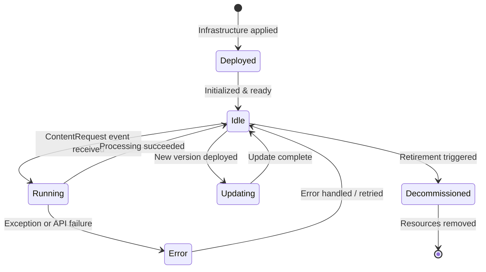

# ContentGen Agent Design Specification

VirtualAgentics Phase 1 — ContentGen Agent Design Specification
## 1. Document Control
| Version | Date | Author(s) | Reviewer(s) | Description |
| --- | --- | --- | --- | --- |
| 0.1 | 2025-06-11 | AI Engineering Team | AI Engineering Team | Initial draft |

Related documents:
System Architecture Overview
Agent Communication and Events Spec
Security & Compliance Policies
## 2. Overview
### 2.1 Agent Purpose and Goals
The ContentGen (Content Generation) agent autonomously generates content (articles/blog posts) in response to incoming content requests. Its business value lies in rapidly producing SEO-optimized articles that drive organic traffic and revenue in Phase 1, without human writers.
## 2.2 Context within VirtualAgentics
Falls under the Marketing/Content department’s domain as the “content creator” role.
Works closely with the Review agent and Publish agent – it produces draft content that the Review agent will check, and that ultimately the Publish agent will publish.
Supports the autonomous content pipeline objective by replacing the need for human content writers, delivering AI-written content on demand.
## 2.3 Scope & Assumptions
In scope:
Generation of textual content (e.g. articles, blog posts) upon request.
Handling event-driven invocations triggered by ContentRequest events.
Integration with an LLM (OpenAI API) to generate content based on the requested topic and parameters.
Out of scope:
Non-text content generation (images, video) – not handled by this agent.
Human-in-the-loop editing or approval – content goes to automated review instead of human review in Phase 1.
Initiating content requests on its own – it only responds to requests from the CMO agent (or other upstream triggers).
## 2.4 Dependencies
Upstream: Receives ContentRequest events from the CMO agent (or marketing trigger). These events prompt content generation.
Downstream: Publishes ContentReady events consumed by the Review agent. Also, stores content in S3 and metadata in DynamoDB for use by later stages.
External: OpenAI API (or similar LLM service) for text generation. This is a critical dependency – the agent calls the API with prompts to get generated content.
## 3. Architecture & System Context
### 3.1 High-Level Context Diagram
(Diagram to be inserted.) The ContentGen agent is implemented as an AWS Lambda that subscribes to the content request SNS topic. When a ContentRequest event arrives, the Lambda executes: it interacts with the OpenAI external API for content generation, and uses AWS services (S3, DynamoDB) for storing results. It emits a ContentReady event upon completion. It has network egress to the internet (to reach OpenAI) and IAM permissions for the necessary AWS resources (S3, DynamoDB, etc.).
## 3.2 Deployment Target
Platform: AWS Lambda (Python 3.11 runtime)
Environment: Deployed to both dev and prod AWS accounts/VPCs. The Lambda is configured with access to a private subnet and NAT Gateway for outbound internet (to call the OpenAI API). No inbound network access is required (triggered by SNS events).
## 3.3 Runtime Environment & Resource Profile
Memory: 256 MB allocated RAM. This is sufficient for generating content up to a couple thousand words and handling the API response.
Timeout: 30 seconds per invocation. This covers the time to call the OpenAI API (which might take a few seconds) plus processing overhead, with some buffer.
Concurrency: 2 (Lambda reserved concurrency). At most two content generation tasks will run in parallel by default. This ensures controlled API usage and avoids token limit spikes. (Concurrency can be adjusted if needed as content request volume increases.)
Resource Usage Pattern: The function uses moderate CPU during JSON handling and slight memory for holding the article text. Most heavy-lifting is done by the external API. The 256MB allocation also allocates CPU power proportional to it, which is adequate for the task.
## 4. Interfaces
### 4.1 Event-Driven Interfaces
4.1.1 Subscribed Events
| Event Name | Topic | Schema Reference | Source |
| --- | --- | --- | --- |
| ContentRequest | /content/request | content-request-v1.json | CMO agent |

The ContentGen agent is invoked when a new ContentRequest event is published on the /content/request SNS topic. This event includes details such as the desired content topic and length. The event schema defines fields like content_topic and word_count which the agent will use as input.
4.1.2 Published Events
| Event Name | Topic | Payload Schema | Destination(s) |
| --- | --- | --- | --- |
| ContentReady | /content/ready | content-ready-v1.json | Review agent |

After successfully generating and storing content, the ContentGen agent publishes a ContentReady event to SNS. This event indicates that a piece of content is ready for review, and it contains metadata such as a content identifier and possibly a summary or pointer to the content. The Review agent subscribes to this event to begin the review process.
## 4.2 Synchronous APIs / Webhooks
None. The ContentGen agent does not expose any direct REST API or webhook in Phase 1. Its interface is purely via events. (It acts as a consumer of events and producer of events.)
## 4.3 Data-Store Interfaces
DynamoDB:
Table: va-phase1-content (content metadata table)
Access: Write – The agent inserts a new item for each generated content (storing metadata like content ID, topic, timestamp, etc.). Read – Optionally, it may read to ensure no duplicate topics recently (e.g. check prior content entries).
S3:
Bucket: va-phase1-content-objects (for content storage)
Path usage: Writes the generated article content to a key such as /drafts/{content_id}.md in Markdown format. The agent puts the raw content here for downstream consumption. It may also read previous content from S3 if needed for duplication checks or prompt context (not common in Phase 1).
## 4.4 External Service Calls
OpenAI API:
Endpoint: https://api.openai.com/v1/completions (or the appropriate model-specific endpoint).
Purpose: Used to generate the article text based on the prompt composed from the ContentRequest. The agent calls the OpenAI completion (or chat completion) API to get AI-generated content.
Auth: Bearer token from AWS Secrets Manager (the API key is stored securely and fetched at runtime).
Rate limiting: The agent must respect OpenAI rate limits (e.g. ~60 requests/minute per key). Given Phase 1 volume, this is not an issue (only a few requests per hour at most).
Error handling: The agent handles HTTP errors or API timeouts from OpenAI by retrying or failing gracefully (detailed in processing logic).
(No other external calls; all other operations are within AWS ecosystem.)
## 5. Inputs & Outputs
### 5.1 Input Catalogue
When processing a ContentRequest event, the following inputs are expected (from the event payload):
| Name | Format | Source | Required | Validation |
| --- | --- | --- | --- | --- |
| content_topic | String | Event payload | Yes | Must be non-empty; must be a valid topic/category (as per business domain). |
| word_count | Integer | Event payload | Yes | Must be between 300 and 2000 (Phase 1 supports article lengths roughly in this range). |
| prompt_context | String | Event payload | Optional | If provided, length < 2000 chars. (Optional extra context or outline for the article; can be empty.) |

content_topic: The subject or title for the article to generate (e.g. “Benefits of AI in Finance”).
word_count: The desired approximate length of the article. The agent will aim to meet this length in the output.
prompt_context: Additional context for the AI (e.g. target audience or key points to cover). If absent, a generic prompt is used.
The ContentRequest event is validated upon receipt. If required fields are missing or values are out of expected bounds, the agent will treat it as a ValidationError (see Error Outputs) instead of proceeding.
## 5.2 Output Catalogue
On successful processing, the ContentGen agent produces:
| Name | Format | Destination | Consumer |
| --- | --- | --- | --- |
| article_text | Markdown text file | S3 bucket (va-phase1-content-objects, under /drafts/) | Review agent (reads this content from S3 for review) |
| content_id | UUID (string) | DynamoDB (va-phase1-content table) | Used by pipeline (IDs for audit, tracking, analytics) |
| event: ContentReady | Event | SNS topic /content/ready | Review agent |

article_text: The full generated article content in Markdown format. It is persisted to S3. This is not directly sent via event due to size, but is referenced by ID. The Review agent will retrieve this text from S3 to perform its checks.
content_id: A unique identifier (e.g. a UUID) for the generated content. The agent generates this ID when creating the content. It is used as the key for the DynamoDB item and part of the S3 object key, tying together all stages of the pipeline. It also allows analytics or audits to reference the content.
ContentReady event: Notification event containing metadata such as content_id, maybe the topic and a pointer to where the content is stored. It signals the next agent (Review) that content generation is complete.
## 5.3 Error/Exception Outputs
If content generation fails or cannot proceed, the agent emits error events. These error events allow the system to handle or log failures without throwing unhandled exceptions.
| Error Name | Format | Output (Topic) | Notes |
| --- | --- | --- | --- |
| GenFailure | Event | SNS /content/errors | Emitted if the content generation process fails (e.g. OpenAI API error or exception). Includes an error code and message indicating the cause. |
| ValidationError | Event | SNS /content/errors | Emitted if the incoming ContentRequest was invalid (e.g. missing fields, out-of-range values). Contains details of what validation failed. |

GenFailure: For example, if the OpenAI API returns an error (rate limit exceeded, or prompt content policy violation) or network timeout, the agent will catch it and emit a GenFailure event. The payload might have fields like content_topic, error_type, and error_message.
ValidationError: If content_topic is empty or word_count is out of bounds, the agent does not attempt generation. Instead, it emits this event stating the request was rejected due to invalid input. This prevents downstream agents from waiting on content that will never be produced.
Both error events go to a common error topic. In Phase 1, these might not be consumed by another agent, but they are logged and can trigger CloudWatch alarms to alert the team.
## 6. Internal Processing Logic
### 6.1 Processing Flow Diagram / Pseudocode
On ContentRequest Event:
Validate input parameters: Check that content_topic and word_count meet requirements (non-empty, within allowed ranges, etc.). If validation fails, emit a ValidationError event and exit.
Compose LLM prompt: Construct a prompt string for the AI model using the event data. For example: “Write a {word_count}-word article about {content_topic}. {prompt_context}”. This combines the topic and any context into a coherent instruction.
Call OpenAI API: Use the OpenAI SDK or HTTP client to send the prompt to the API (with the model and parameters defined). Wait for the response which should contain the generated content text. Implement a timeout (e.g. 25 seconds) to avoid hanging if the API is unresponsive.
On success:
Generate a new content_id (UUID) for this content.
Save the content to S3 as a Markdown file (drafts/{content_id}.md).
Write a metadata record to DynamoDB (va-phase1-content table). The record includes content_id, topic, requested word_count, timestamp, etc. It could also include a status (“ready for review”).
Publish a ContentReady event, including at least the content_id (and possibly topic or summary) for the Review agent to pick up.
On error:
If the OpenAI API call fails (throws exception or returns an error), catch the error.
Emit a GenFailure event with details of the error.
(Optionally) log the error for debugging. The Lambda then finishes without generating content.
Pseudocode:
function handleContentRequest(event):
if not valid(event):
publishError("ValidationError", details)
return

prompt = f"Write a {event.word_count}-word article on {event.content_topic}."
if event.prompt_context:
prompt += f" Context: {event.prompt_context}"
try:
response = OpenAI.complete(prompt, model=OPENAI_MODEL, timeout=TIMEOUT)
except Exception as e:
publishError("GenFailure", error_message=e.message)
return

content_text = response.text
content_id = generate_uuid()
S3.put_object(bucket=DRAFT_BUCKET, key=f"drafts/{content_id}.md", body=content_text)
DynamoDB.put_item(table=CONTENT_TABLE, item={id: content_id, topic: event.content_topic, ...})
publishEvent("ContentReady", {content_id: content_id, topic: event.content_topic, ...})
## 6.2 Key Algorithms or Prompt Templates
LLM Prompt Template: The prompt is crucial for getting good output. In Phase 1, a simple template is used: “Write a {word_count}-word article on {content_topic}. Context: {prompt_context}.”. For example, if topic is “Machine Learning Trends” and word_count is 800, the prompt might be: “Write an 800-word article on Machine Learning Trends.” If additional context is provided (say, target audience or outline), it’s appended after "Context:".
Post-processing of AI output: After receiving the raw text from OpenAI, the agent may perform minor clean-up. For example, ensure the text is in Markdown format (if the model didn’t format it, the agent might add Markdown formatting for headings or bullet points based on simple cues). It might also trim the content to fit the requested length if it’s slightly over. In Phase 1, complex post-processing is minimal; the AI is expected to return ready-to-use Markdown.
Prior Content Check: An optional algorithm is to query DynamoDB to see if a similar content_topic was recently generated, to avoid duplicates. If the same topic appears, the agent could decide not to generate again (Phase 1 docs hinted at “prior content checks” in DynamoDB access). This might simply log a warning or adjust the prompt to produce a fresh take.
## 6.3 Configuration Parameters
MAX_WORDS: 2000 – The upper limit for word_count accepted. This prevents overly large requests that might exceed the model’s capacity or runtime.
OPENAI_MODEL: "gpt-3.5-turbo" (for example) – The specific LLM model or engine to use for generation. This can be configured to upgrade to more advanced models.
TIMEOUT_SECONDS: 25 – How long to wait for the OpenAI API response before giving up. This is slightly less than the Lambda’s 30s timeout.
OPENAI_API_KEY_SECRET: The identifier for the API key in Secrets Manager (e.g. /va/prod/openai-api-key). The Lambda knows which secret to fetch on startup.
PROMPT_TEMPLATE: (If externalized) Template string for prompts. Currently hardcoded in code as above, but could be made configurable for quick tuning of prompt phrasing.
## 6.4 Resource Utilization Expectations
CPU: The agent’s CPU usage is low. It spends most of its time waiting on network I/O (the OpenAI call). CPU is used briefly to construct JSON, prompt strings, and to handle the response.
Memory: Typical memory usage < 128 MB even with large content, as the largest objects in memory are the prompt and generated text. 256 MB is plenty of headroom.
Network: Each content generation triggers an HTTPS request to the OpenAI API, which might consume around 50–200 KB for request/response (depending on prompt and article size). Token usage is roughly up to ~2000 tokens per request (prompt + result), which corresponds to the amount of data exchanged.
Lambda Duration: Typically a few seconds. For instance, generating ~1000 words might take ~2-5 seconds API time. Overall invocation likely completes in ~3 seconds on average, well under the 30s limit.
## 7. Lifecycle Management

## 7.1 Initialization / Startup
Secrets Fetching: On cold start, the Lambda initializes and fetches the OpenAI API key from AWS Secrets Manager. This is done once per container cold start, then reused for subsequent invocations. The secret is stored in memory (as an environment variable or retrieved programmatically).
Connection Warm-up: Optionally, the agent could do a quick connection warm-up to the OpenAI endpoint (perhaps a trivial request) to reduce latency on first real request. In practice, this might be skipped or minimal (Phase 1 might not implement explicit warm-up).
AWS Resource Clients: Initialize AWS SDK clients for DynamoDB, S3, and SNS. Confirm that the environment variables (like table name, bucket name, topic ARNs) are loaded.
Logging context: Log a startup message indicating the ContentGen agent has started (useful in CloudWatch to spot cold starts).
## 7.2 Runtime Behaviour Loop
Event-driven invocation: The ContentGen agent does not run continuously; it waits for events. AWS SNS triggers the Lambda for each ContentRequest event. The Lambda processes a single event per invocation (statelessly).
Stateless Processing: Each invocation handles one content generation from start to finish. It does not carry state from one invocation to the next (aside from possibly reusing the loaded API key and network connections if the container stays warm).
Concurrency Handling: If multiple ContentRequest events come in around the same time, AWS will spin up up to 2 concurrent instances (per concurrency limit) to handle them in parallel. There is no internal queue in the agent itself; parallelism is managed by the Lambda service.
## 7.3 Error Handling & Recovery
Retry on OpenAI errors: If the OpenAI API fails with a transient error (e.g. network glitch or 500 error), the agent will retry the API call up to 3 times with exponential backoff. This increases the chance of success in case of momentary issues. Each retry is within the same invocation (unless hitting the Lambda timeout).
Failure after retries: If after retries the call still fails or another error is encountered (like an unexpected exception), the agent emits a GenFailure event and returns an error. By catching exceptions and signaling via events, we avoid crashing the Lambda without context.
Dead-letter queue: If the Lambda were to error out without catching (e.g. an unhandled exception), the SNS trigger could be configured with a dead-letter queue. However, since we aim to handle errors gracefully and emit error events, a DLQ is a secondary safety net.
Post-failure action: A GenFailure indicates that the specific content request was not fulfilled. In Phase 1, there is no automated re-trigger for a failed content generation. It would rely on either the same content request being sent again manually or a human investigating the failure. The error events allow logging/alerting but the pipeline moves on (that piece of content is effectively skipped).
Validation errors: These are not retried – they indicate a problem with the input. The agent emits the ValidationError and stops. Upstream logic (potentially the CMO agent or operators) would need to correct the input in such a case.
## 7.4 State Transitions & Persistence
State: The ContentGen agent is designed to be stateless between invocations. It does not maintain any long-running state in memory about what content it has generated. Each event is handled independently.
Persistence: All necessary state is externalized:
Generated content and associated data are persisted to S3 and DynamoDB respectively (so other agents and future invocations can reference them).
If there is any need to avoid repeating topics, the check is done by reading DynamoDB on each invocation (so the “memory” of past topics is effectively the database, not the running code).
This design allows scale-out and resilience, as any Lambda instance can handle any request without warm-state dependencies.
## 7.5 Shutdown / Termination
The ContentGen Lambda relies on AWS to handle lifecycle. There is no special shutdown logic – once the function returns (success or failure), the invocation is done. If the container is about to be reclaimed, Lambda may freeze it without notice. The agent does not hold resources that need explicit cleanup (no persistent connections – HTTPS calls are short-lived).
If a deployment is updating the agent, in-flight invocations will complete, and new invocations will use the new version. The old container will eventually be terminated by AWS. All data (content) is already external, so termination has no impact beyond ephemeral compute.
## 7.6 Upgrade & Blue/Green Deployment Considerations
New versions of the ContentGen agent can be deployed with Lambda aliases. A typical safe deployment might use a phased rollout (e.g. deploy new version to a staging alias or a percentage of traffic). However, since this agent is event-driven, a simpler approach is to deploy and update the alias to point to the new version during a low-traffic period. Content requests will then use the new code.
Blue/Green via Aliases: AWS Lambda aliases (e.g. “prod”) can be shifted to a new version and rolled back if needed. This provides immediate rollback capability.
Configuration changes: If any environment/config parameters (like model name or table name) change, ensure that the new Lambda version has those updated before routing events to it.
Given that content generation is not a user-facing API, the tolerance for a brief outage is relatively high (minutes). But to avoid losing content requests, one might pause the upstream triggers (CMO agent) during deployment. In practice, deploying within seconds means this is usually unnecessary.
## 8. Security & Compliance
### 8.1 IAM Role and Least-Privilege Policy Summary
The ContentGen Lambda’s execution role has permissions tightly scoped to what it needs:
DynamoDB Access: dynamodb:PutItem (for inserting new content records) and dynamodb:GetItem/Query (if reading previous content) on the specific va-phase1-content table. The policy restricts actions to that table’s ARN.
S3 Access: s3:PutObject on the specific bucket/path where drafts are stored (ARN for va-phase1-content-objects/drafts/*). Optionally s3:GetObject on the same if it needs to read for duplication check or verify writes. No delete permission (content once created is immutable in Phase 1).
SNS Access: sns:Publish to the content ready topic ARN (/content/ready). Also sns:Publish to the error topic ARN (/content/errors), so it can emit failure events.
Secrets Manager Access: secretsmanager:GetSecretValue for the OpenAI API key secret ARN. No other secrets.
Network: The Lambda’s role has access to the VPC (if needed) and the security group/NACL allows outbound HTTPS to the internet (OpenAI). This is not an IAM policy but an infra setting.
General AWS: Allow logging (logs:CreateLogStream, logs:PutLogEvents) for its CloudWatch Logs. Deny all other AWS services not in use. This follows least privilege – e.g., the agent does not have permission to access other DynamoDB tables, other S3 buckets, etc.
Compliance Note: Ensure the IAM policy is reviewed to avoid wildcards. For example, use specific resource ARNs for S3 bucket and DynamoDB table.
## 8.2 Secrets Management
The OpenAI API key is stored in AWS Secrets Manager (path e.g. /va/prod/openai-api-key). The ContentGen agent retrieves this at startup. The secret is never logged or exposed in plaintext.
The secret rotation is manual or handled outside Phase 1 (set to rotate ~ every 90 days as a policy). When rotated, the new key is updated in Secrets Manager and the Lambda will pick it up on the next cold start (or could be forced to reload by a restart).
No other secrets (the agent does not store credentials for DB or S3 – those are handled by IAM roles).
The prompt template and other config are not secret; they are either code or environment variables.
## 8.3 Data Classification & Encryption
Content Data: Draft articles are not sensitive in the traditional sense (they are intended for publication). However, they are treated with baseline security: stored in an S3 bucket with default encryption (AES-256 at rest). DynamoDB content table has encryption at rest enabled by AWS.
In-Transit Encryption: All calls – the SNS event delivery, the OpenAI API call, S3/DynamoDB communications – use TLS 1.2+ encryption. The OpenAI API is accessed via HTTPS, and AWS SDK calls use HTTPS internally.
PII/Compliance: The content likely does not contain personal data; it’s general marketing content. So compliance focus (GDPR, etc.) is minimal. Regardless, the agent should not include any sensitive internal info in the content. The prompt context if provided could potentially include references to company information, so we ensure nothing confidential is inadvertently sent to OpenAI API without clearance (the content requests should be general topics in Phase 1).
## 8.4 Audit Logging Requirements
All key actions are logged. For instance, when a content generation request starts, the agent logs the content_id and topic. When an OpenAI API call is made, it logs that a request was sent (but not the full prompt to avoid possible sensitive data in logs). On success, it logs that content_id was generated and event published. On failure, it logs the error details.
CloudTrail: The outbound call to OpenAI is external and not in CloudTrail, but the call to Secrets Manager (to fetch API key) and any AWS resource access (S3 put, DynamoDB put, SNS publish) are recorded in CloudTrail. This provides an audit trail of actions like “content item X saved to S3” (as an S3 PutObject event) tied to the Lambda’s role.
Retention: CloudWatch Logs retention should be configured (e.g. 30 days) to balance between having historical logs for audit and saving cost. DynamoDB can serve as an audit of content produced (each item has timestamps).
If needed, an explicit audit entry could be added to the DynamoDB record for each content piece (like who/what created it – here it’s always the ContentGen agent – and when). This is implicitly available via the record’s attributes.
## 9. Observability
### 9.1 Logging
The ContentGen agent uses structured logging (JSON or key=value logs) for important events. For example: a log entry like {"level":"INFO","event":"ContentRequestReceived","topic": "AI in Finance", "requestId": "<aws-request-id>"} on start, and {"level":"INFO","event":"ContentReadyEmitted","contentId": "...", "topic": "...", "length": 800} on completion.
Error Logs: If an error occurs (OpenAI exception, etc.), it logs at ERROR level with details. These logs include the error type and message, and the content_id or request info if available.
Sensitive info: The agent avoids logging the raw API key or full generated content text. It might log a snippet or summary if needed, but in general, content is not secret so logging the first 100 characters could help debugging content quality issues (this is optional and can be toggled).
Traceability: Each log line includes the AWS request ID (to correlate logs to a specific invocation) and, if possible, the content_id once generated. This helps to trace a particular content piece through the logs.
## 9.2 Metrics
The ContentGen agent publishes custom CloudWatch metrics for monitoring throughput and performance:
ContentGen.SuccessCount – incremented every time an article is generated and the ContentReady event is emitted. Allows tracking how many pieces of content are produced over time.
ContentGen.FailureCount – incremented on any failed attempt (either GenFailure or ValidationError). Ideally subdivided by error type via dimensions (e.g. a dimension for ErrorType = GenFailure or ValidationError). A non-zero FailureCount indicates issues in generation.
ContentGen.LatencyMs – records the end-to-end processing time per request in milliseconds. This is measured from receipt of the event to publishing the output event. It gives insight into how long generation takes on average, and can be used to detect if the OpenAI API is slowing down.
ContentGen.OpenAI.TokensUsed (optional) – could record number of tokens used in the OpenAI API call for each article. Over time this helps estimate cost and ensure it’s within expected range. Not essential, but a useful future metric.
These metrics are emitted via CloudWatch Embedded Metrics Format or explicit PutMetric calls inside the Lambda. They can be graphed on dashboards and alarms can be set (see 9.4).
## 9.3 Distributed Tracing
AWS X-Ray is optionally enabled for the ContentGen Lambda. When enabled, the Lambda will capture a segment for the function execution and can include subsegments for the OpenAI API call (outbound HTTP) and AWS SDK calls. This helps in tracing the request flow and diagnosing where time is spent (e.g., how much time was the OpenAI call vs. writing to S3).
In Phase 1, X-Ray is not critical and may be turned off to reduce overhead. However, the code is instrumented such that if X-Ray is on, it will automatically trace external HTTP calls (when using AWS SDK or if manually instrumented).
If multiple agents were traced, one could propagate trace IDs via SNS events. Currently, the SNS -> Lambda invocation does not automatically propagate X-Ray context. In a future iteration, we might pass a trace ID in the event metadata so that the Review and Publish agents can continue the trace of the same content piece.
## 9.4 Alert Thresholds & Destinations
Generation Failures: Alarm if ContentGen.FailureCount > 5 within 10 minutes (indicating repeated generation failures). This could mean the OpenAI API is down or our key is invalid. The alarm would notify the on-call engineer via SNS or PagerDuty.
Latency Alarm: Alarm if ContentGen.LatencyMs p95 exceeds, say, 10 seconds (which is abnormally high) over a 15-minute period. This could indicate an external API slowdown.
No Content Generated: A lower-severity alarm if SuccessCount drops to 0 over an expected interval (for example, if we expect at least N contents per day from upstream triggers but got none in 24 hours, something might be wrong upstream or with the trigger).
Alerts are sent to the team’s monitoring Slack channel or email. The ContentGen agent is critical for pipeline function, so a failure here means content pipeline is halted – thus marked high priority for alerts.
10. Performance & Scaling
### 10.1 Expected Workload Profile
Volume: Approximately 10–50 content generation requests per day in Phase 1. This correlates with how many content pieces the business wants to publish. Initially likely on the lower end (a few per day), with potential to scale up toward 50/day as confidence grows.
Burstiness: Requests could occasionally come in bursts (e.g. the CMO agent might trigger a batch of 5 topics in one go). A worst-case burst might be up to 10 ContentRequest events in one minute if many requests were queued or if multiple triggers coincide.
Off-peak: At night or weekends, fewer or no requests might come (depending on scheduling). The Lambda will be mostly idle outside scheduled or event times.
### 10.2 Latency & Throughput Targets
Latency: The target is to generate content in under 3 seconds on average. P95 latency might be around 5–6 seconds if the OpenAI response is sometimes slower or the content is longer. The 30s timeout is the hard upper bound; ideally we stay well below that for all requests.
Throughput: The system can handle at least 10 requests per minute (if concurrency is increased and OpenAI can handle it). With concurrency=2, effectively ~2 requests at a time. Ten requests in one minute would be processed in roughly 2-3 batches (taking ~15 seconds total if sequential). This meets the current needs. If higher throughput is needed (100s per hour), scaling concurrency and possibly using multiple API keys or a faster model would be considered.
### 10.3 Auto-scaling Triggers and Limits
The Lambda by default will scale up to handle concurrent events up to the concurrency limit (2). If more than 2 ContentRequest events are received simultaneously, additional events will wait until a slot is free (or if no reserved concurrency, AWS could spawn more, but we have it set to 2 to throttle usage).
Scaling Up: If Phase 1 increases content volume, increasing the Lambda’s concurrency to, say, 5 or 10 can allow parallel generations. However, the OpenAI usage (one API call per invocation) should also be scaled (possibly by using multiple API keys or higher rate limit tiers).
OpenAI Rate Limits: With concurrency 2, at most 2 calls are in-flight at once. This is within the rate limit (60/min). If we scale concurrency, ensure not to exceed ~60 requests/minute unless we have rate limit increase or multiple keys.
Memory/CPU scaling: If we observe that generation for longer content (close to 2000 words) is hitting memory or taking close to timeout, we could allocate more memory to also boost CPU speed (Lambda gives more CPU with more memory). So a scale-up to 512MB might be an option to reduce latency in future if needed. Currently not necessary as metrics show comfortable performance.
11. Testing Strategy
### 11.1 Unit Tests
Prompt Construction: Feed a fake ContentRequest input into the prompt-building function. Assert that the resulting prompt string correctly incorporates the topic, word count, and context. Example: topic “Cloud Computing”, 500 words, context “for small businesses” should result in a prompt containing “500-word article on Cloud Computing” and “Context: for small businesses”.
Validation Logic: Test the validation function with various scenarios: missing topic, word_count too low or too high, extremely long context string. Verify that it returns errors (or throws exceptions) appropriately for bad input, and accepts good input.
OpenAI API call (mocked): Use a stub or mock for the OpenAI client. Simulate a successful response (return a known text). Ensure the code correctly handles the response and proceeds to store data and publish event. Then simulate a failure (throw an exception or return an error code) – ensure the code catches it and triggers the error handling path (e.g. sets up to publish a GenFailure event).
AWS interactions (mocked): Mock S3 and DynamoDB calls. After generation, verify that the code attempts to put the object to the correct S3 bucket/key and write the DynamoDB item with expected attributes (especially check that content_id and topic are present). Use assertions on the mock calls. Similarly, ensure that SNS publish is called with the ContentReady event to the correct topic ARN.
Edge case handling: Unit test behavior when the generated content is slightly shorter or longer than requested. (The code might not strictly enforce length, but we might have a trimming step.) If trimming logic exists, test that it trims only modestly and doesn’t cut mid-sentence. If no trimming, ensure that’s acceptable.
### 11.2 Integration Tests
Local Integration Test (without real OpenAI): Use a smaller dummy LLM or a stub that generates predictable text. Run the ContentGen handler with a sample event JSON (ContentRequest). Check that after execution, there is a file in a test S3 bucket and an item in a test DynamoDB table. This can be done using a localstack or AWS sandbox environment to avoid incurring costs. Verify the content of the file matches what the stub LLM returned.
End-to-End in Dev: In the deployed dev environment, trigger a ContentRequest event (manually publish a message to the SNS topic with a test topic). Observe the Lambda’s logs and results: confirm that a ContentReady event was published. Also, check that the S3 bucket has the markdown file and DynamoDB has the item. This effectively tests the happy path through real AWS services (and real OpenAI if using the actual key in dev).
Error Path Integration: Intentionally cause an error to test the end-to-end error handling. For example, configure an invalid OpenAI API key in a test environment or temporarily block network access, then publish a ContentRequest. The Lambda should emit a GenFailure event. Verify that event either lands in the error SNS (if you have a test subscriber) or that logs show it was published. This ensures the error flow works properly in the deployed context.
Schema Compliance Test: After an integration run, take the actual ContentReady event (perhaps by subscribing a test consumer or retrieving it from CloudWatch if logged) and validate it against the content-ready-v1.json schema file. This double-checks that our event formatting in code matches the agreed contract.
### 11.3 Contract Tests
Input Event Schema: Validate that the Lambda’s event parsing logic expects fields exactly as defined in content-request-v1.json. We can generate a variety of ContentRequest samples (including boundary cases) and ensure the Lambda code (or a JSON schema validator in tests) does not reject valid ones nor accept invalid ones. Essentially, our code’s validation logic should mirror the schema.
Output Event Schema: Similar to integration test above, but in a controlled test: construct the ContentReady event that the code produces (we might call the function that creates the event payload) and run a JSON schema validation (using the content-ready schema document). This ensures no missing required fields or type mismatches.
Round-trip Contract Test: Feed a ContentRequest event and capture the resulting ContentReady event (via the function return or a stub SNS). Then feed that ContentReady to a Review agent unit test to ensure the fields align with what the Review agent expects. This cross-agent contract test ensures, for example, that if ContentGen outputs content_id and the Review agent looks for content_id field, the naming and types match exactly.
### 11.4 Load/Soak Tests
Burst Load Test: Simulate a burst of content requests to see if the agent (and OpenAI) can handle them in parallel. For instance, using a script or test harness, publish 5 ContentRequest events in quick succession to the SNS topic in a test environment. Observe that at least 2 are processed concurrently (given concurrency=2) and the rest are queued and processed immediately after. Ensure all 5 result in ContentReady events and no failures occur. Monitor the execution times to verify they remain in acceptable range even under concurrency.
Soak Test: Run the agent continuously with a moderate load in a test environment – e.g. 1 request every few minutes for several hours. This can help detect any memory leaks or resource exhaustion if the container stays warm (though Lambda tends to recycle, but still). Ensure that the agent doesn’t degrade over time and continues to produce content consistently.
OpenAI Rate Limit Test: If possible in a staging environment, attempt to push requests at the known rate limit boundary. For example, 60 requests in a minute with a higher concurrency setting (only if we have a way to not incur too high cost). This is to verify the behavior when hitting external API limits – do we get graceful failures and are they handled? This test might be more theoretical due to cost, but even a partial test (like 10 requests rapidly) can indicate if rate limiting starts kicking in.
12. Operational Runbooks
### 12.1 Standard Deployment Steps
CI Pipeline: Developer merges code into main -> Automated tests run (unit tests including those for ContentGen). Assuming tests pass, a CI job builds a deployment package (Lambda zip or container).
Terraform/Infrastructure Deploy: The CI/CD (e.g. GitHub Actions) then runs Terraform apply (or CloudFormation deploy) for the ContentGen Lambda. This updates the code for the Lambda function in AWS.
Configuration: Ensure that the deployment includes updating any environment variables or configuration (like model name or secrets ARNs) if they have changed. Usually these are managed via infrastructure code as well.
Post-Deploy Checks: After deployment to Prod, verify the Lambda is healthy. This can be done by manually triggering a test ContentRequest (or observing the next real one) to see that it succeeds. Check CloudWatch Logs for any errors on startup.
Deployment Frequency: The content generation logic might be updated periodically as prompt tuning is done. Each deployment should follow the same process: code review, test, then promote. The pipeline ensures consistency across dev/staging/prod.
(In summary, deployment is handled by the unified CI/CD pipeline for VirtualAgentics Phase 1, promoting through environments with automated checks).
### 12.2 Rollback Procedure
Quick Lambda Rollback: Because Lambda supports versioning, the fastest rollback is to point the alias “prod” back to the previous version of the ContentGen function. This can be done via the AWS console or CLI in seconds. All new invocations will then use the old code. The previous version’s code is still present and unchanged, ensuring immediate restoration of known-good behavior.
Infrastructure Code Rollback: If the deployment was done via infrastructure code, a rollback might involve reverting the Git commit and re-running the pipeline. However, the alias method above is quicker for immediate fix. The infrastructure state can be synced later.
Downstream Consideration: If a buggy ContentGen was deployed that produced some incorrect content events, those might already be in the pipeline. Rolling back fixes future events. Any bad content already generated could be handled manually (e.g. an operator might remove or mark as unusable any content generated by the faulty version).
Communication: Upon rollback, notify the team that the new version was rolled back due to issues, so they stop investigating downstream problems and focus on patching the ContentGen bug.
### 12.3 Common Incident Diagnostics
Failure to Generate (OpenAI issues): If alarms indicate multiple GenFailures, check CloudWatch Logs for the error details. Likely causes: OpenAI API key expired or rate limit. The error messages (from the exception or API response) in the logs will clarify (e.g. “401 Unauthorized” or “429 Rate limit”). Remedy could involve rotating the API key or contacting OpenAI if rate limited.
High Latency: If monitoring shows ContentGen.LatencyMs spiking, examine logs for any timeouts or unusual delays. Perhaps the OpenAI API is responding slowly. One can cross-check by manually calling the API outside the Lambda to verify. Also, check if content size or prompt context drastically increased (maybe CMO started sending very large contexts causing delays). Throttle input size or consider switching model if needed.
Missing ContentReady event: If a ContentRequest was sent but no ContentReady or ContentGen logs show up, the ContentGen Lambda might not have been invoked. Check SNS delivery metrics – did SNS successfully deliver to the Lambda? Perhaps the subscription was misconfigured. Or check if Lambda was throttled (CloudWatch ConcurrentExecutions metric). If concurrency was exceeded, some events might be delayed or dropped (though SNS will retry on certain failures). Adjust concurrency if needed.
DynamoDB/S3 errors: If logs show DynamoDB put or S3 put failures (e.g. AccessDenied or throttling), that indicates either an IAM regression or resource issue. For AccessDenied – verify the IAM policy hasn’t been inadvertently changed or the resource ARNs are correct. For throttling – unlikely at Phase 1 scale, but if it happens, investigate if too many writes are happening (maybe from an unexpected loop). Increase capacity or fix the loop.
Content Quality Issues: Not an “incident” in system terms, but if stakeholders report the AI content is consistently off-topic or low quality, treat it as an operational issue: gather examples, check if prompt formatting might be causing it (logs of prompts could help). Possibly adjust the prompt template in code or model parameters as a hotfix. This would go through deployment of course, but being aware of it falls under monitoring content output.
### 12.4 Known Limitations
OpenAI Dependency: The agent’s success is wholly tied to the OpenAI API availability and performance. If OpenAI has an outage, ContentGen cannot produce content. There is no fallback model or redundancy in Phase 1. This is a risk for continuous operation.
Cost of Generation: Each request to OpenAI costs tokens; if the system scales up content volume, costs rise linearly. Phase 1 documentation doesn’t detail cost controls, so an implicit limitation is that content volume might be capped by budget. (This is more a business limitation than technical, but relevant operationally.)
English-Only: As noted, content generation is only in English in Phase 1. If a ContentRequest for another language slips in, the output may be invalid or the model might produce English anyway. The agent does not detect or handle multiple languages yet.
Content not factual or up-to-date: The AI might produce content that has factual inaccuracies. The ContentGen agent has no capability to verify facts or ensure up-to-dateness. In Phase 1, this is partly mitigated by careful topic selection and short cycle, but it’s a limitation – some incorrect info could pass to publishing if the Review agent doesn’t catch it (and it might not catch factual errors).
Draft Quality: The Markdown formatting might be basic. The agent doesn’t ensure images, links, or other rich content are included. So published articles might be plain text heavy. This is acceptable in Phase 1 MVP but not ideal long-term.
Single-threaded Processing: With concurrency=2, if a large number of content requests come in, others will queue up. While currently fine, if upstream accidentally sends 100 events at once, many will be delayed or could even time out if not processed in time (SNS will retry some, but not indefinitely). The system as built isn’t meant for huge spikes without manual scaling adjustments.
13. Future Enhancements
### 13.1 Planned Phase 2+ Capabilities
Multi-Language Support: Enable content generation in multiple languages. This would involve specifying language in the ContentRequest and using appropriate prompts or models that support that language. The agent might dynamically switch models (or prompt in that language) to produce content for different locales.
Incorporation of Images: Extend the content generation to also include relevant images (perhaps by integrating with an image generation model or by selecting stock images). This could mean generating  links or references in the content that the Publish agent can fill. Phase 2 might include an agent or service for image generation to accompany articles.
Retrieval-Augmented Generation (RAG): Integrate a retrieval step where the agent pulls factual data from a knowledge base or the web to include up-to-date info in the content. For example, before calling OpenAI, the agent could fetch relevant snippets from a company wiki or public API and provide them as context (improving factual accuracy). This requires additional infrastructure (knowledge base, vector DB for embeddings, etc.) and would be a significant Phase 2 feature.
Adaptive Prompting: Use more advanced prompting techniques such as few-shot examples or chain-of-thought prompting to improve content quality. The agent could maintain a library of high-quality article examples and include them in the prompt when generating new content of a similar type.
Content Revision Loop: Instead of one-shot generation, the agent could iterate: generate a draft, then perhaps call a second AI pass to improve or expand certain sections. This multi-step generation could yield better quality but would increase complexity and cost.
Parallelization and Caching: If certain content requests become repetitive (e.g. monthly similar topics), the agent might cache results or partial results, or pre-generate content in anticipation of requests (predictive generation based on schedule). This is a more speculative improvement to boost efficiency.
### 13.2 Technical Debt & Refactor Candidates
Prompt Template Management: Currently the prompt is constructed inline. As prompts evolve, it would be better to manage them as versioned templates (possibly externalized in a config or in code with easy toggles). We may refactor to separate prompt logic from core logic, enabling prompt updates without touching core code.
Error Handling Unification: The agent currently sends error events but handling of those events is not centralized (each agent might just log them). As more agents come online, it might make sense to introduce a global error handler or dashboard. We should ensure error event schemas are consistent and maybe refactor to a common error structure across agents.
Codebase Maintenance: If multiple agents share similar code (e.g. all Lambdas might need an SNS publish helper, or similar logging setup), factor those into a common library. For now, ContentGen has some unique aspects, but as we add more (like if another agent also calls an external API), common patterns could be abstracted.
Testing Enhancements: Increase automated test coverage especially integration tests using frameworks that can simulate AWS services (e.g. localstack). Some manual steps in testing could be automated further, reducing tech debt in the deployment pipeline where we rely on manual observation.
Observability Refinement: The logging and metrics could be standardized. For example, ensure every log line has a correlation-id that ties to the content_id across agents. We might refactor logging to include that once the content_id is known, and propagate it via events. This is a cross-agent improvement requiring changes in ContentGen (to include content_id in event) and in how Review/Publish log. This will greatly aid debugging multi-agent workflows.