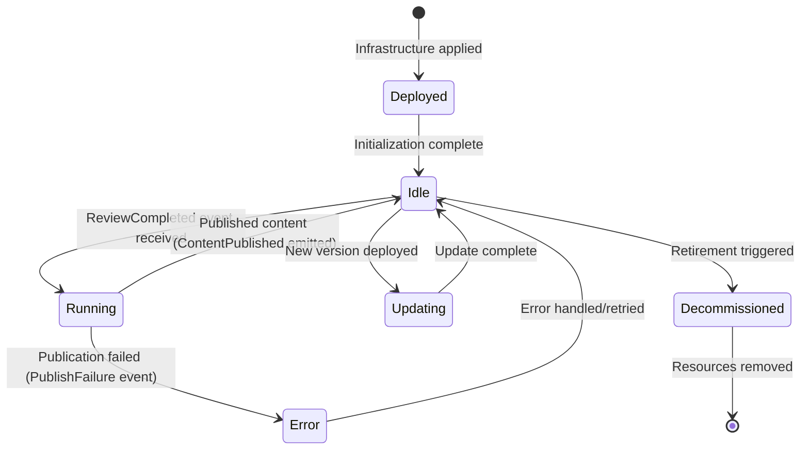

## 1. Document Control
| Version | Date | Author(s) | Reviewer(s) | Description |
| --- | --- | --- | --- | --- |
| 0.1 | 2025-06-11 | AI Engineering Team | AI Engineering Team | Initial draft |

Related documents:
System Architecture Overview
Agent Communication and Events Spec
Security & Compliance Policies
## 2. Overview
### 2.1 Agent Purpose and Goals
The Publish agent autonomously publishes approved content to the final destination (e.g., website or content repository). Its primary function in Phase 1 is to take reviewed articles and make them publicly accessible by converting them to the proper format and deploying them. This agent ensures that once content has passed review, it is reliably delivered to the publication platform without human intervention, closing the content pipeline loop.
## 2.2 Context within VirtualAgentics
Belongs to the IT/Publishing or Web Operations domain – effectively acting as the “webmaster” or content manager.
Works after the Review agent: it subscribes to approved content events and handles final publishing steps. It is the last agent in the Phase 1 content pipeline, outputting content to the live site or repository.
Supports the autonomous pipeline by removing the need for manual content uploading or formatting. It ensures content moves from internal storage to customer-facing channels seamlessly.
## 2.3 Scope & Assumptions

**In scope:**
- Receiving notification of approved content and fetching that content for publishing.
- Converting content from markdown (or draft format) into the format needed for the website (e.g., HTML).
- Uploading the final content to the production content store (which might be an S3 website bucket or a CMS via API).
- Basic post-publish actions like clearing caches or updating indexes if required (Phase 1 minimal here).
- Emitting an event or log that content was published for record-keeping.

**Out of scope:**
- Content scheduling or deciding when to publish (assumed immediate upon approval in Phase 1).
- Multi-channel distribution (e.g., not posting on social media or email – just the website).
- Complex HTML templating or site generation (Phase 1 assumes a simple static publish or that the markdown conversion suffices with minimal templating).
- Manual editorial adjustments (the content is published as given; no agent tweaks content at this stage beyond format conversion).


## 2.4 Dependencies

- **Upstream**: Subscribes to ReviewCompleted events (or equivalent) from the Review agent, which indicate content that is ready to be published. Without an approval event, the Publish agent does nothing.
- **Downstream**: In terms of events, it may emit a ContentPublished event as a final signal (for analytics or acknowledgments). Also, the content is placed in a live content store (S3 bucket for website, etc.), making it accessible to end users. That content store could be considered a dependency too if there's a CDN or website reading from it.
- **External**: Possibly none in Phase 1 if using S3 static site. If publishing to an external CMS or using a service like WordPress API, that would be an external dependency (with network calls). In Phase 1, assume publishing to an S3 website (internal to AWS).
- **Services**: CloudFront CDN if it caches the site (would need an invalidation, perhaps). Not explicitly stated, but likely Phase 1 might not have CDN integration beyond static hosting.

## 3. Architecture & System Context
### 3.1 High-Level Context Diagram
(Diagram to be inserted.) The Publish agent is implemented as an AWS Lambda triggered by an SNS topic for reviewed content (approval events). It retrieves the content (by content_id) from the internal content store (the same S3 bucket used for drafts, or maybe a separate staging area), then processes and transfers it to a public location (for instance, moving the file to a "published" prefix or different bucket accessible by the website). If needed, it converts markdown to HTML. The agent then signals completion. It interacts with AWS services like S3 and possibly DynamoDB (to update content status). There is no direct user interaction; the published content is consumed by web users via the website (which could be backed by that S3 or CMS).
## 3.2 Deployment Target
- **Platform**: AWS Lambda (Python 3.11 runtime).
- **Environment**: Deployed to dev and prod, likely in the same environment as other Lambdas. It might need access to a different S3 bucket (the live site bucket) possibly in a public-facing zone. If the site bucket is public, Lambda may not need VPC. But if it’s internal, ensure correct VPC or endpoint. For our context, likely just normal S3 access.
- **Trigger**: Configured to be invoked by SNS topic (e.g., /content/reviewed). Possibly an EventBridge rule could also trigger it if we had scheduled publishing, but Phase 1 uses event-driven immediate publishing.
## 3.3 Runtime Environment & Resource Profile
- **Memory**: 256 MB (to align with others). Publishing tasks are not heavy, but conversion to HTML might use some CPU; 256 is more than enough. If content is large, converting to HTML might briefly use memory proportional to content size (which is small relative to 256MB).
Timeout: 30 seconds (like others). Typically publishing should be quick (a few hundred ms for S3 operations, maybe up to a second for conversion). But if there's a CDN invalidation step, that might take a few seconds (still under 30).
- **Concurrency**: 2 (similar default limit). It's rare to have multiple publish events at the exact same time given pipeline flow, but if two reviews finish at once, the publish can handle them concurrently. If needed (very high volume), concurrency could be raised, but Phase 1 doesn’t require more.
Resource Usage: Minimal CPU for format conversion, some network I/O to S3. No heavy external calls, so resource usage is generally light.
## 4. Interfaces
### 4.1 Event-Driven Interfaces
4.1.1 Subscribed Events
| Event Name | Topic | Schema Reference | Source |
| --- | --- | --- | --- |
| ReviewCompleted | /content/reviewed | content-reviewed-v1.json | Review agent |

The Publish agent listens for ReviewCompleted events indicating content that passed review. The event includes the content_id and possibly some metadata like status or URL stub. This is the trigger for the publish process.
(If naming differs, e.g., ContentApproved, the subscription would adjust accordingly. Here we use ReviewCompleted as per context.)
4.1.2 Published Events
| Event Name | Topic | Payload Schema | Destination(s) |
| --- | --- | --- | --- |
| ContentPublished | /content/published | content-published-v1.json | (Optional) Analytics systems, or general event bus for logs |

**ContentPublished**: Emitted when an article has been successfully published. It serves as a final confirmation in the pipeline. In Phase 1, there may not be an active consumer of this event (other than logging or maybe triggering a simple counter). But it can be used by future analytics or to signal the CMO agent that the content is live. It typically carries the content_id and possibly the public URL or location of the content.
If any failure occurs during publishing, the agent would instead publish an error event (see Error Outputs) rather than a ContentPublished.
(Note: ContentPublished event might not be strictly required, but including it for completeness. If not needed, the agent could just log success. But having the event is good practice for consistency.)
## 4.2 Synchronous APIs / Webhooks
None. The Publish agent is entirely event-driven and does not expose any web API. (In the future, maybe an API to re-trigger a publish or publish external content could exist, but not in Phase 1.)
## 4.3 Data-Store Interfaces

- **DynamoDB**:
  - *Table*: `va-phase1-content`.
  - *Access*:
    - **Update** – The agent updates the content record to mark it published (e.g., setting status to `"published"` and possibly adding the URL or publish timestamp).
    - **Read** – To fetch any details needed for publishing (e.g., slug or category if stored).

- **S3**:
  - *Source Bucket*: `va-phase1-content-objects` (the drafts bucket).
    - Access: **GetObject** to retrieve the draft content (if not already included in event, which it likely isn't to avoid size issues). Specifically reads from `/drafts/{content_id}.md` or the reviewed location (if Review agent saved an edited version in same place).

  - *Destination Bucket*: `va-phase1-public-content` (for example, a public website bucket or path). Possibly this is the same bucket with a different prefix, or a separate bucket. For static sites, it could be the same bucket but moving from `/drafts` to `/published`.
    - Access:
      - **PutObject** to write the final content file to its public location (e.g., `/posts/{slug}.html` or similar).
      - Possibly **PutObjectAcl** if making it public, but usually bucket policy handles that. If using the same bucket with CloudFront, might not need ACL.
      - Possibly **DeleteObject** if we want to remove the draft file after publish (not mandatory, might keep drafts for record). Phase 1 likely keeps it or doesn’t bother to delete.

(*If using a CMS API or database, those would appear here, but Phase 1 uses S3 for content presumably.*)

## 4.4 External Service Calls

- **Possibly CloudFront Invalidation API**:  
  If the site is served via CloudFront, after uploading new content, the agent might call CloudFront to invalidate the cache for that content or update an index page. If so, it requires an external AWS API call (`cloudfront:CreateInvalidation`).
  - Not sure if Phase 1 includes a CloudFront distribution for site, but likely yes if static site approach. We'll include it as a possible call.

- **Possibly Email/Slack Notification**:  
  Not a core requirement, but one could imagine the Publish agent pinging a Slack channel “New article published: {title}”. If that were done, it’d be an external webhook call. Phase 1 didn’t specify it, so skip.

- If the architecture was different (like publishing to WordPress via REST API), that would be external. However, it appears we stick to AWS static site. So:
  - **CloudFront**: if needed (external to Lambda in the sense of a separate AWS service API).
  - Otherwise, no third-party services.

## 5. Inputs & Outputs
### 5.1 Input Catalogue
Inputs come from the ReviewCompleted event and any referenced data:
| Name | Format | Source | Required | Validation |
| --- | --- | --- | --- | --- |
| content_id | String (UUID) | Event payload (ReviewCompleted) | Yes | Must be a valid UUID referencing existing content in storage. |
| content_topic | String | Event payload or DB | Optional | If provided, used for metadata (e.g., file naming or logging). Not strictly needed to publish. |
| slug or filename | String | DynamoDB (content record) | Optional | If the content has a specific desired URL slug or filename, use it. Otherwise will derive one (e.g., from topic or ID). Validate it's filesystem-safe. |
| format (flag) | String | Possibly event or config | Optional | Indicates format of content (e.g., "markdown") so the agent knows if conversion is needed. By default assume markdown. |
| approved_at | Timestamp | Event or DB | Optional | Not needed for function, but maybe recorded for completeness. |

- *content_id*: Key identifier for the content. The publish agent will use this to fetch the content from S3 (the draft/ready file) and to update records. If missing or not found, publishing cannot proceed.

- *content_topic*: The title or topic of the content. Might be included in the event for reference. The agent might use it to create a user-friendly file name or URL if not otherwise provided (e.g., "AI-in-Finance-How-It-Works" slug). If not provided, we can derive from content or use `content_id`.

- *slug/filename*: In some architectures, the content's URL or filename might be predetermined (maybe the CMO or content generator decided a SEO slug). If the DynamoDB record has a field for slug, the publish agent should use that for naming the output file (like slug.html). If not, it might generate one from topic (like lowercase hyphenated topic). Needs validation to strip unsafe chars, etc. If still not available, fallback to `content_id` as file name (ensures uniqueness but not pretty).

- *format*: If the event indicated the content is already HTML or some other format, the agent would publish accordingly without converting. In Phase 1, we assume the content is Markdown that needs conversion to HTML. Could be an implicit assumption rather than explicit input. We'll treat it as known config: "convert markdown to HTML."

- *approved_at*: More for record, not needed to publish. Possibly used to set published date in some metadata (if generating HTML, might embed date). Could be drawn from event timestamp or record.

The agent validates that `content_id` exists and that it can retrieve the content file. If those fail, it's error output time.

## 5.2 Output Catalogue
Outputs include the actual published content artifact and events/logs:
| Name | Format | Destination | Consumer |
| --- | --- | --- | --- |
| published_content_file | HTML file (text) | S3 bucket (va-phase1-public-content), e.g., /posts/{id or slug}.html | End-users via website, and any site generator/indices |
| content_status_update | DynamoDB item update | va-phase1-content table | Analytics/Reporting (content marked published) |
| event: ContentPublished | Event | SNS topic /content/published (or similar) | (Future Analytics or confirmation logs) |

- *published_content_file*: The core output – the article in final form in the public site store. For example, after conversion, an HTML file is placed in the website bucket. Consumers of this are outside the agent world: it’s the website front-end (could be a static site served via S3 or CloudFront) or users downloading the content. The presence of this file is essentially the end goal.

- *content_status_update*: The agent updates the content’s database record to reflect that it’s published (status = `"published"`, published timestamp, and maybe the URL or path where it was published). This allows tracking and possibly the CMO agent to query how many have been published. It’s internal output used for reporting or future logic.

- *ContentPublished event*: A final event broadcast. It might contain `content_id` and possibly the public URL (like https://site.com/posts/slug). In Phase 1, no active agent might listen, but we include it for completeness and in case a monitoring tool or analytic event collector picks it up. It’s good for decoupling – e.g., a future Analytics agent could subscribe and log web analytics setup.

## 5.3 Error/Exception Outputs
If publishing fails (e.g., can't upload, conversion error), the agent emits error events:
| Error Name | Format | Output (Topic) | Notes |
| --- | --- | --- | --- |
| PublishFailure | Event | SNS /content/errors | Emitted if content cannot be published (e.g. S3 upload failed, conversion error). Contains content_id and error details. |
| PublishPartial (optional) | Event | SNS /content/errors | Emitted if content is published but with issues (e.g., published but index update failed). Phase 1 probably not needed. |

- *PublishFailure*: Covers any hard failure that means the content is not live. For example, inability to fetch the content file (should have been caught in review though, but if S3 had an outage), failure converting to HTML (maybe malformed markdown?), or S3 put failing due to permissions or network. The event will log the error and `content_id` so ops knows that content did not go live. Possibly, as there’s no automatic retry in Phase 1, someone might have to handle it manually.

- *PublishPartial*: In more complex pipelines, you might have a scenario where content is *up* but some ancillary step failed. In Phase 1, not likely needed. For instance, if content published but sending `ContentPublished` event failed (somehow), that’s minor since content is live. We won't complicate with *partial*, we'll just treat anything not fully done as failure.

All errors go to the common `/content/errors` topic. In Phase 1, an ops alarm would catch these so team can intervene. If a *PublishFailure* occurs, the content might remain in "reviewed but not published" state; resolution might involve manual publish or redeploying fix and reprocessing event.

## 6. Internal Processing Logic
### 6.1 Processing Flow Diagram / Pseudocode
- **On ReviewCompleted Event**:
- **Extract content_id (and slug if provided)**: From the event message, get the content identifier and any relevant metadata (title, etc.).
- **Fetch content from S3**: Retrieve the markdown file for the given content_id from the drafts bucket. If not found or access denied, emit PublishFailure (with reason "content file missing"). (This scenario indicates a pipeline bug, as review should ensure content exists. It's an error path though.)
- **Convert Markdown to HTML**: Use a Markdown library (e.g., Python markdown or similar) to convert the markdown text into HTML. If conversion fails (e.g., due to some bad markdown or library error), log and emit PublishFailure (with details). Possibly could attempt a simpler fallback (but not necessary in Phase 1).
- **Compose HTML page (if needed)**: Depending on how the site is structured, possibly wrap the generated HTML content in a basic HTML template (adding <html><body> tags if the markdown library didn’t do full HTML). If the content includes a title or meta, incorporate those. For Phase 1, possibly the markdown content already contains title as a heading which is fine. Minimal template might be applied or none if static site generator does it offline. We assume we may need to produce a standalone HTML snippet or full page.
- **Determine output path/filename**: Decide where to put the file in the public bucket:
If a slug or human-friendly filename is available, use it (e.g., my-title.html). Otherwise use content_id as filename ({uuid}.html). Possibly include date or keep simple. Ensure the extension is .html for static hosting.
Determine S3 key like posts/{filename} or root if no subdir.
- **Upload to public bucket**: Put the HTML content to the public S3 bucket at the decided key. Mark it with the appropriate content-type (text/html). If using a separate bucket, it's likely configured for web hosting or behind CloudFront. If upload fails (network or permission issue), attempt a retry (maybe up to 3 times), if still failing emit PublishFailure.
- **Post-publish actions**:
  - If the site has an index page or a listing of posts, Phase 1 might not auto-update it (maybe out-of-scope or static page). Possibly in Phase 1 there's no aggregated index to update, or it's manual. If needed and trivial (like update a “recent posts” JSON file), we could do it. But likely skip for now.
  - If CloudFront is in front, create an invalidation for the newly uploaded content (and perhaps the index page if it exists). CloudFront invalidation ensures if there was a cache, it's refreshed. This is an AWS API call. If it fails, one might still consider content published (because eventual consistency might catch up). But better to attempt and if fail, log an alert (maybe our partial scenario, or just treat it as publish succeeded but with warning). For Phase 1, assume either no CDN or trivial to invalidate (we can do it and not consider it a publish failure unless critical). Possibly we skip if site is new enough that CloudFront always fetches new file.
- **Update DynamoDB**: Mark the content record as published. E.g., set status = "published", published_at = now, url = generated_url. If this update fails (rare), log error but don't necessarily call the whole publish a failure – the content is live, just the record not updated. We might attempt a retry on the DB update. If still failing, one could emit an error event as well because system state is inconsistent. But likely, treat it as minor and rely on event as source of truth that it was published. However, to be safe and consistent for pipeline, let's attempt and if it fails, we could include that info in the ContentPublished event (like "published but DB not updated"). But to keep it simple, we'll not fail the whole publish if DB update fails; we'll alert separately.
- **Emit ContentPublished event**: If all above steps (especially the S3 upload) succeeded, publish a ContentPublished event with at least content_id and maybe the URL or key of the content. This event goes to SNS and can be picked up by any listeners (future analytics). If SNS publish fails for some reason, log it. The content is already up, so we won't roll back that; the failure to emit event might be acceptable (though it's part of pipeline, not critical to content presence but might affect any dependent processes). Possibly attempt a retry for event publish too.
- **On any error prior to final step**: If an error happened (except DB update or final event emission which we treat as minor), we emit PublishFailure. That means content is not live (if error was fetch or conversion or upload). If some step partially succeeded (like file uploaded but then failure afterwards), we need to decide:
  - If HTML uploaded but DB update failed, content is live but not recorded. In that edge case, we might still send ContentPublished (since user-facing outcome achieved), and separately alert someone to fix DB.
  - If HTML not uploaded, then definitely PublishFailure. If conversion failed, nothing uploaded -> failure. If S3 upload partially done (which usually either success or fail, it's not partial), handle as fail if no confirmation.
- The agent should be idempotent-safe: If the event is redelivered or retried, uploading again is fine (overwrites same file, which is idempotent outcome). DB update again is fine. So no harm if it runs twice, aside from a possible double invalidation or double event. But usually once.

*Pseudocode outline*:
```python
on event ReviewCompleted(content_id, maybe slug):
content = S3.get_object(drafts_bucket, f"drafts/{content_id}.md")
if not content:
publishError("PublishFailure", reason="Draft not found")
return

html = convert_markdown_to_html(content.text)
if conversion_failed:
publishError("PublishFailure", reason="Markdown conversion failed: ...")
return

slug = event.slug or generate_slug(event.topic or content_id)
out_key = f"posts/{slug}.html"
success = S3.put_object(public_bucket, out_key, html, ContentType="text/html")
if not success:
# Optionally retry internal times
publishError("PublishFailure", reason="Upload failed")
return

# Optionally CloudFront invalidate out_key (and maybe '/index.html')
try_invalidate(out_key)

# Update content status in DB
try:
DynamoDB.update(content_table, Key=content_id, Set={'status':'published','published_at':now,'url':out_key})
except Exception as e:
log("WARN: DynamoDB update failed", e)
# continue without failing publish

publishEvent("ContentPublished", {content_id: content_id, url: generate_public_url(out_key)})
```
## 6.2 Key Algorithms or Data Processing
- **Markdown to HTML Conversion**: Using a library like markdown2 or python-markdown. Possibly with some extensions (like code formatting or tables if needed). The agent should ensure relative links or images in markdown still work. If images were included in content, likely ContentGen didn't handle images in Phase 1, so not an issue.
  - Confirm that the output HTML is well-formed. If the markdown had a title (maybe first line ```# Title```), the converter will produce ```<h1>Title</h1>```. We might want to wrap content with ```<html><head><title>Title</title></head><body> ... content ... </body></html>``` if the static site expects full HTML pages. Possibly optional if static site uses something like Jekyll (but if we had Jekyll, we might not be doing conversion here, we’d just output markdown to a repo).
  - We'll assume for Phase 1, we want a self-contained HTML page per article (makes it directly publishable via S3 static hosting). So the agent might need to insert the HTML boilerplate.
  - For simplicity, we can either use a template string or use the markdown library's ability to output full HTML (some libraries have an option to include header and body? If not, we do manual).
- **Slug Generation**: If not provided, implement a simple slug function:
  - Take content topic or title, lowercase it, replace spaces with hyphens, remove non-alphanumeric (keeping hyphens). E.g., "AI in Finance – How it Works?" -> "ai-in-finance-how-it-works". If that yields empty (if no topic given), fallback to using content_id (or part of it).
  -Ensure uniqueness: if using content_id, always unique. If using topic, two content could have same title. Possibly the CMO ensures topics are unique enough. In Phase 1, volume is low and they may all have distinct subjects, but collisions are possible (like "Monthly Report" repeating).
    - Could append content_id or date if collision detection is needed. But for Phase 1, we might ignore that since content_id is always an option (or just always use content_id to avoid collisions, but then URLs are ugly).
    - Possibly store slug in DB at request time to ensure uniqueness (like an index or something). Not done in Phase 1 likely.
  - We'll assume unique or not worry for now.

- **Template for HTML Page**: Could have a very basic HTML structure or none:
  - If static hosting, sometimes you can just host the HTML fragment, but usually you need a full HTML.
  - We'll incorporate a basic template:
    - Possibly add a <title> in the head. We can use the content topic or if none, "Article".
    - Basic styling not asked, likely minimal or external CSS maybe linked globally. Phase 1 might not concern style.
    - If there's a site header or footer, maybe not handled by agent (unless a static include). Possibly out-of-scope, marketing might manually design the site template.
    - So agent just ensures content is a complete HTML page with its title embedded, plus maybe an H1 from the content itself at top.
- **CloudFront Invalidation**: If the site is behind CloudFront:
  - Use AWS SDK for cloudfront: create_invalidation(DistributionId, Paths=[out_key]).
  - This is asynchronous on CloudFront side (returns immediately with an Invalidation ID to check status). We probably don't wait for it to complete (which can take minutes) since the page will eventually propagate. No point delaying Lambda for it, we can fire-and-forget. The AWS API call itself is quick to start invalidation.
  - If CloudFront call fails (due to auth or network), we log and maybe send a warning event. But content is still accessible directly via S3 if needed, or eventually CloudFront will fetch new content after TTL. It's not catastrophic.
- **Retry strategy**: For critical steps like S3 upload:
  - AWS SDK might handle some retries internally (the Python boto3 does for certain errors like throughput issues). We could incorporate a small manual retry loop for put_object if it fails (like try up to 3 times with short wait).
  - Considering low volume, an immediate failure is likely a serious issue (like wrong permissions or bucket doesn't exist), so a retry likely won't fix that. But network blips maybe. We'll include maybe one immediate retry for safe measure.
- **Idempotency & Overwrite**: If the same content is published again (due to reprocessing or event duplication), uploading the same HTML to same key is fine (overwrites identical file). DB update again is fine. CloudFront invalidation repeated is fine (just might say resource already invalidated, but that’s okay).
  - So design is idempotent.
- **Post conditions**: After success, content is accessible at http://public-bucket.s3-website.amazonaws.com/posts/slug.html or behind site domain if configured.
- **Clean-up**: Perhaps after publishing, the draft could be removed from /drafts. Not necessary but maybe to avoid clutter. If we want:
  - Could do a DeleteObject on the draft file. But might be nice to keep for history.
  - Possibly mark in DB that content is published so one could filter drafts vs published.
  - We'll not delete in Phase 1 to keep every step traceable. Also if publish fails half way, leaving draft is fine; if we deleted then failed uploading, we'd have lost content.
- **Notifications**: Maybe future enhancement to notify content team or Slack, but not in Phase 1.
## 6.3 Configuration Parameters
- **PUBLIC_BUCKET_NAME**: Name of the S3 bucket (or bucket + path) where published content goes. Provided via environment (so that dev and prod can use different buckets). e.g. va-phase1-site-bucket.
- **SITE_BASE_URL**: If we want to include full URL in events or logs, we might configure the site’s domain or base URL (e.g., https://www.virtualagentics.com/). Not strictly needed for functionality, but good for constructing the content URL in event notifications or logs.
- **CLOUDFRONT_DISTRIBUTION_ID**: If using CloudFront, the distribution ID for invalidations could be configured. If not set, means we skip invalidation.
- **HTML_TEMPLATE**: Possibly store an HTML template string or file for wrapping content. Alternatively, smaller config:
  - **SITE_NAME** or default title to put in <title> if no specific one.
  - **STYLESHEET_URL** if linking a CSS in head. Hardcoded or configured if needed. Phase 1 might have a simple inline style or none.
- **FILE_NAME_FORMAT**: Perhaps a format string or choice (like use_slug = true or pattern such as posts/{slug}.html). But we can encode that logic in code for now. Not likely to be externally configured in Phase 1 beyond the bucket name and maybe a subfolder name ("posts"). We could have an env var for subdirectory if wanted.
- **MAX_RETRIES**: for any retry logic (like 3 by default). Could be constant.
- **DELETE_DRAFT_AFTER_PUBLISH**: boolean flag. If true, after successful publish, the agent would delete the draft file. If false, leave it. Default false for safety in Phase 1. But configurable if we later decide to clear drafts to save space.
## 6.4 Resource Utilization Expectations
- **CPU**: The most CPU-intensive step might be the markdown to HTML conversion, which is not heavy for documents of a few thousand words. That might take tens of milliseconds. All other tasks (AWS SDK calls) are I/O-bound, waiting on network. So CPU usage is low.
- **Memory**: The content maybe up to a couple hundred KB (2k words ~ maybe 15k characters, which is tiny). Even if images or big content in future, not huge. The markdown library might use some memory to parse but trivial relative to 256MB.
- Converting one article at a time with these sizes is fine.
- If the HTML template is stored or any library loaded, also minor.
- **Network I/O*:
  - Download draft from S3: a few KB to maybe hundred KB of data.
  - Upload HTML to S3: similar size, maybe slightly larger because HTML has tags overhead but not much difference.
  - CloudFront invalidation call: minimal request.
  - DynamoDB update: negligible.
  - So bandwidth usage is small.
- **Execution Time**: likely ~0.5 to 1 second for entire operation. Possibly slightly more if awaiting CloudFront to accept invalidation or if S3 calls take latency. But within 30s by a huge margin.
- Even if concurrently doing 2, doesn't strain memory or CPU.
- If concurrency scaled up with dozens, S3 and DB could handle it, though mass publishing isn't needed.
- The allocated memory CPU share is fine; if we needed faster conversion maybe giving more CPU by upping memory could speed by some small fraction, but not needed.
## 7. Lifecycle Management

## 7.1 Initialization / Startup
- **AWS Clients Setup**: On cold start, the Lambda initializes clients for S3, DynamoDB, SNS, CloudFront (if needed). These can be reused for multiple events in same container. Ensure environment variables for bucket names, etc., are read and stored.
- **HTML Template Loading**: If a separate template file is packaged (for HTML wrapper), the agent could load it into memory at startup (from local file or an environment string). Alternatively, define template string in code, so nothing to load. If we had more complex templates or external references (like fetch a header snippet from S3), could do it, but Phase 1 likely hardcoded minimal template.
- **Secrets**: Not needed. All config are environment or code. If CloudFront uses standard AWS credentials from Lambda role, no secret needed beyond that.
- **Warm-up**: Possibly none needed; first invocation might have a minor overhead loading markdown library. It's fine. Could consider compiling markdown patterns if possible, but overhead is small.
- **Logging context*: Log a startup message including which bucket it's publishing to (useful to verify config).
- No heavy computations to precompute.
- If the system had a backlog of events at cold start, it will process them one by one anyway. There's no persistent state except environment config.
- **VPC cold start**: If Lambda in VPC, cold start might be a bit slower establishing ENI for network. But once up, subsequent events quick. It's fine. Possibly needed if S3 endpoints in VPC or if we needed NAT for external. But not an issue to mention specifically.
## 7.2 Runtime Behaviour Loop
- The Publish agent, like others, is event-driven one-off. Each invocation processes a single ReviewCompleted event. There's no loop aside from that.
- It does not poll or schedule; it strictly reacts to SNS triggers.
- If multiple events come concurrently, AWS may spin multiple container instances up to concurrency limit. There's no internal queue, SNS ensures delivery attempts.
- There's no persistent in-memory state to maintain across events. The Lambda ends after finishing an event. (It might stay warm to handle another event later, but the code is written idempotently each time).
- So runtime loop is basically:
  - Wait for event (implicitly by AWS).
  - Process event, exit.
## 7.3 Error Handling & Recovery
- **In-function errors**: The code catches errors and emits PublishFailure events instead of crashing:
  - If content not found or conversion fails, we handle and return gracefully (with an event).
  - If S3 upload fails, likewise handle (maybe try then fail event).
  - If SNS publish (ContentPublished event) fails at the end, it's a tricky one: the function might log error but still succeed from AWS perspective (we wouldn't want to throw unhandled because then SNS might retry event and double publish content, which we might want to avoid).
    - Best to catch SNS publish failure, maybe send an error event if needed (though if content is live, maybe we could send a partial event or a CloudWatch alarm).
    - Perhaps simpler: log error for manual attention (maybe set CloudWatch alarm on such log).
  - If DB update fails, we log error as mentioned. Possibly also could raise a separate event or alarm since state is inconsistent. But as above, not making the whole pipeline fail since content is live.
- **Lambda errors (uncaught)**: Ideally none remain uncaught. But if one did (like a coding bug), the Lambda invocation would error, causing SNS to retry the event. That could lead to duplicate attempt to publish. It's mostly idempotent (except maybe double ContentPublished event), but better to avoid.
  - We should test and ensure all predictable exceptions are caught. Possibly wrap main logic in a try-catch-all to ensure any unexpected exceptions also result in at least a logged error, and maybe a PublishFailure event if possible.
  - If it did error out without sending any event, SNS will redeliver up to a few times. Possibly the second attempt might succeed if it was a transient error or code bug may just happen again. If after retries it's still failing, the message ends in DLQ if configured.
  - We prefer to capture error and produce a PublishFailure event so at least the pipeline knows to stop expecting it and can alert.
- **Retriable scenarios**:
  - S3 or network: if it was a blip, an immediate retry likely suffices. If it fails after retries, it's likely not transient (like a permission issue or our code logic).
  - We implement minimal retries where it makes sense. Many AWS errors will be captured as exceptions anyway to handle.
- **Poison message scenario**: If something about this specific content always causes a bug (like conversion library hitting a corner case and crashing), SNS would keep retrying and failing. Without manual intervention, it could get stuck.
  - A DLQ could catch it, or our catch-all might at least produce a failure event and not rethrow, thus acknowledging the message to SNS so it won't retry.
  - We will attempt to handle gracefully to avoid infinite retry: e.g., if conversion crashes, catch and fail event, then function returns normally so SNS sees success (from its perspective) even though logically content wasn't published. That stops SNS retries.
  - The downside is content might be lost (we consider it failure and pipeline moves on). But better than stuck in loop.
- **Post-failure process*: If a PublishFailure is emitted, likely a human should see it in logs/alerts and possibly decide to handle it. Could involve:
  - If content publish failed due to a system problem, fix system and perhaps manually trigger publish. They might re-publish by manually invoking the publish agent with same content id (or re-driving the pipeline from review stage).
  - In Phase 1, there's no automated requeue for publish agent. Possibly on re-run of system, a manual trick (like republishing ContentReady events) would do it.
- **Dead-letter queue**: If we have SNS DLQ, any event not processed after retries could be landed there. We might not rely on that if we plan to catch errors internally.
  - Could still configure one as last resort. For example, if our code itself crashed without error event, message could go to DLQ. The team could then inspect it and maybe manually publish the content or fix code and reprocess from DLQ.
  - Summation: The agent tries to always either succeed or explicitly signal failure via events, rather than leaving things hanging.
## 7.4 State Transitions & Persistence
- **State*: The Publish agent doesn’t maintain long-running state; it transitions the content's state from "reviewed" to "published". The actual record of state is in DynamoDB item status and in events logs.
- The pipeline’s idea of content state:
  - Initially content in "draft" (generated, not yet reviewed).
  - After review, content state "approved/pending publish".
  - After publish, "published".
  - These states are tracked by the events and DB updates. The Publish agent updates the DB to reflect the "published" state, completing the lifecycle.
- **Persistence*:
  - The content itself is persisted by moving (or copying) from draft storage to final storage (S3 to S3).
  - The original draft remains (unless we choose to delete). In any case, the published location holds the final content permanently.
  - The DynamoDB entry is updated to reflect final info (published timestamp, etc.), serving as a persistent log or record.
- If a published content needed to be updated or removed, that would be outside Phase 1 (perhaps in future, an agent might unpublish or update on new info, but we have none in Phase 1).
- The system doesn't maintain any per-content memory in the agent itself across runs – all is in external storage.
## 7.5 Shutdown / Termination
- The Lambda will terminate after processing the event, releasing any ephemeral resources.
- If partway through publishing an event the Lambda gets terminated (very unlikely unless it hit timeout or was killed by deployment), potential outcomes:
  - It may have uploaded content but not updated DB or not emitted event. In such a scenario, content is live but pipeline didn't finalize. A new event might eventually re-trigger or an alert might cause manual fix. But since our tasks are quick, normally it finishes well before timeout.
  - If we redeploy code mid-processing (rare because deployment is near instantaneous and Lambdas handle gracefully by either finishing or being replaced after invocation), no major issues, worst case a content might have to be retried.
- There's no special shutdown procedure needed.
- If the service is decommissioned or paused, content might stack up at review stage. But Phase 1 likely means if Publish agent is down, content remains approved but not published until agent returns. Not huge issue for short downtime; for long downtime they'd notice nothing is hitting site and check logs.
- Blue/green deploy doesn’t require draining anything since events not in flight can queue in SNS briefly until new version ready.
## 7.6 Upgrade & Blue/Green Deployment Considerations
- **Deployment**: New versions of the Publish agent can be deployed with minimal fuss:
  - While deploying, if an event arrives, it might be processed by either old version if still active or queued a second until new version is ready. Using Lambda aliases, one can cut over between versions.
  - If worried about double or missing, one could temporarily pause the SNS subscription (but not easily done gracefully). Usually, we trust AWS to handle it seamlessly.
- If doing blue/green (like shifting alias gradually, which SNS doesn't support splitting traffic, so blue/green is basically manual test new alias with test events, then swap alias fully).
- **Rollback**: Already covered earlier: switch alias to old version if needed.
- No ordering guarantee needed on events, each content is independent, so deploying mid-stream doesn't break a sequence or anything.
- Make sure new version has correct config (especially if environment variables changed e.g., bucket name or CloudFront id).
- If new version changes output logic significantly (like using a different bucket or different file naming), ensure that is coordinated with site config (like if now adding a different prefix, site code knows or static site knows where to find it). Those changes need careful planning or simultaneous config updates (maybe in the System Arch).
- Because it’s last in pipeline, a faulty deployment could mean content isn't reaching site. The team should quickly catch that if no new content appears. We have alarms on PublishFailure events as well.
- Possibly maintain backward compatibility: If we changed the content format, the new agent might produce things differently. But since it's end of pipeline, backward compatibility matters only if, say, the site expects a certain format. We must coordinate with site. E.g., if we decided to not wrap HTML with <html> anymore, site might break if it expected full pages (if it's just serving that file raw).
- Usually, any changes to output format is considered carefully to not break site or to update site accordingly.
- Also if we changed event structure (like ContentPublished fields), it mainly affects any subscribers (maybe none in Phase 1).
- Summarily, upgrade is straightforward as far as pipeline continuity, with attention to configuration consistency.
## 8. Security & Compliance
### 8.1 IAM Role and Least-Privilege Policy Summary
The Publish Lambda’s IAM role should allow:
- **S3 Access**:
  - s3:GetObject for the drafts bucket va-phase1-content-objects (specifically the /drafts/* prefix) to read content.
  - s3:PutObject for the public content bucket (e.g., va-phase1-site-content or same bucket’s /published/* prefix). Possibly also s3:PutObjectAcl if needed to set objects public, but if bucket policy auto makes them public based on prefix, we might not need ACL setting.
  - If cleaning up, s3:DeleteObject on drafts (but we chose not to, so can omit).
  - Ensure resource scope to exact bucket ARNs and prefixes (no wildcards beyond necessary).
- **DynamoDB Access**:
  - dynamodb:UpdateItem on va-phase1-content table (for status updates).
  - Possibly dynamodb:GetItem to fetch slug or details (if we didn't pass all needed info in event).
  - Scope to specific table ARN.
- **SNS Publish*:
  - sns:Publish to the /content/published topic ARN (for sending ContentPublished events).
  - Also sns:Publish to error topic /content/errors (for failures).
- **CloudFront Invalidation (if used)**:
  - cloudfront:CreateInvalidation on the specific distribution (Arn including distribution ID).
  - Possibly also cloudfront:GetDistribution if needed (not really for invalidation, just create is enough).
  - This is an AWS global service call outside VPC, so ensure no VPC blocking if any. The role needs permission at least for CreateInvalidation. It can be scoped to the distribution ID's resource ARN (like arn:aws:cloudfront::<account-id>:distribution/<distribution-id>).
- **Logs**: Standard logs:CreateLogStream, logs:PutLogEvents for CloudWatch.
- **No Secrets**: If CloudFront distribution ID is not a secret (just config), no need for secrets manager. If site had basic auth or something (not mentioned), then would require secret. Phase 1, none.
   **Least Privilege**:
  -Don’t allow delete or list on S3 unnecessarily. PutObject and maybe GetObject specifically for certain paths.
  - If we consider general, listing bucket or entire table not needed.
  - The put to S3 needs to cover any key pattern we might use. Possibly easier to allow entire bucket for put and maybe just the prefix for get from draft bucket. But better to restrict to known prefixes to avoid misuse.
  - CloudFront invalidation for a single distribution only, not all.
- **Other compliance**:
  - If bucket encryption is required, the objects should be encrypted by default (S3 default encryption). Our agent just puts objects, which S3 will encrypt because bucket policy says so, or we could specifically add encryption param (but not needed if bucket default).
  - The agent's role doesn’t need access to content beyond what's needed to publish.
## 8.2 Secrets Management
- There are no direct secrets used by the Publish agent in Phase 1.
- The CloudFront invalidation uses IAM auth of the role, no secret keys required (using AWS SDK).
- If an external CMS API were used, that would require an API key/secret, likely from Secrets Manager. But since using AWS S3, none needed.
- The site URL or config are not secrets.
- Ensure not to embed any credentials in code. All is via role policies.
 Possibly consider the domain name of the site as not sensitive, just config.
## 8.3 Data Classification & Encryption
- **Content Data**: The published content is intended for public consumption, so it's not sensitive at all. However, until it's published, it might be considered internal. But once published, it's public. The Publish agent deals with content that is now approved to be public, so there's no confidentiality requirement on it.
- However, all data transfer still occurs over AWS secure channels:
  - S3 access is within AWS network (or TLS if going over internet endpoints).
  - DynamoDB calls are encrypted in transit by AWS.
  - CloudFront invalidation calls are to AWS API (HTTPS).
  - So all in-transit encryption best practices are by default done.
- **At rest**: The content in S3 (both draft and published) is encrypted at rest by S3's SSE (AES-256). The published bucket might be public for read, but objects are still stored encrypted. This is good (though doesn't matter to end user because they get decrypted version via http).
- **Integrity**: The agent should ensure content isn’t tampered with during publish:
  - It reads from an internal source it trusts (the S3 where only our pipeline writes).
  - It writes to a target with correctness.
  - There's no step where data is open to tampering except perhaps if an attacker had access to the pipeline or S3, which is controlled by IAM. So, maintain strict IAM to avoid unauthorized modifications.
- **Compliance with deletion requests**: Not relevant for content. If content needed to be removed (maybe due to policy or user request), Phase 1 hasn't covered that. But since content is not personal data, no immediate compliance concern (like GDPR right to be forgotten). It's marketing content the company itself created.
- **Audit and logs**: CloudTrail logs all S3 and DynamoDB operations by this agent’s role. So if needed, we can audit who published what when. Also, the DynamoDB item has a timestamp which helps.
- **No PII**: It's possible an article might incidentally mention names or something, but as marketing content, there's no expectation of personal user data being processed by this agent. So privacy compliance is not directly applicable here.
## 8.4 Audit Logging Requirements
- The Publish agent logs significant actions:
  - It should log that it received a content for publishing (with content_id and maybe slug) – an INFO log.
  - It logs success of each major step: e.g. "Converted markdown to HTML for content X" (maybe DEBUG or not needed if always succeed).
  - "Uploaded content X to bucket Y at key Z" – success confirmation.
  - If CloudFront invalidation is done, log "Invalidation requested for /posts/slug".
  - If any step fails, log an ERROR with details (and also send event). The logs provide more technical context (stack trace etc).
- These logs form an audit trail in CloudWatch: one can see for each content when it got published and to where.
- Additionally, the DynamoDB update can serve as an audit record (published_at timestamp).
- CloudTrail (for S3 and Dynamo) will show the API calls:
  - e.g., PutObject by lambda-role at time X for file Y.
  - That can be used to verify if needed (rarely needed unless diagnosing an outside-of-pipeline addition).
- We might not have a formal "audit report", but logs + DB suffice.
- If required, we could in future gather contentPublished events into a central log (like an internal analytics DB of published content). But Phase 1 likely uses the DynamoDB table as source of truth for content states.
- There should also be an alarm if content publishing fails (which we'll set up in Observability).
Perhaps maintain a metric or log for content count published for trending (for analytics, but not a direct audit requirement).
- Ensure logs do not contain sensitive info:
  - They will contain content_id, slug, maybe the title. That’s fine (title is intended to be public anyway).
  - No credentials.
  - They might contain partial content or snippet in error messages if conversion failed at a certain line, but that content is intended public anyway.
- So no log scrubbing needed beyond normal.
## 9. Observability
### 9.1 Logging
Logging strategy:
- **Structured Logging**: Use a structured format (JSON or key-value) for important events. Eg:
  - INFO {"action":"StartPublish","content_id":"1234-uuid","slug":"ai-in-finance-how-it-works"}
  - INFO {"action":"UploadSuccess","content_id":"1234-uuid","bucket":"va-phase1-site-content","key":"posts/ai-in-finance-how-it-works.html"}
  - INFO {"action":"Published","content_id":"1234-uuid","url":"https://.../ai-in-finance-how-it-works.html","status":"success"} or similarly at end.
  - ERROR {"action":"PublishFailed","content_id":"1234-uuid","error":"Markdown conversion error: ..."}
- Each log includes content_id to correlate logs to a piece of content.
- We ensure not to log entire content HTML (which is public anyway, but not needed in logs). Summaries like "converted content length X chars" could be logged if needed for debugging sizes.
- **Levels**:
  - Use INFO for normal milestones (starting, uploaded, completed).
  - WARN if something non-critical fails (like DB update or CloudFront invalidation but content is live).
  - ERROR for failures that stop publishing. Those should coincide with sending a PublishFailure event.
- **No PII or secrets in logs**: Only content and technical info. All fine.
- CloudWatch Logs will aggregate these. We might set retention to e.g. 90 days or per policy.
- Could also log timing info if needed (like conversion took X ms, upload took Y ms).
- Possibly assign unique execution IDs (though AWS request ID can serve for grouping logs of one invocation).
- Also ensure the error logs include enough detail to diagnose (like exception message, maybe truncated stacktrace if needed).
- For example, if markdown conversion fails, output the exception text which might say what line or char caused error.
- Logging environment config at startup can also be helpful: "Using bucket A and bucket B, distribution D". This appears in logs once per cold start typically and helps troubleshooting config issues.
## 9.2 Metrics
Key metrics for the Publish agent:
- **Publish.SuccessCount** – increment for each content published successfully (i.e., ContentPublished event sent). Allows tracking volume of published content over time.
- **Publish.FailureCount** – increment for each publishing failure (PublishFailure event). Ideally zero; if >0 triggers alerts (see below).
- Possibly classify failure reasons by dimension (like reason = 'ConversionError' or 'UploadError') to pinpoint if there's a pattern (like every failure is conversion, meaning maybe a bug in conversion for certain content).
- **Publish.LatencyMs** – measure time from event receipt to completion. Since it's short, might not be critical, but we can gather to ensure it remains low. If it spiked, might indicate S3 slowdown or CloudFront issues.
- **Publish.ContentSize** – optionally record size of content processed (in bytes). Not crucial but could correlate with latency or highlight if content sizes are growing beyond expectations.
- **Publish.CloudFrontLatency** – if we wait for invalidation or such, measure that specifically if synchronous (we likely won't wait for complete invalidation, so negligible).
- Because publish events volume is low (similar to content volume), metrics will have low numbers, but still useful for verifying everything that got review also got published (SuccessCount vs. content requests).
- The metrics can be emitted either by using CloudWatch EMF (embedding in logs) or by PutMetric calls for each event.
- Possibly simpler: use PutMetric in code:
  - e.g., after publish success, Publish.SuccessCount +=1.
  - after failure, Publish.FailureCount +=1.
  - measure time from start to finish (with Python time) to record latency.
- The success count should ideally equal the number of ContentReady (assuming everything eventually publishes). If there's discrepancy (failures or still pending), one can investigate.
## 9.3 Distributed Tracing
- If X-Ray is enabled, the Publish agent would trace:
  - The S3 get call, S3 put call, DynamoDB update, CloudFront invalidation as subsegments.
  - It can also include a segment for markdown conversion (as a custom subsegment or just as part of the main).
- If we propagate a trace from earlier pipeline:
  - The ReviewCompleted event might not carry X-Ray trace by default, but if we included trace IDs in events (which we haven't in Phase 1 likely), we could continue it.
  - Without that, each agent will have separate trace.
  - We can still use X-Ray to debug within this agent (like how long S3 calls took).
- X-Ray overhead is small at our scale. Possibly optional to keep off if not needed.
- It might help in diagnosing if any external call is slow (like if S3 was slow one day, the X-Ray trace would show the get or put took longer).
- Possibly enable in dev environment if not needed in prod due to cost. But could enable sampling in prod as well because traffic is low.
- For now, keep as optional. (Our logs and metrics likely suffice given the simplicity).
- If an end-to-end view is desired: one could manually correlate by content_id across X-Ray traces of different agents (not trivial). Might not be worth it. Instead a pipeline sequence diagram or event log is easier.
## 9.4 Alert Thresholds & Destinations
- **Publish Failure Alert**: If Publish.FailureCount > 0 in a given time window (or specifically if any failure event occurs), trigger an immediate alert (since any publish failure means content didn't go out as expected).
  - Could be PagerDuty/severity-high if content pipeline is critical (especially if it's for external customers). For internal content, maybe email/Slack to team suffices. But presumably, publishing content is a key deliverable, so treat failures seriously.
  - In practice, we'd set CloudWatch Alarm on the metric or configure SNS on error events. Perhaps simpler: the error events on /content/errors can be forwarded to an alerting SNS -> email. Because presumably all errors from all agents are important. But to not flood, maybe separate by agent; but since any error is abnormal anyway, central monitoring could catch it and escalate.
- **Delayed Content Alert**: If a content got stuck (review done but no publish within X minutes). Hard to do automatically unless system tracks expected timeline. But we might:
  - Check if number of approved content minus published content is >0 for a while.
  - We could approximate: if SuccessCount (published) is more than a certain ratio behind ReviewCompleted count (assuming we track that metric too) over a period.
  - Simpler for Phase 1: rely on failure alarms. If no failure and content was not published, then maybe it didn't pass review or didn't trigger. Possibly monitor pipeline events overall with a dashboard, but not do an alert since no explicit "content stuck" signal.
- **High Latency**: If average or p95 **Publish.LatencyMs** > some threshold (e.g., > 5s unexpectedly, since normally <1s). Could indicate a slow down (maybe S3 issues). We could set a CloudWatch alarm for extremely high latency in a sample (though our volume is small, maybe not enough data to compute percentiles well). Might not need formal alert, but worth having metric to manually inspect if pipeline seems slow.
- **No Publish events**: If we expect at least some regular content (like daily) but see none published in a timeframe, that may be an upstream issue. Perhaps the CMO or ContentGen would catch that first. But a catch-all might be: if no Publish.SuccessCount increment in X days (and we expected some), alert. This might be too involved to automate given content scheduling isn't continuous (some days might legitimately have none).
- Instead, the content team will likely notice if nothing published when there should have been.
- For Phase 1, the critical one is any failure triggers alert.
- **Alert destination**: Typically an operations channel (like Slack #ops or an email to devops on-call). Possibly the content team as well if a content fails, since they might need to know it didn't go out. But likely first dev team fixes it or manually publishes then informs content team.
- If using a centralized monitoring system, we integrate these CloudWatch alarms into it. For now, assume a CloudWatch Alarm with SNS to on-call email for simplicity.
- Also likely to share error event info (like which content, reason) in the alert so they know what to do.
10. Performance & Scaling
### 10.1 Expected Workload Profile
- Matches review and generation: ~10–50 publish events/day in Phase 1, possibly one at a time.
- Typically content pipeline is not heavy load; a few pieces per day or week. So Publish agent usage is low. Possibly the quietest agent in terms of run frequency (if content generation is weekly or daily).
- **Burst**: Might rarely have bursts. If, say, the CMO agent queued 5 articles to be generated in quick succession (like a batch for a product launch), then contentgen might generate them one after another, reviews them quickly, publish might get 5 tasks in a short time.
  - Concurrency=2 means it might do two at once, then others queued by SNS, finishing within maybe a minute or two all. That's fine.
- **Peak concurrency**: Possibly 2 if two review events delivered at same moment. More than 2 improbable at Phase 1 scale.
- If volume increased (Phase 2 maybe multi-lingual or user content scenario with dozens a day), we can increase concurrency. But even dozens a day is trivial sequentially for a computer, so concurrency 2 is usually fine unless dozens per minute.
- The tasks are I/O-bound mostly; sequential processing of 10 items might take ~10 seconds total, not an issue. Concurrency is more for pipeline speed or if strictly needed to meet a publishing time window.
- **Throughput**: Could easily handle well above Phase 1 demands (hundreds per hour) if needed by scaling concurrency or just sequentially since even sequential can do ~60 per minute easily.
- So the agent is not a bottleneck.
### 10.2 Latency & Throughput Targets
- **Latency*: each publish should complete in < 5 seconds. Our target is ~1 second average.
  - If CloudFront invalidation is invoked synchronously (the API returns quickly but the invalidation propagation is async, so we don't wait for it to actually expire content, just accept request), so that doesn't add much.
  - If a heavy template or extremely large content, maybe up to 2-3s but still way below 30s limit.
  - If content had large images (not likely Phase 1 as generation doesn't do images), then uploading images might add a second or so per image (not in scope).
- The pipeline end-to-end from content request to published likely is a few seconds if all smooth (with contentgen being maybe largest chunk). The publish agent adds negligible delay, which is good for quick content release.
- **Throughput**: For sequential processing, can do maybe 60 contents/min (if each ~1s).
  - If concurrency needed, just scale. But Phase 1 fine as is.
- No formal throughput requirement beyond "should not be slower than content generation pipeline".
- The site likely doesn't want dozens of posts per minute anyway from a business standpoint.
- **Scalability**: If needed, raising Lambda concurrency or even converting to some other architecture (like an asynchronous pipeline or direct integration to CMS) could be done. But not needed at our scale.
### 10.3 Auto-scaling Triggers and Limits
- The Lambda scales automatically up to concurrency=2 reserved. If more events come simultaneously (exceeding 2), the third will wait until one finishes (SNS will hold it or attempt concurrently above limit and get throttled).
- If a scenario arises where, say, content generation pipeline was massively scaled and 10 review events come at once often, we would up the concurrency to 10. But likely unnecessary in Phase 1.
- Memory (256MB) is plenty per function even if content size grows. If in future content included images or attached files, or much larger text, memory usage might need a bump for conversion overhead. Right now, text is small.
- S3 and Dynamo throughput is well within free tier levels basically. If we did mass publishing (like migrating hundreds of posts at once), might consider using multi-part upload if any objects > 5MB (not likely for text).
- At current, one piece might be < 100KB, no throughput issues.
- Watch out for any potential CloudFront API rate limits if called in bulk (like distribution invalidation has limits, often ~ invalidation requests per minute). If we somehow published hundreds of items at once, better to batch them into one invalidation. But Phase 1 won't hit CF rate limits (maybe 2-3 invalidations a day).
- So no special scaling triggers needed beyond what Lambda and AWS handle by default.
11. Testing Strategy
### 11.1 Unit Tests
- **Markdown Conversion**: Provide a sample markdown string and run the conversion function. Verify that the output contains expected HTML tags. E.g., "# Title" becomes <h1>Title</h1>. Use a lightweight markdown library in tests or a stub if the actual library is heavy (but likely just use the same library to ensure parity). Also test edge cases: empty content (should produce maybe empty HTML body), content with special characters (make sure not broken), etc.
 **Slug Generation**: Test the slugify function with various inputs:
  - Normal phrase -> lower-hyphen,
  - phrase with punctuation (ensures they are removed or replaced properly),
  - phrase with non-ASCII (maybe remove or transliterate? depending on design; if out-of-scope, just remove them).
  - No title scenario -> should default to content_id (maybe test that branch).
  - Colliding titles scenario (if our code would append ID or number, but currently we don't implement that; so might skip).
- **S3 interactions (mocked)**:
  -Simulate get_object returning a known markdown content (like "Hello world") as bytes. Ensure our code calls the right bucket/key and gets the data (with mocks, verify call arguments).
  - Simulate put_object and verify it is called with the correct bucket, key (including slug logic), and that the content to put is the HTML from conversion. Possibly verify ContentType = text/html is set.
  - Simulate the scenario where get_object raises an exception or returns no data (like file not found) and ensure the function would catch that and plan to emit a PublishFailure (we might not directly test event emission here, but we can test that the function returns an indication of failure or calls the error publish mock).
  - Simulate put_object failing (throwing exception). Ensure we catch and mark failure.
- **DynamoDB update (mock)** :
  - Verify that we call UpdateItem with correct content_id key and update expression to set status to published and possibly URL/timestamp. If we supply a test timestamp in environment or freeze time, check that correct values are passed. If code uses a simplified client method, just check that function is called once if things go well.
  - Simulate the update throwing an exception (like conditional check fail or throughput exceed). Ensure we log or handle it gracefully (the test might check that our function logs a warning or doesn't raise).
- **CloudFront invalidation (if implemented)**:
  - If code calls a CloudFront client, simulate a successful response. Ensure it is called with correct distribution ID and path (the path should match the file we uploaded, e.g., "/posts/slug.html").
  - We might not wait for invalidation complete, so test just that CreateInvalidation was invoked and we didn't treat it as failure.
  - Simulate that invalidation call throws an exception (perhaps invalid distribution ID config), check that we catch it and just warn (if that's our plan).
- **Full success flow**:
  - Simulate everything succeeding and ensure at end we attempt to publish the ContentPublished event. Use a mock for SNS publish. Check it was called with the right topic ARN and message that includes content_id and possibly URL.
  - Possibly verify the message structure matches our content-published-v1.json expectation (like fields present). But a unit test can only easily verify what we passed to SNS client publish if we have that accessible.
- **Failure flow**:
  - Force a failure at each stage and ensure the code path leads to appropriate error event:
    - Example: make markdown conversion throw; then ensure we did not call put, update, etc. and did call error publish.
    - Another: make S3 put throw; ensure we attempted it given conversion succeeded but then error path triggered event publish for failure after catching.
    - Could test that in each failure scenario, the SNS publish for ContentPublished is not called (so we don't erroneously signal success).
    - Ensure in these cases, the function either returns a special error indicator or at least did the error event call. If our code design is such that the unit test can check a flag or call to a mock error publisher, we can confirm that.
- **Edge Inpu**t:
  - If event missing slug or topic, ensure our code still works (generates slug from id).
  - If content is extremely trivial (like just "Hi"), does conversion and publish still do the right minimal output.
  - If content has relative links or images, though Phase 1 no images, but maybe link [see](other-article), our agent wouldn't fix those references beyond converting to <a>. Not much to test unless we had logic for adjusting links (which we likely not do).
  - If content has HTML already inside (like ContentGen included some), our markdown converter might just pass it through or escape it depending on library. We should test that scenario to ensure we aren't double-escaping legitimate HTML. e.g., a code snippet or a script tag? But less likely. Maybe skip if not expecting it.
- These unit tests rely on mocking AWS services. Could use moto library for S3 and Dynamo to simulate (which actually stores in memory), or simpler approach: monkeypatch boto3 clients to stubs. Possibly simpler to create stub classes with expected interface (get_object, put_object, etc.) and inject them.
- Also test the idempotence: If the code is called twice with same content, ideally it should do same steps. Hard to check idempotence in unit, but we can ensure that if something already exists (the put returns success even if overriding an existing file, which is fine in S3 semantics).
- If we had an optional deletion of draft (we decided not to do in Phase 1), but if did, test that we call DeleteObject at end and handle if fails (but since we skip, no test needed).
- Memory or performance cannot be directly unit tested, but we can at least ensure our code isn't doing obviously inefficient things (like reading the entire S3 file repeatedly or building giant strings in loops unnecessarily; but given small scope, not an issue).
### 11.2 Integration Tests
- **Dev environment end-to-end test*:
  - Trigger a full pipeline in a dev environment (or using localstack to simulate S3 and Dynamo):
    - Put a known markdown file in the draft bucket and simulate a ReviewCompleted event (maybe via SNS or call Lambda handler directly). 
    - Verify after the Publish agent runs:
    - The HTML file appears in the public bucket with correct content and name.
    - The DynamoDB record for that content has status updated (if we have access to check dev DB).
    - The ContentPublished event is either visible on some test subscriber or at least we see a log that it was sent (maybe integrate an SQS or another Lambda to capture published events in dev).
    - Alternatively, if not easy, just verify via logs that it got to "Published content with URL ..." and no errors.
  - Could also run the pipeline up to Review agent as integration, but focusing on publish:
    - We can simulate by actually triggering the publish Lambda either manually or by sending an SNS message to the dev topic it listens to.
    - Use a test content id and pre-populated content.
  - If working with real AWS dev environment:
    - Possibly manually create a DynamoDB item, manually upload draft to S3, then manually trigger SNS event.
    - Check S3 output and DB after.
  - Use AWS CLI or SDK to confirm outputs (like list bucket for new file, get content to confirm it matches expected HTML format).
- **Error injection test in integration**:
  - Purposefully misconfigure or break something to see if PublishFailure event is sent and how pipeline reacts:
    - For instance, change the public bucket name to an incorrect one in a test deploy or environment variable to force S3 put failure (bucket not found or access denied). Then send an event:
      - Expect to see in logs and maybe in error SNS subscriber that a PublishFailure happened.
      - Check that the content was not uploaded (shouldn't exist).
      - And confirm the error event came through (if we have a test subscriber).
    - Another approach: feed a markdown content that maybe the conversion library might have an issue with (though unlikely, we can attempt something like an extremely long word or weird formatting to see if library fails; not easy to force an error without hacking the library).
    - Or simulate environment lacking permissions (like remove the role permission in dev to put S3 object) to test error path. But that requires IAM change which maybe not convenient. Possibly skip, as unit tests can cover logic for that scenario.
    - These tests ensure that even if something goes wrong, the pipeline signals it, and no partial side-effects (like check that Dynamo didn't update if it was supposed to update after failure).
- **Performance observation**:
  - Not a typical integration test, but we can publish a moderately large content (maybe artificially create a markdown of 50k characters) and measure how long it took via logs. This can show if it's comfortably within limits. Could do in dev environment and observe logs.
- **Multiple content test**:
  - In dev, try publishing two events concurrently (if possible):
    - Could either use threading or send two SNS messages at same time. The Lambda likely handles sequentially if concurrency 1 in dev, unless we adjust concurrency. Perhaps set concurrency 2 and see if AWS triggers two concurrently.
    - Or simulate by invoking the Lambda directly in quick succession on separate threads or processes (but direct invocation vs SNS might not fully simulate concurrency in same environment).
    - If done, check that both outputs appear (two files in bucket) and no interference (like each had correct content).
    - Check logs to see if one instance or two instances handled them concurrently (maybe two different request IDs).
  - This assures concurrency works but expected to anyway because AWS separates executions.
- **End-to-end pipeline (manual)**:
  - Ideally, run a scenario from CMO all the way to Publish in a staging environment with one or two content pieces. Then physically verify the content is visible on the target site or bucket.
  - e.g., after pipeline runs, open the S3 static site URL or if integrated with a real domain, open that domain to see if content accessible.
  - That validates not only agent interactions but that the content is indeed delivered to end-users.
- Document any manual steps needed to recover from a failure (maybe not part of automated tests but part of runbook, which we have in Operational sections).
- Integration test for "published content accessible":
  - Possibly write a small script that after publish agent finishes (subscribe to ContentPublished events in dev), it fetches the public URL (if accessible publicly even in dev) to ensure it returns expected content (HTTP 200 and contains known string).
  - That would truly confirm end-user perspective.
  - For dev, if no domain, can access S3 website endpoint if configured. If not configured, skip this test.
### 11.3 Contract Tests
- **ContentReviewed to Publish contract**: Ensure the event fields the Publish agent expects from Review agent are present and correctly named. If using content-reviewed-v1.json, validate a sample ReviewCompleted event (maybe from actual Review test or documentation) against our code:
  - E.g., the code expects content_id key. Confirm schema says content_id. If it was contentId and we mis-match, that's a contract error to catch.
  - If slug or topic is part of event (maybe we decide to include topic in ReviewCompleted event), verify our code can handle if it's there or not.
- **Published event schema**: Validate that the ContentPublished event we send conforms to content-published-v1.json.
  - For example, if schema expects content_id and url, ensure we include those and correct types (string).
  - Possibly use a JSON schema validator in a test, constructing the event as our code would and validate it.
- **System integration contract**: Optionally, cross-verify that the CMO or any other part might listen to ContentPublished. Possibly the CMO agent might in future subscribe to ContentPublished to update some metrics (phase1 not really, but maybe).
  - If so, ensure the event has whatever fields they'd need (like maybe content_id and topic to know what's published). If we think future uses, including topic or title in ContentPublished might be useful for analytics/humans. Not specified but could consider adding it. Not doing explicit contract test since no current consumer, but thinking ahead.
- **Bucket/URL contract**: If front-end expects content at a certain path or naming convention, verify we adhere to that. E.g., if the site front-end code expects all blog posts to be in /posts/ prefix and named by slug, ensure our slug logic meets their naming rules (no uppercase, no spaces, etc.).
  - This might be more an architecture test. Possibly the "System Architecture Overview" doc might define URL scheme. We test that our output path aligns.
  - For example, if site uses slug plus date (like 2025-06-11-ai-in-finance.html but we omitted date, we might be breaking contract with expected site structure).
  - Clarify such with team. For now assume simpler route where site lists just uses whatever we produce.
- **DynamoDB content record contract**: If other parts of system (like CFO or analytics) read the DynamoDB records, ensure we fill the fields they expect. For instance, if an analytics script expects status to eventually become 'published' and an url field present, we do that.
  - If published_at is expected to be in certain format (ISO8601?), ensure we store in correct format (maybe as an ISO string or epoch). Possibly the architecture doc might have guidance. If not, we just pick a sensible format (ISO string or epoch as Number).
  - Later if a reporting tool reads it, they'd adapt anyway. So minor contract to consider.
### 11.4 Load/Stress Tests
- **High Volume Simulation**: Though Phase 1 won't encounter it, we could test the publish agent with a larger number of events to ensure no resources leak or any possible throttling:
  - For example, write a script to invoke the Lambda function 20 times sequentially with different content ids and small markdown to simulate backlog.
  - Monitor memory usage or time. Likely fine, but ensures no cumulative slowdown.
  - If concurrency 2, maybe try launching 4 events at once (we did small in integration, could try larger like 10 concurrently by quickly sending messages, SNS might spawn up to concurrency threads).
  - Confirm all finished and produced outputs.
  - Check CloudWatch for any concurrency throttle logs (none expected as we set concurrency limit).
  - If we simulate extremely large markdown (like artificially 1MB text), see if it still processes within time. Should but if not, we consider raising memory (which also raises CPU).
- **CloudFront rate test**: CloudFront API has limit ~ invalidations per minute (like 1 per minute default, could be more with paid plan). If we publish 5 at once and we call 5 invalidations, maybe the 5th could get rate-limited. We might not catch that until at scale.
  - For test, one could try sending a loop of invalidations quickly to see if AWS returns a Throttling error. If it does, we might consider if we need to batch or throttle calls.
  - However, Phase 1 likely low frequency, so not urgent.
  - Possibly note that if we did have to publish many at once, a better approach is to group them in one invalidation call (which can accept multiple paths).
  - We didn't implement grouping because not needed at low volume. If needed, we might adapt to collect all paths to invalidate up to some limit and call one invalidation after processing all, but that complicates pipeline as separate published events combining, so likely not needed.
- **Resource usage monitoring**: If possible, run a lambda in performance mode and check actual memory usage through CloudWatch (there’s metric for memory used). It should be far below 256MB. Possibly not an automated test but an observation in dev/prod with one large content to confirm headroom.
- **Soak Test**: Not necessary given low usage, but running the pipeline repeatedly over a day to see if any latent issues (like memory leak if container reused many times).
  - Lambdas typically don't leak memory across invocations drastically (and even if they did, container resets occasionally).
  - Could simulate by invoking same function 100 times with small content and see if any slowdown (timing each) or if memory usage creeps up (difficult to measure precisely without X-Ray memory info).
  - Likely fine due to short stateless operations.
12. Operational Runbooks
### 12.1 Standard Deployment Steps
- **Deployment is orchestrated by CI/CD**:
  - Developer merges code changes for the Publish agent. This triggers the pipeline to run tests (including new/modified tests for publishing).
  - If tests pass, CI builds the Lambda package (zips code and dependencies).
  - Terraform (or CloudFormation) is applied to update the Lambda function code and any config changes (like new env var, new IAM perms if we added CloudFront invalidation).
  - Typically, the SNS subscription remains the same (Terraform likely sets it up once and not needed each deploy unless we changed topics or function names).
  - The new code is published as a new version, and the alias (e.g., "prod") is updated to it (depending on deployment strategy).
- After deployment:
  - Confirm in AWS console or CLI that the Publish Lambda's code has updated (maybe by version number or a log line from new version).
  - Possibly run a quick test in dev environment first, then deploy to prod. If using separate stages, might have separate pipeline triggers or manual promotion.
- **Pre-deployment checks**:
  - Ensure any new environment variables (like if we introduced PUBLIC_BUCKET etc. different from before) are set in Terraform to correct values for each environment.
  - If we changed IAM (like adding CloudFront perms), ensure those changes are included and applied. Mistakes in IAM can cause runtime errors.
  - If using CloudFront for first time, confirm the distribution ID is correctly configured and that invalidation call has the needed role perms.
- **Post-deployment**:
  - Monitor the next content through pipeline.
    - If content is not expected soon, maybe trigger a test manually (in production careful, but maybe a harmless test content).
    - Or coordinate with content team to schedule a post-deploy content release to see pipeline in action.
  - Check CloudWatch Logs of the Publish agent after it runs on a content:
    - Look for "Published content..." log or any errors.
    - Check the site to ensure content appears as expected.
  - If anything is off (content not on site, error logs), be ready to rollback quickly (see below).
- Typically, because this agent touches user-facing content, doing deployments at a low-traffic time might be wise (though content publishing might not be continuous anyway).
- Document the deployment in change log or notify relevant stakeholders (so content team knows if any changes in process).
- If deployment involved a new feature like new template or something visible in published pages, double-check that the output is correct format (e.g., new CSS link included).
- For Blue/Green:
  - Possibly test new code on a sample by temporarily pointing dev topic to new function or running it manually. But since it's not user facing until it publishes content, it's simpler to just deploy and watch carefully as above.
- Also consider that in case of not fully automated pipeline, sometimes content team might hold content requests during a deployment to avoid overlap. But pipeline small enough, probably not needed.
### 12.2 Rollback Procedure
- **Immediate rollback via Lambda alias**: If the new publish agent is failing to publish content or otherwise malfunctioning, revert to previous version:
  - In AWS Lambda console or via CLI, point the alias (which SNS uses) back to the last version. This takes effect immediately for new events.
  - This assumes the previous code was left as a version (which is typical).
  - If we not using aliases, we might redeploy the old package. But best to use alias for quick swap.
- **SNS considerations**: The SNS subscription is typically to the alias ARN (if properly configured via Lambda alias). If it's to the function's unqualified ARN, then an alias change may not redirect SNS events (because SNS might be pointed to a specific function version?). Actually, by default, SNS to Lambda uses an unqualified ARN which means current $LATEST or any update. If we deployed by updating function code, SNS triggers automatically use new code.
  - If we want blue/green, we'd have to subscribe alias specifically (supported as of AWS partial, possibly have to do via triggers?).
  - Let's assume standard: SNS triggers always use whatever code is current. So to rollback, we could redeploy old code from history or have to push a quick fix commit to revert.
  - If alias method was used (subscribe alias), then alias switching works.
  - For speed, one might maintain two separate Lambda functions for blue/green but that complicates pipeline triggers. Likely not doing that in Phase 1.
  - So likely rollback is just deploying the previous known-good commit (maybe via CI revert).
  - But since content volume is low, if something is wrong, the damage isn't too widespread by the time we catch it (maybe one or two content items).
- **Manual fallback for content**: If publish agent is down or buggy:
  - The content can be published manually by an operator as a stop-gap:
    - They could copy the draft markdown, convert it manually or use an external tool, and upload to the site bucket themselves.
    - Or run the publish Lambda code manually with fixed code via console if possible.
    - Or temporarily set an environment variable to skip conversion if conversion was the issue and content could be published as markdown if the site can handle it (less likely).
  - Inform content team if a piece will be delayed or had to be manually done.
  - After rollback, any content that was supposed to publish during the bad deployment might need reprocessing:
    - If the publish agent sent a failure, presumably the pipeline stops. The content remains approved in DB but not published.
    - In rollback scenario, either we:
      - Replay the ReviewCompleted events (e.g., manually re-send them from logs or have content team trigger something) to let the stable agent handle them.
      - Or manually publish those few pieces that got stuck.
    -Possibly the easiest in-phase1: if one piece failed, after fix or rollback, content team or dev can manually call the Publish Lambda (using test event with that content_id) to push it out.
      - Or could trigger the review agent to re-send the event (but no built-in, so manual step).
  - Keep track of which content items weren't published due to issue and ensure they eventually do.
- **Root cause and fix forward**: Once stabilized with rollback, analyze logs to identify the bug. Possibly write a quick patch and redeploy when ready.
- Communicate to stakeholders (content team, etc.) what happened if content was delayed or any visible effect (like formatting glitch on site).
- If any content was published incorrectly (e.g., wrong format template), decide if we need to fix those items after the fix:
  - E.g., if our new code published without HTML header and site needs that, the page might display weird. Those items might need to be republished with correct format once fixed.
  - So possibly mark them to re-publish. This can be done by a manual republish or leaving as is if not catastrophic.
- Check if any residual side-effects from bug: e.g., DB statuses inconsistent or double entries. Usually not likely since we update one item.
  - But if the new code erroneously updated DB incorrectly (like cleared fields), rollback code should fix going forward but might need to manually correct those DB entries if critical.
  - Typically, the DB just might have 'reviewed' status but not 'published' if fail. After fix, republish will update to published.
- Keep the older stable package handy if needed to redeploy directly in emergency. If CI can deploy a specific version by commit or artifact, know that process.
### 12.3 Common Incident Diagnostics
- **Content Not Appearing on Site**:
  - Check if a ReviewCompleted event for that content was processed by Publish:
    - Look at CloudWatch Logs for the Publish Lambda around the time. Is there an entry for that content_id? If yes, see if it shows success or error.
    - If no entry, maybe the event never triggered (subscribe issue or earlier pipeline broke). Possibly check SNS metrics or DLQ for unprocessed events.
    - If logs show success, then likely the content is published but perhaps in a location not visible (maybe wrong bucket or slug).
      - Check the S3 bucket manually to see if the file exists (looking for content_id or slug). Maybe a slug mis-generation (like slug is empty so file named ".html" or something).
      - If file is present, maybe the site (CloudFront or DNS) isn't pointing to correct place. Check if the site expecting files in a certain prefix. Possibly path mismatch.
      - If file not present in bucket but logs claimed success, maybe there was a silent error or a race condition. Unlikely, but maybe Dynamo update succeeded but file upload didn't actually happen? Check CloudTrail for PutObject event for that content_id to confirm.
    - If logs show an error:
      - Identify error (e.g., "Upload failed because Access Denied" means IAM issues).
      - Use error message to find cause:
        - Access Denied -> maybe bucket policy missing? Or our role not permitted. Possibly a misconfiguration (like wrong bucket name used or forgot to allow in policy).
        - Conversion error -> maybe a bug with a particular markdown syntax. If so, we might manually fix content (like if a table caused an issue, maybe remove table as a workaround).
        - "NoSuchBucket" -> our config might have wrong bucket name or bucket not created in that env. Check env var and actual bucket existence.
        - CloudFront error -> not critical for content appearance (just caching).
      - Once cause known, implement fix:
        - IAM/Access issues: adjust policy or bucket settings quickly.
        - Code bug (like conversion): maybe circumvent by manually editing content or quickly patch code to handle the edge case (if minor, could do quick fix).
        - Config error: correct environment variable via quick update (less overhead than full code deploy).
      - Meanwhile, if content is urgent, publish it manually (download markdown, run a known good converter or copy to site).
    - After fix, republish content (manually or via pipeline re-run).
  - If multiple contents not appearing, likely a systemic issue (like none published for last N hours).
    - Could be the entire agent is failing (maybe crashed on a particular content and stuck? But since we handle errors gracefully, one stuck content would not block others ideally).
    - Or maybe SNS subscription broke (rare but if someone removed the trigger).
    - Check if any publishes succeeded recently. If none, maybe function disabled? Check Lambda metrics (Invocations vs Errors).
    - Possibly an AWS outage affecting S3 or similar (in that case pipeline might fail at publishing stage).
    - For AWS outage, content might queue (if SNS keeps events and tries later) or fail. If fail, our agent likely caught and gave up with error events.
    - If S3 was down, we'd see errors for each attempt.
    - In such external downtime, not much to do except wait and manually communicate to stakeholders that publishing will resume when AWS resolves issues.
- **Site shows broken format content**:
  - e.g., content is published but appears without proper formatting (maybe missing HTML header or CSS).
  - Possibly our template logic might be wrong, or we forgot to link CSS.
  - If it's our oversight, we might need to update the publish agent to include whatever is missing (like adding a <head> section linking a stylesheet).
  - As immediate fix, we could manually edit the published file to insert needed parts (since it's static).
  - Or redeploy agent with fix and republish content. If small number, manual fix might suffice for immediate, then update agent for future.
  - Also confirm if it's indeed agent's fault or maybe content itself expected a different environment. Eg: If using a separate static site generator in production (maybe not here).
  - Check differences between a working older post (if any) and these new ones. Perhaps older site content had a template and our direct publish lacks it.
  - If so, coordinate with web team: maybe they planned to apply a template externally (if not, our agent must do it).
  - Solve by either:
    - Adjust agent to output full HTML (if it didn't).
    - Or if site is static but uses a client-side logic, ensure at least title and content are properly placed (maybe the site had a generic index that loads posts via JS, but we didn't provide any hooking? Probably not in Phase 1).
  - If multiple posts share broken styling, fix agent and republish them as needed.
- **Delayed CloudFront propagation**:
  - After publishing, maybe the website still shows old content or 404 for a short time because CloudFront cached empty file.
  - If we didn't invalidate (or if invalidation is slow or not done), content might not be immediately visible on site.
  - Confirm if the file is in S3 (if yes, then likely a caching issue).
  - If we suspect that, do a manual CloudFront invalidation via console for that path, see if it appears.
  - To remedy systematically, ensure our agent triggers invalidation as it should. If we omitted it and see caching issues, implement it for next time.
  - In the short term, clear CloudFront or tell users to add cache-bypass query param to see content if urgent.
- **Permission Issues on content file**:
  - If site returns 403 for the new content:
    - Possibly our uploaded object isn't public. Check ACL or bucket policy:
      - Many modern static sites rely on bucket policy granting read access to all objects under certain prefix. If our object is in correct prefix, maybe bucket policy covers it. If not, maybe we needed to set ACL "public-read" on put (not if bucket policy covers it).
      - Check object metadata in S3: if it's not accessible, maybe bucket policy didn't apply (some bucket policies require specific tag or prefix).
      - Quick fix: set ACL via manual or allow our agent to set ACL. But AWS now encourages using bucket policy only, so ensure the object key falls under an allowed prefix.
      - Possibly we put it under a prefix that isn't allowed. Eg: policy allows /posts/* but we put at root or a different directory. If we mis-placed file, move it or adjust policy or output path.
      - If using the same bucket as draft but that is private by default, we may have expected the final output in a separate bucket configured for public. If we accidentally uploaded to the private bucket's another prefix, it won't be accessible.
      - Check if PUBLIC_BUCKET_NAME was correct. Could be we left it as the same content bucket which might not be web-accessible.
    - Fix by ensuring it's in the site bucket. Possibly a config error in env.
  So in summary:
      - Confirm correct bucket usage.
      - Confirm bucket policy or ACL allows public read.
      - Then re-upload (or set ACL on existing object if needing quick fix).
    - Going forward, adjust agent or config:
      - If needed, agent can call put_object(..., ACL='public-read'). But if we have correct policy we shouldn't have to.
      - Check AWS account security settings: some accounts by default block public ACLs, then must rely on bucket policy.
      - If a mis-placed location, fix code to use right bucket/prefix.
- **Scale or performance issues**:
  - Not expected in Phase 1, but if, say, in Phase 2 volume increases and publishing seems to lag:
    - Possibly content generation outpacing publishing if concurrency too low. If we notice backlog (maybe multiple approved content waiting because publish is slow), an operator might see many items in DB stuck at "reviewed" not "published" and error count is zero. That hints maybe concurrency limit or a performance problem causing backlog.
    - Check CloudWatch metrics: if concurrency is at max frequently and queue backlog building, you might see some "ConcurrentExecutions Throttled" metrics on the Lambda.
    - If so, raise concurrency limit accordingly in config.
    - If code performance is issue (rare given the tasks), see which part is slow via X-Ray or logs, and consider optimizations or scaling out (like splitting tasks if one Lambda run was doing heavy multiple content at once, but we do one at time).
  - Possibly CloudFront limit issues if too many invalidations:
    - Could get an alert from AWS if we exceed free invalidations. If pipeline grew that large, consider bundling invalidations or raising distribution config.
- **Ad-hoc requests**:
  - Content or marketing team might ask: "We need to update a published piece (typo fix or additional info)". Phase 1 has no automated update pipeline.
    - On operations side, either:
    - Re-run ContentGen with new prompt (not exactly update, that's create new content).
    - Or manually edit in S3 (quick fix for a typo).
    - Communicate that Phase 1 doesn't handle iterative editing; likely they'd handle small edits manually by direct S3 edit or by pulling content back through pipeline (not trivial).
    - Make note to consider an "update content" flow in future enhancements, possibly as part of Review agent or a separate iteration agent.
### 12.4 Known Limitations
- **No Multi-Channel**-: The Publish agent currently only puts content to the web static bucket. It doesn’t propagate content to other channels (e.g., email newsletters, social media). So, if marketing wants content on multiple platforms, Phase 1 doesn’t cover it. This would be a future extension.
- **No Rollback of Published Content**: Once content is published, the pipeline doesn’t have an automatic way to unpublish or rollback if an issue is found post-publish. The content would have to be manually removed from the site if necessary. This is noted as a limitation; future phases or a manual procedure covers it.
- **Simplistic SEO/Metadata**: The current publishing doesn’t add meta tags (like description, keywords, Open Graph tags) or structured data to the HTML. It’s basically raw article HTML. That might be fine for an initial blog, but for advanced SEO, additional metadata might be needed. This is a limitation in quality of publishing.
- **Formatting Constraints**: If the markdown content uses advanced features (tables, footnotes), the simple markdown-to-HTML conversion might not handle them well (maybe requiring extensions). In Phase 1, content is assumed straightforward. Anything exotic might break or not render ideally. We accepted this risk for MVP.
- **Manual Site Integration**: The agent assumes an S3 static site. If the company later moves to a CMS, this agent would need a redesign or replacement. The current design is not abstracted to easily switch output targets (though we could change the publish method in code, it’s tightly coupled to S3).
- **No Content Aggregation**: The agent doesn’t update indexes or feeds (e.g., an RSS feed or a homepage list). That means after publishing multiple articles, there’s no automatic homepage update to link to them (unless homepage is dynamic or maybe listing all files in the bucket). This might be solved outside our pipeline or left manual in Phase 1, but it’s a known gap for a fully functional blog.
- **Operational Silence on Success**: Apart from metrics, we don’t notify anyone on successful publishes (which might be fine, but maybe marketing might want an email "Your article X is now live"). This is a feature not implemented. As a result, they have to manually check the site to know it’s live. Possibly okay for Phase 1 scale.
- **Content File Retention**: We keep draft and final content indefinitely. Over time, drafts could accumulate. Not a big cost, but some might consider cleaning them. Phase 1 doesn’t address that (and it’s fine given low volume).
- **Time Synchronization**: If content scheduling was needed (publish at a future time), this agent doesn’t handle it. It publishes immediately on event. Phase 1 uses immediate mode only. This is fine now, but a limitation if timed release was desired (future maybe hooking into EventBridge scheduler or a delay).
- **Potential Single Point**: If for any reason the publish agent fails, it halts content going live. We partially mitigate by error alerts, but still, it is a single Lambda controlling output. In a more critical scenario, one might want redundancy or fallback. Phase 1 relies on AWS reliability and manual interventions rather than having multiple methods to publish.
- **Security of Public Content**: If content should be behind auth (not the case here, all public), that would require a different approach (like leaving bucket private and serving via an authenticated channel). Phase 1 assumes all published content is fully public. So any requirement for restricting content is not handled.
- **Analytics Integration**: The agent doesn’t inject any tracking scripts or analytics codes into content. If marketing wants Google Analytics or similar, that needs to be present in the site template (outside our pipeline) or we would have to modify content with such snippet. Not done in Phase 1, so published pages will have no tracking unless the static site template includes it (if we had a global template, which we might not). This is an operational insight – if they realize no analytics, they might later embed a script tag via the publishing pipeline or static site configuration.
13. Future Enhancements
### 13.1 Planned Phase 2+ Capabilities
- **Multi-Channel Publishing**: Extend the agent (or add new ones) to publish content to other platforms. For example, automatically post a link and excerpt to social media (Twitter, LinkedIn) or cross-post the article to a Medium blog. This could be triggers off the ContentPublished event. The current agent might remain for website, while new sub-agents handle other channels.
- **CMS Integration**: Instead of (or in addition to) static S3, Phase 2 might integrate with a content management system (like WordPress or Contentful). The agent would then call CMS APIs to create the post, including metadata (author, categories, etc.). This likely means significant changes: use of a different external API and handling authentication (would involve secret management, mapping fields). The Phase 1 design keeps things simple with static publishing, but CMS integration is a logical next step for more robust content management.
- **Scheduled Publishing**: Introduce the ability to hold content and publish at a scheduled future time. This could involve modifying the CMO or Publish agent logic: e.g., if content has a "publish_date" in the request, the Publish agent could schedule itself via a delayed trigger (maybe putting the event in a delay queue or using EventBridge to invoke at that time). Alternatively, hold content in DB until time and then trigger publish. Phase 2 could incorporate that for planned campaigns.
- **Site Index and Notifications**: Enhance publishing to also update an index page or RSS feed, and notify subscribers:
  - For example, generate or update a JSON/XML feed of latest articles (RSS) in the bucket for subscribers.
  - Update a "recent posts" section on the homepage (if not dynamic, perhaps by regenerating an index file listing titles and links; this could be done by reading the DynamoDB table or maintaining a separate index in DB that is used to generate homepage).
  - Also, send an email or Slack notification internally that "Article X has been published". Possibly tie into an email marketing system for external newsletter.
- **Better SEO/Metadata**: Phase 2 might have the pipeline incorporate meta description, keywords, etc. Perhaps the CMO agent could generate meta description and pass it through, and the Publish agent would embed it in the HTML <head>. Also support for Open Graph tags for social media (title, description, image). This requires storing those in DB or events and updating templates.
- **Handle Images and Media**: If content generation in Phase 2 includes images (either by linking or generating with DALL-E etc.), then the Publish agent must handle them:
  - Possibly upload images to a CDN or S3 as well and adjust HTML to reference them.
  - Ensure images have correct permissions and paths.
  - Could involve scanning content for image links (like if ContentGen returns markdown with  placeholders), then retrieving those images (maybe from a link or generating them), storing in S3, and replacing the src in HTML.
  - That’s a complex addition but a realistic one for richer content.
- **Analytics Integration**: Automatically embed analytic tags or tracking codes on the page. For example, injecting a Google Analytics <script> or a tracking pixel ID. Could be configured via environment. This ensures all pages have analytics without manual editing.
- **Performance improvements**: If content volume increases drastically:
  - Possibly switch to batch publishing if needed (though event-driven is fine). Or introduce concurrency scaling if needed.
  - Or if static site becomes large, consider a static site generator integration (like generating an entire site rather than one page at a time). That might be beyond single agent – more of a build process. Not likely needed soon, but maybe if the structure becomes more complex (like needing to regenerate category pages each time).
- **Error Resilience and Self-healing**: Future pipeline enhancements might include automatic retries for transient failures, or storing failed events and trying again after a cooldown. E.g., if publish fails due to a momentary S3 glitch, Phase 2 could reattempt after a minute via a DLQ redrive.
- **User Feedback Loop**: Perhaps add a step where after content published, it notifies the CMO agent or another feedback mechanism with a link, and maybe monitors page performance (views, etc.) which the CFO might care about. That loop is future (like the CFO agent might collect traffic metrics to gauge content ROI). The ContentPublished events could be input to such analysis.
- **Refine Slug Logic**: If we see slug collisions or want consistent URL patterns (like including date or category in URL), refine slug generation. Possibly incorporate content categories or ensure uniqueness by adding ID if needed.
- **Internationalization**: If Phase 2 includes multi-language content, the Publish agent could need to handle different target sections for languages, maybe different buckets or subfolders for locales (like /en/slug.html, /fr/slug.html). We’d add logic based on a content language field.
- **Templating engine**: If site design gets more complex, using a templating engine (like Jinja2 or similar) for HTML might be better than string concatenation. Could incorporate that if multiple sections (header, footer, etc.) need to be combined. Possibly even fetch templates from S3 to allow updating site design without code deploy.
- **Partial Update Flow**: If editing an existing article becomes needed, Phase 2 might require a way to trigger republish of an updated draft. Possibly the pipeline could handle "ContentUpdateRequest" events and Publish agent would replace existing file. Currently, it always overwrites if same slug used, so it could already handle updates by just republishing same slug (the new content would override old). But the pipeline would need to differentiate new vs update in metrics maybe. Also consider if the URL or slug should change on updates (usually no, so slug stays same, our logic already does that if topic unchanged). So maybe minimal changes needed besides having a path to trigger such updates via events.
### 13.2 Technical Debt & Refactor Candidates
- **Hardcoded Strings & Duplication**: Currently the HTML template (if any) might be hardcoded in code. That is technical debt because changing site look requires code change. We should refactor to load template from an external file or environment. E.g., store an HTML skeleton in S3 or in an environment variable (though env is not great for large text). Or use a templating library for cleanliness. As site evolves, making this dynamic will reduce code changes for cosmetic updates.
- **Unified Config Management**: We have bucket names and such in env variables. As we add more (like distribution ID, template path, etc.), consider grouping config or using Systems Manager Parameter Store for better management, especially if more environments. Not urgent now, but as config grows, a refactor to centralize configuration loading could be prudent.
- **Better Error Handling Patterns**: Right now we do try/except and manual event on error. If multiple agents follow this pattern, maybe abstract an error reporting function or use a decorator pattern to catch exceptions and send events automatically. Could reduce code repetition and ensure consistency (like ensure every error event has content_id and agent name etc.). Right now each agent implemented its own logic – refactor to a common utility in the code repository might be beneficial as technical debt reduction.
- **Testing and Staging**: As pipeline grows, manual test gets harder. Might invest in an automated integration test suite (maybe using a localstack or a staging stack with test events). Setting up a pipeline test harness would pay off to catch issues pre-prod. So, incorporate infrastructure for that in Phase 2 (this is more process than code refactor, but relevant to quality).
- **Monitoring Consolidation**: Each agent posts metrics and events. A future refactor could be building a unified dashboard or log aggregator that shows an entire content's journey (like using content_id to correlate logs across agents). We partially do that by content_id in logs, but maybe building an ELK or CloudWatch Insights query across all agent logs by content_id might be formalized. This is not code in the agent, but overall monitoring improvement (less of debt, more of an enhancement).
- **Remove Redundancy between DB and events**: We both update DB and send event about published status. Possibly that’s double. In future, if we trust events, maybe DB is just for content data not state, or vice versa. Right now, it's fine, but if we find it redundant, could simplify. However, DB is good for queryable history, events are ephemeral.
- **Orchestrate with Step Functions?** If pipeline complexity grows (with parallel tasks or conditions), might consider refactoring from decoupled events to an orchestrator (like Step Functions or simple workflow). That could centralize error handling and state transitions. It's a big change, likely not needed until more complexity (maybe beyond Phase 2).
- **Documentation and Traceability**: We should ensure each piece (like if slug generation logic changes, update documentation so others know how URLs are formed). Also document the place in code where templates reside for easy update. Reducing technical debt around "tribal knowledge" by proper docs is an action item (not code refactor, but process).
- **Cleanup of Old Drafts**: If needed, a small refactor to incorporate deletion of drafts after publish might be considered to save space or avoid confusion. It's low priority because cost/storage is minor, but as a maintenance tasks perhaps in future or via a separate cleanup script (maybe after verifying content in Prod, the draft could be removed).
- **Include more content metadata**: If later we add categories/tags, the pipeline will pass those through. We might need to refactor the publish agent to handle such (e.g., place content in category subfolders or include tags in HTML meta). That’s more new feature than refactor, but it would require code changes we can foresee and perhaps design for (like we could already structure the code to easily add category handling).
- **Idempotency and Replays**: If not already, consider making publish re-runnable easily. It's mostly there. If we wanted to replay an entire backlog (like after a long outage, to republish all pending), maybe build a small script or incorporate logic to detect items in DB with reviewed status and publish them. For now, not needed, but in post-mortem of any incident, that might come up. Could refactor to have an on-start scan for any missed items (dangerous if misused, but could be behind a manual trigger).
- **Separation of Concerns**: Right now, this agent does conversion and publishing. If in future we had different output formats (like also produce a PDF version of article), should that be separate agent or integrated? Possibly separate to keep responsibilities clear. Not an immediate refactor, but something to consider if expansion happens.
