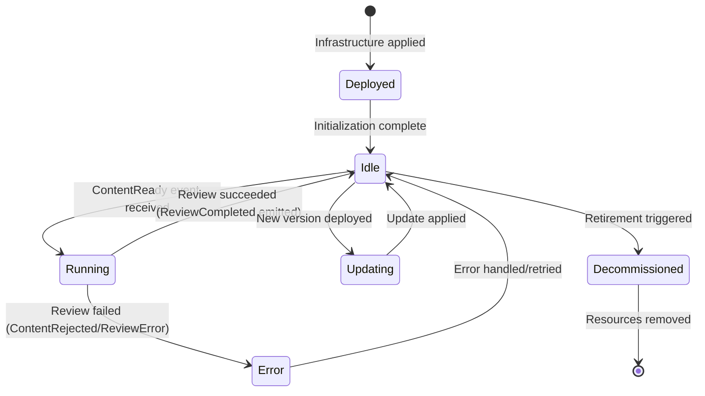

VirtualAgentics Phase 1 — Review Agent Design Specification
1. Document Control
| Version | Date | Author(s) | Reviewer(s) | Description |
| --- | --- | --- | --- | --- |
| 0.1 | 2025-06-11 | AI Engineering Team | AI Engineering Team | Initial draft |

Related documents:
System Architecture Overview
Agent Communication and Events Spec
Security & Compliance Policies
2. Overview
2.1 Agent Purpose and Goals
The Review agent autonomously reviews and validates generated content to ensure it meets quality and compliance standards before publication. Its goal is to emulate an editor: catching errors, inconsistencies, or policy violations in the content produced by ContentGen, and only approving content that is fit for publishing. This safeguards content quality in Phase 1 without human intervention.
2.2 Context within VirtualAgentics
Operates under the Content/Quality Assurance function – essentially the “editor” in the Marketing pipeline.
Works in tandem with ContentGen (as its downstream consumer) and the Publish agent (as its upstream provider). It receives content from ContentGen and passes approved content to Publish.
Supports autonomous pipeline execution by providing an automated gatekeeper that ensures only acceptable content moves forward.
2.3 Scope & Assumptions
In scope:
Automated validation of article content (spell check, basic grammar check, length verification, and compliance with simple content policies).
Parsing content from S3 (markdown text) and analyzing it for issues.
Emitting an approval event (ReviewCompleted) if content is acceptable, or an error/rejection event if not.
Out of scope:
Deep fact-checking or understanding of content accuracy (Phase 1 does not include AI fact verification).
Human-like subjective editing (stylistic improvements, tone adjustments beyond simple rules).
Complex compliance checks (e.g. legal review) – only basic rules (no forbidden words, etc.) are enforced in Phase 1.
2.4 Dependencies
Upstream: Listens for ContentReady events from the ContentGen agent. This event signals a draft article is available for review (and points to the content location).
Downstream: Publishes ReviewCompleted (content approved) events consumed by the Publish agent. Also may publish error events for content that fails review, which could be consumed by monitoring or a future workflow.
External: No external third-party API in Phase 1. The Review agent’s checks are done via internal logic or possibly open-source libraries (e.g. a Python spell checker). (Future phases might integrate external plagiarism or grammar APIs, but not currently.)
3. Architecture & System Context
3.1 High-Level Context Diagram
(Diagram to be inserted.) The Review agent is an AWS Lambda that is triggered by ContentReady events via SNS. It retrieves the corresponding article from S3 (using the content ID provided), and possibly metadata from DynamoDB. It then runs a series of checks on the content text. If the content passes, the agent emits a ReviewCompleted event. If the content fails, it emits a failure event (and in either case logs the results). The Publish agent subscribes to the success events. The Review agent itself does not interact with external networks – all data is within AWS.
3.2 Deployment Target
Platform: AWS Lambda (Python 3.11 runtime, same standard as other agents).
Environment: Deployed in both dev and prod AWS accounts. It runs in the same VPC as other pipeline Lambdas, with access to internal services (S3, DynamoDB). It does not require outbound internet for Phase 1.
Integration: The Lambda is subscribed to the /content/ready SNS topic (for triggering on content ready events). It outputs to another SNS topic for review outcomes.
3.3 Runtime Environment & Resource Profile
Memory: 256 MB allocated. This agent’s processing is lightweight (text analysis) and doesn’t need large memory, but 256 MB provides comfortable overhead and consistency with other Lambdas.
Timeout: 15 seconds (could be less, but set to 30s by default to match others – we assume ~15s is more than enough for checks, and the Lambda default 30s is acceptable). The actual checks typically complete in < 2 seconds for a few-thousand-word article.
Concurrency: 2 (default concurrency limit, matching ContentGen) – meaning it can review two pieces of content in parallel if needed. Usually content arrives sequentially or in small bursts, so this is sufficient. (Can be adjusted if needed, but unlikely that more than 2 reviews occur simultaneously given ContentGen’s concurrency.)
4. Interfaces
4.1 Event-Driven Interfaces
4.1.1 Subscribed Events
| Event Name | Topic | Schema Reference | Source |
| --- | --- | --- | --- |
| ContentReady | /content/ready | content-ready-v1.json | ContentGen agent |

The Review agent is triggered by the ContentReady event. This event contains at minimum a content_id (to locate the content), and possibly the content topic or other metadata. Upon receiving this event, the agent knows a new article is prepared for review.
4.1.2 Published Events
| Event Name | Topic | Payload Schema | Destination(s) |
| --- | --- | --- | --- |
| ReviewCompleted | /content/reviewed (or similar) | content-reviewed-v1.json | Publish agent (for approved content) |
| (Error events)e.g. ReviewFailed | /content/errors | content-error-v1.json (common error schema) | (Monitoring or future handling) |

ReviewCompleted: Emitted when an article passes all review checks. This event signifies that the content is approved and ready for publishing. It typically contains the content_id and perhaps a flag or message "approved". The Publish agent listens for this to proceed with publication.
ReviewFailed (or ContentRejected): If the article does not meet standards (e.g. contains disallowed content or too many errors), the agent will emit an error event. In Phase 1, there is no separate consumer agent to handle a rejection; this mainly serves logging/alerting purposes. It goes to the common error topic. The payload would include the content_id and reason for rejection (e.g. "profanity found" or "too short").
(Note: The exact naming of the topics and event types for success vs failure can be adjusted; here we use ReviewCompleted for success as per docs and treat failures as part of error events.)
4.2 Synchronous APIs / Webhooks
None. The Review agent does not expose any synchronous API or endpoint. It only reacts to events.
4.3 Data-Store Interfaces
DynamoDB:
Table: va-phase1-content (same content metadata table used by ContentGen).
Access: Read/Update – The agent may read the metadata for context (like original requested length or any flags). It may also update the item to record the review result (e.g. set a status field to "Reviewed" or add a review timestamp). Specifically, it might do an UpdateItem to mark content as reviewed/approved and perhaps add a field for any changes made.
S3:
Bucket: va-phase1-content-objects.
Access: Read – Retrieves the content file from the /drafts/{content_id}.md path in S3 to perform the review.
Access: Write – If the agent makes minor edits or wants to mark the content as reviewed, it could write an updated version (for instance, replacing the draft or writing to a new prefix like /edited/{content_id}.md). In Phase 1, we assume no significant content alterations, so writing back might not be used or it might overwrite the draft if small auto-fixes are applied.
(No other data stores in Phase 1 for this agent – e.g., no separate repository of banned words beyond maybe an in-memory list or a config file.)
4.4 External Service Calls
None in the current scope. All review logic is internal (code and possibly local libraries).
(Potential future external calls could include grammar checking APIs, plagiarism detection services, etc., but those are not implemented in Phase 1.)
5. Inputs & Outputs
5.1 Input Catalogue
The input to the Review agent is the data contained in the ContentReady event plus the content it references.
| Name | Format | Source | Required | Validation |
| --- | --- | --- | --- | --- |
| content_id | String (UUID) | ContentReady event payload | Yes | Must be a valid UUID format; must correspond to an existing content item in storage. |
| content_topic | String | ContentReady event payload (or DynamoDB) | Yes | (If provided) Non-empty; matches the topic of the article. Used for context checking (optional). |
| content_path | String (S3 key) | Constructed from content_id or provided | Yes | Must point to the location of the draft content (e.g. drafts/{id}.md). The agent will verify the file exists in S3. |
| requested_word_count | Integer | DynamoDB (from content metadata) | Optional | If available, used to compare with actual length. (No direct validation needed, it’s reference info.) |

content_id: Identifies which piece of content to review. The event provides this, and it’s used to fetch the actual content from S3 and any metadata from DB. The agent will confirm that this ID is valid and locate the file; if not, that’s an error.
content_topic: The topic or title of the article. Often included in the ContentReady event so the review agent knows what the article was supposed to be about. This can be used to do a sanity check (e.g. ensure the content indeed mentions or is relevant to the topic). If not provided in the event, the agent can fetch it from the DynamoDB record.
content_path: The storage location of the content, typically derived from content_id (the design decision: ContentGen stored content in S3 using the content_id). The agent might implicitly know the path pattern (drafts/ID.md). It validates the file can be accessed.
requested_word_count: The length that was requested by the CMO. The agent can use this as a guideline to check if the article length is reasonable (for example, if requested 1000 words but actual is 300, that’s an issue). This is optional input gathered from the metadata.
The Review agent will treat absence of expected inputs as errors. For example, if the content file is missing or corrupt, that triggers a failure.
5.2 Output Catalogue
Upon processing, the Review agent produces either an approval event or an error event. For successful reviews:
| Name | Format | Destination | Consumer |
| --- | --- | --- | --- |
| event: ReviewCompleted | Event | SNS topic /content/reviewed | Publish agent (content is approved) |
| content_status_update | DynamoDB item update | va-phase1-content table | (For record-keeping / analytics) |

ReviewCompleted event: This event contains the outcome of the review. It will at least include content_id and a status (like "approved"). It may also include a summary of any minor fixes applied, or simply signal that content with that ID is ready to publish. The Publish agent uses this as a trigger to proceed.
content_status_update: The agent updates the content’s record in DynamoDB, setting a field such as status = "reviewed" (or "approved") and reviewedAt = timestamp. This isn’t an externally consumed output per se, but it’s an effect that later allows traceability. Analytics or the CMO could later query the table to see which content is published versus still in review, etc.
For failure cases, see Error Outputs below.
5.3 Error/Exception Outputs
If content fails the review or if an error occurs during the process, the agent emits error events:
| Error Name | Format | Output (Topic) | Notes |
| --- | --- | --- | --- |
| ContentRejected | Event | SNS /content/errors | Emitted if the content does not meet quality standards (e.g. contains disallowed material or severe issues). The event includes the content_id and reasons (e.g. “rejected for profanity”). |
| ReviewError | Event | SNS /content/errors | Emitted if an internal error occurs (e.g. cannot fetch content from S3, or a runtime exception during checking). Includes content_id and error details. |

ContentRejected: This is a deliberate negative outcome – the content is generated fine but is deemed unpublishable by the automated checks. For instance, the agent finds banned words or the content is off-topic or too low quality (maybe mostly gibberish). In Phase 1, this event might not trigger an alternative flow (since no human review), but it alerts that this content should not be published. The pipeline will essentially end for that content (Publish agent might either not get any event or we ensure it does not proceed without a ReviewCompleted).
ReviewError: If something goes wrong in the review process itself (like an exception, or missing content file), this event flags an operational issue. The content might still be publishable, but due to error, it wasn’t reviewed. In this case, likely the content will also not be published because no approval was given. This event is mainly for logging/alerting an operational fix is needed.
Both types of errors go to the common error topic. In Phase 1, these would be monitored (e.g. CloudWatch Alarm) but not automatically handled by another agent.
(Note: The actual schema for these error events could reuse a general content-error-v1.json with fields for content_id, stage ("review"), and message.)
6. Internal Processing Logic
6.1 Processing Flow Diagram / Pseudocode
On ContentReady Event:
Extract metadata: Read content_id (and other info like topic) from the event.
Retrieve content: Fetch the article text from S3 using the content_id (e.g., get object drafts/{content_id}.md). If this fails (object not found or access denied), emit a ReviewError (cannot proceed).
Load content text: Parse the Markdown file content into plain text or a structured form (could use a Markdown parser if needed, or operate on raw text for checks).
Run validation checks:
Length check: Count words or characters in the article. Compare with the requested word_count (if provided). If the article is significantly shorter or excessively longer than expected (threshold can be say ±20%), flag an issue.
Spellcheck & Grammar: Use a spell-checking library or simple dictionary to find obvious spelling mistakes. Use basic grammar heuristics or external library (if included) to catch glaring grammar issues. The agent might tolerate a few minor issues (or fix them) but too many could cause rejection.
Profanity/Blacklist check: Scan the content for any disallowed words or phrases (maintain a list of banned words like hate speech, etc., provided by compliance). If any are found, mark as immediate rejection.
Tone/Style check: (Basic in Phase 1) – e.g., ensure the content is not just repetitive nonsense. This is hard to quantify automatically; the agent might check that the article has at least a title and a few paragraphs, or that it mentions the topic if topic is provided (to ensure relevance).
Apply minor fixes (if possible):
For example, if a word is misspelled and it’s easily corrected via a known suggestion, the agent could auto-correct it. Or if the content lacks a final newline, add it. These small adjustments can be done directly in the text buffer. (Phase 1 fixes are minimal; anything complex is left unfixed and possibly just triggers a rejection if severe.)
Decision:
If no major issues are found: mark content as approved.
If issues found that are within acceptable limits: possibly still approve, maybe log a warning (e.g., 2 spelling errors fixed is okay).
If issues exceed threshold or any critical issue (banned content) appears: mark as rejected.
On approval path:
Update DynamoDB: set status to reviewed/approved for content_id.
If content was modified (e.g., minor fixes), save the corrected content. This could mean overwriting the draft file or saving an “edited” file. (For simplicity, we might overwrite the original draft with the corrected version, or just keep changes in memory if trivial.)
Emit ReviewCompleted event (with content_id and status=approved).
On rejection path:
Update DynamoDB: could set status to "rejected" (or remove published flag).
Emit ContentRejected error event with reasons. (No ReviewCompleted event is sent, so Publish will not act on this content.)
On any internal error:
If, say, the DynamoDB update fails or some unexpected exception arises, emit a ReviewError event. Possibly also retry minor operations if appropriate (not usually needed for idempotent DB update – if it fails, it might be okay to just proceed with event since Publish can rely on event alone).
Pseudocode:
on event ContentReady(content_id, topic, requested_word_count):
text = S3.get_object(f"drafts/{content_id}.md")
if not text:
publishError("ReviewError", reason="Content file missing")
return

issues = []
word_count = count_words(text)
if requested_word_count and abs(word_count - requested_word_count) / requested_word_count > 0.2:
issues.append(f"Length mismatch: got {word_count}, expected ~{requested_word_count}")

misspellings = spellcheck(text)
if misspellings_count := len(misspellings) > 0:
for word in misspellings:
if word in COMMON_MISSPELLINGS:
text = auto_correct(text, word)
# else could mark or ignore minor if below threshold
if misspellings_count > ALLOWED_MISSPELLINGS:
issues.append(f"{misspellings_count} spelling errors")

if contains_banned_words(text):
issues.append("Found banned language")
# immediate rejection likely

if topic and topic not in text:
issues.append("Topic not referenced in content")

if issues:
if any(issue indicates critical for issue in issues):
# e.g., banned words or too many issues
publishError("ContentRejected", content_id, reasons=issues)
update_status(content_id, "rejected")
return
else:
# Non-critical issues (maybe auto-fixed or minor)
# We can log them but still approve
log("Warnings in content", issues)

update_status(content_id, "reviewed")
if text_modified:
S3.put_object(f"drafts/{content_id}.md", text)  # update with corrections
publishEvent("ReviewCompleted", {content_id: content_id, status: "approved"})
6.2 Key Algorithms or Checks
Spell Checking: The agent might use a simple English word list (or Python’s language_tool or pyspellchecker library) to identify misspelled words. Given Phase 1 constraints, assume a basic approach: identify words not in dictionary, exclude proper nouns. If only a handful, it might ignore or correct if obvious (like “teh” -> “the”). If many misspellings, that indicates low quality (AI usually doesn’t misspell, so numerous misspellings could mean gibberish content).
Grammar/Clarity: A full grammar check is complex. Phase 1 might limit this to simple heuristics: e.g., check that sentences are not extremely long (run-on), or that the article has multiple sentences per paragraph, etc. Optionally, if an open-source grammar tool is easy to integrate, it could be used to count grammar issues. We treat grammar leniently unless extremely bad.
Banned Content Filter: The agent maintains a list of disallowed words/phrases (for example, curse words or discriminatory language). Implementation: a simple substring or regex search on the lowercase content. If found, immediate rejection. This is straightforward but important for brand safety.
Relevance Check: One way to ensure the article is on-topic is to verify the main topic keyword appears at least a few times. For example, if the topic is “Blockchain in Healthcare,” ensure "Blockchain" or synonyms appear. The agent might also check that the content isn't too far off in general (maybe ensuring at least X% of sentences contain words from the topic description). This is a crude check, but catches if the AI drifted off-topic.
Length & Structure: Use word count and maybe paragraph count. If an article is supposed to be ~1000 words and we got 100, that’s a fail (AI might have stopped early or misunderstood). If it’s double the length, maybe still okay, but flag as outside spec. Also, ensure there's at least one title or heading (maybe the first line should be treated as a title if the ContentGen was supposed to include it). The agent can check for markdown heading syntax (e.g. a line starting with "#") – if missing, maybe add one based on topic or flag it.
Auto-corrections: Implement minimal automatic corrections: fix common contractions or spacing issues, maybe ensure consistent newline at end of file, etc. If grammar tool available, perhaps auto-correct a few straightforward grammar issues. But Phase 1 likely sticks to spelling and punctuation fixes at most.
Confidence Thresholds: Define constants like ALLOWED_MISSPELLINGS = e.g. 0 or 2, ALLOWED_GRAMMAR_ISSUES maybe a small number. If content exceeds these, it’s rejected to avoid publishing subpar content. These thresholds can be tuned.
6.3 Configuration Parameters
BANNED_WORDS: List of words/phrases that are not allowed. Configured via an environment variable (could be a comma-separated list) or a file packaged with the Lambda. E.g., ["badword1", "badword2", ...].
ALLOWED_MISSPELLINGS: e.g. 3 – threshold for how many misspelled words can be tolerated. Could be configurable if we want to adjust sensitivity.
ALLOWED_LENGTH_DEVIATION: e.g. 0.2 (20%) – the fraction by which actual word count can deviate from requested word_count. Configurable if needed.
SPELLCHECK_DICTIONARY: Perhaps a path to a dictionary file or a language code ("en_US") to use for spellchecker. If using a library, might not need to configure.
AUTO_CORRECT_ENABLED: Boolean flag (true/false). If true, the agent will attempt to auto-fix minor issues (spelling) as described. We can toggle this off if it caused issues.
LOG_DETAILED_ISSUES: Boolean to control how verbosely issues are logged (to avoid cluttering logs if there's many minor issues).
Most of these can be environment variables so we can tweak without code changes. In Phase 1 they might be constants in code.
6.4 Resource Utilization Expectations
CPU: Running a few regex checks and looping through words for spellcheck is not CPU-intensive. Even for a 2000-word article, it’s very fast (< 100ms) for these operations. CPU usage is low to moderate for a short burst during the invocation.
Memory: Holding the content text in memory (a few KB to maybe 100KB at most) and some data structures for dictionary (maybe a few MB if a full word list is loaded). 256 MB covers this easily. Expect actual usage well under 100 MB.
Disk (ephemeral): If using a library that loads a language model or dictionary, it might use /tmp or memory; still small.
I/O: The main I/O is retrieving the file from S3 and writing to S3 if needed. The S3 read might be, say, 50 KB (for a typical article). DynamoDB read/update is negligible throughput. So I/O demands are very low.
Execution time: Likely 0.5 to 1 second per content on average. Spellchecking and content scanning is quick. The S3 fetch may be the slowest part (tens of milliseconds to a few hundred ms). All well within the timeout. If grammar libraries are used, they might be a bit slower but still within a second or two.
7. Lifecycle Management

7.1 Initialization / Startup
Environment Loading: On cold start, the Lambda will load configurations like the banned words list from environment variables or files. For example, if there's a file embedded with banned words or a dictionary for spellcheck, it will be read into memory.
Spellchecker Setup: If using a library that needs initialization (like loading a corpus or model), do that at startup. For instance, language_tool_python might spin up a Java process which is heavy (maybe we skip that in Phase 1 to keep things light). If using pyspellchecker, it might load a word frequency list in memory – ensure this happens once on cold start to reuse in subsequent invocations.
Secrets: Not applicable (no external API keys needed).
Connectivity Checks: Possibly a quick attempt to access the S3 bucket or DB to ensure IAM permissions are correct (though typically you find out on first operation). Usually not done explicitly; rely on first event to reveal any misconfig.
Logging Init: Log that the Review agent has initialized, including the number of banned words loaded, etc., to confirm configuration.
7.2 Runtime Behaviour Loop
The Review agent is event-driven, one invocation per ContentReady event. There’s no continuous loop; after finishing processing an event, the Lambda terminates.
It is effectively stateless across invocations. It waits for the next event from SNS to trigger another run. There’s no persistent process polling or anything – SNS integration handles invocation on events.
Each invocation handles exactly one content review. No batching is done in Phase 1 (though SNS could batch events, here it’s one message per invocation typically).
7.3 Error Handling & Recovery
During processing: The agent anticipates certain failures: S3 get failure, DynamoDB read/update failure, unexpected exceptions (null references etc.). For each, the code should catch exceptions:
If S3 get fails (e.g. NoSuchKey), the agent logs an error and emits a ReviewError event. It might retry once if it's a transient error like a timeout. But NoSuchKey likely means content generation failed to save file, so no point in retry – treat as error.
If DynamoDB update fails due to throughput or conditional failure, it’s not critical; the main signal is the event. It can log it and possibly retry or skip. (Publishing the event is more important to not block pipeline; the DB update is secondary. We might implement a simple retry for DB update if it fails, up to 3 times).
If any check logic throws an exception (e.g., the spellcheck library throws something), catch it. If it’s non-critical, maybe skip that check; if it leaves review uncertain, best to err on safe side and reject content with a ReviewError stating the check couldn't complete.
Retries: The Lambda itself can rely on the SNS retry if it errors out completely. But better is to handle internally and emit error events. We aim for the latter (no uncaught exceptions leading to Lambda error).
Post-error: When a ReviewError or rejection occurs, no further processing for that content happens in Phase 1 (the content is effectively dropped from pipeline). Recovery might involve manual human review or regenerating content if needed (out of scope for automation in Phase 1).
Dead-letter and logging: If for some reason an error wasn’t caught and the Lambda invocation fails, SNS will retry up to the delivery policy. If still failing, the message could go to an SNS DLQ if configured. The ops team would then see a stuck content. But our design tries to avoid that by catching and turning all issues into events.
7.4 State Transitions & Persistence
State: The Review agent is stateless across runs. It does not maintain a persistent internal state machine. Each content piece’s state (e.g. pending, reviewed, published) is stored externally (DynamoDB) rather than in memory.
State Progression: For each content item, the pipeline state goes from "generated" to "reviewed" (or "rejected"). The Review agent marks that transition in the database and via events. There’s no complex state transition within the agent itself; it’s a simple pass/fail outcome.
Persistence:
DynamoDB is the authoritative record for content status. The agent’s update ensures persistence of the review result.
If any minor edits are made to content, that is persisted by updating the S3 object. (Thus the stored content is always the latest version that was approved, as opposed to the initial draft if we overwrote it. If we choose not to overwrite, then the draft remains as originally generated and the differences live only in memory – likely we want to save them for consistency).
Idempotency: If a ContentReady event were accidentally delivered twice (rare but possible in distributed systems), the agent’s design should handle it gracefully. DynamoDB update could be idempotent if using content_id as key and setting status "reviewed" (the second time it’s already reviewed – ideally the agent could detect that and not double-approve or something, but since Publish might also only accept one event per ID, it might just ignore duplicates). Logging double review might occur. This is a minor consideration.
7.5 Shutdown / Termination
The Lambda container shuts down after processing (or after some idle time). The agent does not hold any long-lived resources except possibly an in-memory dictionary or loaded library which the container can reuse if it stays warm. There’s no explicit shutdown logic needed.
If the Lambda is being removed or redeployed, existing in-flight invocations (reviewing a piece of content) will complete or fail as normal. New events will either route to the new version or wait briefly during deployment. Since review is quick, the window is small.
No special cleanup is necessary because the agent’s actions are transactional (either DB/S3 updated or not). There's no multi-step transaction to roll back in case of termination mid-run (worst case a content remains in "generated" state if review didn’t finish; it would simply get reviewed when retried or left for manual follow-up).
7.6 Upgrade & Blue/Green Deployment Considerations
Deployment of a new Review agent version should be straightforward as it doesn’t maintain state. Using Lambda aliases, we can shift traffic to new version gradually or immediately. Given each event is independent, any in-flight events on old version can finish; new events can start on new version with no overlap issues.
If we wanted to test a new review logic (like more strict checks) on a subset, we could route some percentage of SNS subscriptions to the new version (not natively supported by SNS, so likely we’d just deploy and monitor outcomes carefully rather than partial rollout).
Rollback is easy: repoint alias to old version if new review logic was problematic (for example, if it was mistakenly rejecting good content).
Coordination with other agents: The content pipeline tolerates a brief downtime in review agent – content will just accumulate at "ready" stage until review agent is back. So deploying/upgrading quickly is fine; if downtime is only seconds, it's negligible.
If we ever introduced a queue for content awaiting review, we’d have to drain it, but currently SNS holds events until delivered. If the Lambda is down (during deploy), SNS will retry the content events shortly after, so nothing lost.
8. Security & Compliance
8.1 IAM Role and Least-Privilege Policy Summary
The Review Lambda’s IAM role permissions:
S3 Access: s3:GetObject for the content drafts bucket (restricted to va-phase1-content-objects/drafts/*) to read content. If we allow it to write back corrections: s3:PutObject on that same path (or edited/* path).
DynamoDB Access: dynamodb:GetItem or Query on va-phase1-content (to fetch content metadata, if needed) and dynamodb:UpdateItem on the same table (to mark review status). Scope to the specific table ARN. No permission to delete items or scan entire table beyond what’s needed.
SNS Publish: sns:Publish to the /content/reviewed topic (for ReviewCompleted events) and to the /content/errors topic (for any error events). Also permission to publish to any centralized notification if needed, but primarily those two topics.
CloudWatch Logs: Standard logs:CreateLogStream and logs:PutLogEvents for its own log group.
No OpenAI or external access: The role should not have internet-bound permissions beyond what Lambda basic execution provides (no need for VPC outbound since no external API; if Lambda is in VPC, the security group likely blocks egress except to AWS services or via NAT – but since we only call AWS services, that’s fine).
Least Privilege: Ensure the policy uses resource ARNs – e.g., restrict S3 actions to that specific bucket ARN and prefix, restrict DynamoDB to that table only. No wildcard “*” actions except possibly in logs where needed.
There are no secrets to access, so no Secrets Manager permission needed.
If using AWS Comprehend or other services in future for advanced review, those would be added – but Phase 1 keeps it simple.
8.2 Secrets Management
No secrets are used by the Review agent in Phase 1. All checks are internal, so there is no API key or password needed. Any configuration like banned words is non-sensitive.
(If a future enhancement used an API like a plagiarism checker requiring a key, that key would be stored in Secrets Manager accordingly, and the agent would fetch it – but not applicable now.)
8.3 Data Classification & Encryption
The content being reviewed is company content intended for public release, thus not confidential. However, until published, treat it as internal data. It resides in S3 which is encrypted at rest by AWS (AES-256 via SSE-S3 or KMS). DynamoDB content metadata is also encrypted at rest.
All communications for review: DynamoDB, S3, SNS – occur within AWS’s secure environment. The Lambda runs in a VPC and communicates with S3/DynamoDB over AWS’s internal network, and those connections are TLS encrypted.
Log data: If content text or excerpts appear in logs (for debugging, possibly we log small parts), that data is stored in CloudWatch (also encrypted at rest). Since content is not sensitive PII, this is acceptable. We avoid logging entire articles to keep logs concise, but snippets of non-sensitive text are fine.
Compliance: As content might eventually be public, there's no strict compliance requirement like GDPR here. However, the review agent’s job is partly to ensure compliance: e.g., no hateful or plagiarized content is published. So from a compliance perspective, it enforces company policy on content. It doesn’t handle user data or personal info.
The banned words list and policy rules might be considered part of compliance documentation – we ensure this list is kept updated by legal/HR as needed. This isn't directly technical, but the agent enforces that compliance list.
8.4 Audit Logging Requirements
The Review agent logs all important decisions: it logs an entry when it starts reviewing content ID X, and logs the outcome (approved/rejected) with reasons. These logs serve as an audit trail for why content was or wasn’t published. For example, “Content {id} rejected for profanity” appears in logs.
CloudTrail will capture DynamoDB and S3 accesses by this Lambda’s role. If an audit is needed to see that content was read and updated at time Y by this agent, those records exist (though rarely needed to examine).
The DynamoDB record itself can store a simple audit: e.g., a field reviewedBy = "ReviewAgent" and reviewedAt = timestamp. That, combined with logs, provides traceability.
If later asked “why was article X not published?”, one can check DynamoDB (status might say “rejected”) and CloudWatch Logs for that content_id to find the reason logged.
Log retention: ensure CloudWatch Logs retention is set (maybe 30 or 90 days) as needed for audit/troubleshooting. Content decisions older than that likely not needed, but can adjust based on compliance needs.
9. Observability
9.1 Logging
Structured Logs: The Review agent logs events in structured format. For instance:
On start: INFO {"event":"StartReview","content_id":"1234-uuid","topic":"AI in Finance"}.
On findings: if minor issues found and fixed: WARN {"event":"IssuesFound","content_id":"...","misspellings":2,"corrections":2,"notes":"corrected minor typos"}.
On approval: INFO {"event":"ContentApproved","content_id":"...","status":"approved"}.
On rejection: ERROR {"event":"ContentRejected","content_id":"...","reasons":["banned_word","too_short"]}.
The logs include unique request IDs, and we tag each log with content_id to correlate across messages.
No sensitive info: The logs may include excerpts of content only if relevant to an issue (e.g., might log the banned word found, or first few words if needed). But since content is not private data, this is acceptable. Still, avoid massive dumps of content text in logs to reduce noise and cost.
The logging level is appropriate: use INFO for normal flow, WARN for recoverable issues (like "we fixed two typos"), and ERROR for rejections or technical failures.
If X-Ray is enabled, the log might contain trace IDs. Not required though.
9.2 Metrics
We define custom CloudWatch metrics for the Review agent to monitor its performance and outcomes:
Review.SuccessCount – count of contents successfully approved (each emits a ReviewCompleted). This should match Publish count eventually.
Review.FailureCount – count of contents rejected or errored. Ideally should be zero or very low; any non-zero indicates content quality issues or system errors. We might break this down by type via dimensions (e.g., Outcome=Rejected vs Outcome=Error).
Review.AverageLatencyMs – measure time from receiving event to finishing review. We expect this to be low (~hundreds of ms). Tracking it ensures no performance regressions (like if we integrate heavier analysis later).
Review.IssuesPerContent (optional) – average number of issues found per content. This could be a metric to track content quality: if the average issues skyrockets, maybe ContentGen started producing worse content. This is more of an analytics metric.
Review.ContentLength (maybe record distribution of actual lengths reviewed vs requested). But that might be beyond necessary metrics.
All metrics can be emitted via CloudWatch EMF or putMetric. They help gauge how often content fails and how fast reviews are.
9.3 Distributed Tracing
If AWS X-Ray is enabled across the pipeline, the Review agent participates in tracing. It would trace the steps: retrieval from S3 (could be an SDK subsegment), analysis step, and SNS publish for result.
If the ContentReady event carried a trace ID (not by default, but if we propagate manually via metadata), the Review agent could join the same trace to link generation -> review -> publish in one chain. Phase 1 likely doesn’t do that, but we could enable X-Ray on the Lambda to at least see its internal segments.
Because the agent mainly calls AWS services (S3, DynamoDB, SNS), X-Ray will show those calls in the trace timeline, which can help identify if, say, S3 read took an unusually long time (not likely, but it’s there).
In absence of trace propagation, one can still manually correlate by content_id in logs as mentioned. So X-Ray is optional. Possibly plan to enable it when more complex analysis or external calls appear in future.
9.4 Alert Thresholds & Destinations
Content Rejection Spike: If Review.FailureCount (rejections) > some threshold (e.g., > 3 in a day) alarm. Rationale: If multiple contents are being rejected, maybe ContentGen is malfunctioning or topics are problematic. This would alert the development or content team to check content quality upstream.
ReviewError Alarm: If any ReviewError events occur (this ideally should be 0), trigger an immediate alert (PagerDuty or email). A ReviewError indicates a pipeline issue (missing content or system failure) that needs quick investigation since it stops content from publishing.
Latency Warning: If Review.AverageLatencyMs or p95 goes above, say, 2000ms (2s), it’s unusual (since expected ~500ms). This might alert to inefficiencies or a stuck external call (though none external now, unless maybe S3 extremely slow or spellcheck library hung). Low priority alert.
No Reviews Happening: If we expected content and none got reviewed in a period (say 0 reviews in a day while requests were coming), maybe the agent is down. But SNS would retry or we’d see explicit errors, so a separate “heartbeat” might not be needed. Still, we could have a generic pipeline monitor that checks each stage’s throughput. In Phase 1, likely overkill.
Alerts are sent to the on-call engineers (via SNS to Slack or email). Content rejections might also be flagged to the content team (maybe an email summary daily if any rejections, so they know content X wasn’t published and why).
10. Performance & Scaling
10.1 Expected Workload Profile
The Review agent processes as many events as ContentGen produces. So if ContentGen handles ~10–50 requests/day, Review also sees 10–50 events/day. One review per content.
Concurrency: Usually content will be generated sequentially or a small burst. With ContentGen concurrency 2, at most 2 ContentReady events might hit Review around the same time. So concurrency usage is low.
Burst behavior: If a burst of 10 content pieces come (maybe if CMO triggered many), contentgen can only do 2 at a time, but they might finish in quick succession. Review might get e.g. 2 almost simultaneously, then a brief pause, then 2 more, etc. It can handle that with concurrency=2 as well, meaning it might queue a couple briefly if more than 2 arrive exactly together. But likely fine.
Processing time: Each piece under 1s. So even if 10 queued, they’d all finish within a few seconds. Bottleneck could be S3 if too many simultaneous reads but 2 is trivial load for S3.
10.2 Latency & Throughput Targets
Review Latency: Target is < 1 second per content review on average. Even at p99, should be < 3 seconds (maybe if content length is max and grammar check is heavy) which is well under Lambda timeout. This latency is negligible in the bigger workflow (which includes generation time a few seconds).
Throughput: The system can review as fast as content comes. With concurrency=2, it can do 2 reviews in parallel. That equates to potentially ~120 reviews/minute if ever needed (2 per second * 60). We are nowhere near that demand. So throughput is more than sufficient. If needed, concurrency could be increased.
Since it's event-driven, scaling out horizontally (more concurrent Lambdas) is trivial by raising the concurrency limit. But likely unnecessary in Phase 1.
If a scenario happened where hundreds of content pieces needed reviewing at once (not Phase 1, but hypothetically Phase 3 with user-generated content?), then we’d scale concurrency and possibly use batch processing or more advanced filtering. But Phase 1 is safe.
10.3 Auto-scaling Triggers and Limits
AWS Lambda will automatically scale up to 2 concurrent executions (the reserved concurrency we set). If more events arrive, they will queue in SNS for a short time. If this turned out to be too low, we’d raise it. Right now, it's fine.
We don’t anticipate need for bursting above that. But if pipeline speeds up generation dramatically (like ContentGen concurrency raised to 10), we’d similarly raise Review concurrency to 10. It’s a config change.
Memory and CPU can also be tuned if we incorporate heavier checks. Presently, 256MB is fine. If we integrated an AI model for review in future, we might need more memory. Then auto-scaling memory based on payload is not automatic – we’d manually adjust.
No other scaling concerns: S3 and DynamoDB can handle far more throughput than we use. Spell check etc. are in-process and trivial relative to resources.
If, in an edge case, content throughput grows, we have clear scaling levers: concurrency and multiple instances, since stateless.
11. Testing Strategy
11.1 Unit Tests
Content Fetch Logic: Simulate the S3 get call for a known content_id. Unit test that given a certain content_id in the event, the code correctly constructs the S3 key and calls the S3 client. Use a mock S3 client to return a sample markdown text. Ensure the code handles it properly (e.g., converts to string). Test also the branch where S3 throws an exception or returns 404 – the code should then plan to emit a ReviewError.
Spellcheck & Correction: Provide a sample text with known misspellings (e.g. "Teh cat"). Unit test the function that runs spellcheck: it should identify "Teh" as wrong and correct it to "The" if auto-correct is intended. If auto-correct is off, it should at least flag the misspelling. Test various counts of errors to see if it crosses the threshold logic. For example, feed text with 5 misspelled words and verify that the agent’s logic would mark this for rejection (i.e., issues list contains spelling error count > allowed).
Banned Words Filter: Unit test the function that scans for banned words. Provide text with a banned word (from a configured list) and ensure it is detected and triggers an immediate reject path. Test with no banned words to ensure it doesn’t false-positive. Also test case insensitivity (e.g., banned word in mixed case still caught).
Relevance Check: If implemented, unit test with a content_topic and content that deliberately does not mention the topic. The logic should flag that. And if content does mention it sufficiently, no flag.
Decision Logic:
Test scenario where issues list is empty: ensure that the function would decide to approve (set status to approved, output event).
Test scenario with non-critical issues (e.g., 1 spelling error corrected, which is below threshold): ensure it still approves, and logs a warning perhaps.
Test scenario with critical issue (like banned word or 10 misspellings): ensure it goes to rejection branch (and that the correct event type is prepared).
Event Emission: Use a stub for SNS publish within the agent (or better, refactor the agent to return a result which our test can examine rather than actually publishing events). Ensure that on each path (approve or reject), the agent would call the appropriate publish function with correct parameters (content_id, etc.). We might simulate the internal publish function to capture the event instead of sending it.
DynamoDB Update: Unit test that after a decision, the agent attempts to update the DynamoDB record with the right status. Use a mock for DynamoDB. For example, after an approve, check that UpdateItem was called with Key=content_id and Expression setting status = "reviewed". Test error: simulate DynamoDB throwing an exception on update and ensure agent still sends the event (the logic might catch and proceed anyway, depending on how we implement it).
11.2 Integration Tests
Local Integration: Using a development AWS environment, we can simulate the whole pipeline up to review: publish a ContentRequest to SNS, let ContentGen create content, then see that the Review agent Lambda runs. But focusing on just the Review agent in integration:
Manually put a test file in S3 (representing a draft content) and create a fake ContentReady event JSON with that content_id. Invoke the Review Lambda with this event (using an AWS SAM local or direct lambda invoke in dev). Verify the outcome:
If the content was intentionally good, check that a ReviewCompleted event was published (maybe subscribe a test SQS to the /content/reviewed topic to catch it).
If the content was intentionally containing a banned word or error, check that a ContentRejected error event was published (subscribe to /content/errors in dev to catch it). Also check that no ReviewCompleted was sent in that case.
Also verify DynamoDB changes: for the content_id used, see that the table has status updated accordingly after invocation.
End-to-End Integration (Stage environment): Run the entire pipeline with known inputs:
Provide a ContentRequest for a topic that will produce problematic content (perhaps tweak ContentGen to produce a specific text via prompt context for testing). For instance, include a banned word in prompt context to force it in output. Then observe that ContentGen outputs and then Review agent rejects it. Confirm the publish agent did not run for it. This requires orchestrating a bit of predictable content generation, which might be done by a special test mode or prompt.
Conversely, test a normal scenario: ContentRequest -> ContentGen -> valid content -> Review agent approves -> Publish (maybe to a test bucket). Confirm all steps happened.
Time coordination: Check that the Review agent processes events reasonably quickly. For example, measure from when ContentReady event is published to when ReviewCompleted appears. It should be a few seconds at most, verifying no bottlenecks. (This can be indirectly done by timestamps on CloudWatch logs or using X-Ray if enabled).
Multiple Parallel Content Test: In a staging environment, publish two ContentReady events almost simultaneously (or trigger two content generation tasks to complete at near same time). Confirm that the Review Lambda handled both (perhaps one after the other or concurrently if allowed). This ensures concurrency works and that there’s no interference (like both trying to update the same DB record or any race, which shouldn’t happen because content_ids differ).
Error injection test: In a dev environment, one can simulate an S3 failure by giving the Review agent a content_id that doesn’t exist in S3. Invoke the event and confirm it emits a ReviewError event. This tests the error handling path on missing content. Similarly, can simulate a DynamoDB fail (harder unless one revokes permissions intentionally for test or uses a wrong table name in config). Possibly skip that as unit tests covered logic, but it's an edge scenario.
11.3 Contract Tests
Event Contract (Input): Validate that the Review agent correctly interprets content-ready-v1.json. We should cross-verify that fields the ContentGen outputs (content_id, etc.) match what Review expects. For example, if ContentGen’s event uses contentId vs content_id, ensure the agent code matches that naming. Ideally, run the JSON schema content-ready-v1.json against a sample event used in tests to ensure it’s correct, and ensure our code uses the same keys.
Event Contract (Output): Ensure that the ReviewCompleted event conforms to content-reviewed-v1.json schema. We can simulate the agent's output event and run it through a JSON schema validator. If we haven't defined a formal schema in code, we at least ensure it has the agreed fields (content_id, maybe status).
Chain Contract: Confirm that the Publish agent’s expected input (likely the event from review) matches what Review actually sends. If the Publish agent expects an event called ReviewCompleted with a field content_id, test that an actual event from Review agent (captured in dev or built from code) indeed has that. This avoids integration mismatches. This is essentially verifying what docs recommended: e.g. "Review agent emits ReviewCompleted" and Publish listens for same.
Error Event Schema: Optionally ensure our error events fit the common format for error events (if one exists, e.g., maybe content-error-v1.json). At minimum, they should include the content_id and a descriptive message. Contract test could ensure an error event can be parsed by any error monitoring system expecting that format.
11.4 Load/Stress Tests
Concurrent Load Test: Simulate a scenario with multiple content events at once. For instance, use a script to publish 5 ContentReady events in rapid succession to the SNS topic in a test environment. Observe that the Review agent Lambda scales to handle them (with concurrency=2, some will queue but get processed). Verify all 5 are processed and outcomes are correct. Check CloudWatch for any throttling or dropped events (should be none).
Extended Soak Test: Over a period (like an hour), feed a steady stream of events (not too high volume, maybe 1 every minute or so) and ensure the agent continues to handle them without memory issues or increasing latency. Because Lambdas are short-lived, memory leaks across invocations are not an issue, but soak might reveal any state bleed or minor logging issues.
Performance Profiling: If possible, measure the processing time with a large content input (~2000 words with complex structure) to ensure it's still within targets. E.g., create a dummy article near 2000 words, feed it to the agent (through S3 file & event) and measure time taken. Confirm it's comfortably under the timeout.
Scaling Out (theoretical): If we wanted to see the agent handle more concurrency, one could temporarily up concurrency and fire, say, 10 events in parallel in a test environment to see if any internal collision or resource issue arises (none expected beyond maybe higher memory usage if multiple run at same time). But given our low concurrency, this might not be necessary.
Given the expected load is low, heavy stress tests aren't critical, but it's good to ensure the agent can handle occasional bursts.
12. Operational Runbooks
12.1 Standard Deployment Steps
The Review agent’s code resides in the repository along with other agents. When changes are made (e.g., adjusting banned words or improving logic), developers push commits and open a PR. After code review, merges to main trigger the CI/CD pipeline.
CI Steps: The pipeline runs all tests (including new ones for the Review agent). All tests must pass, otherwise deployment is blocked. This ensures no regressions in content checking logic.
Build & Deploy: The pipeline then packages the Lambda (zips code and dependencies). Infrastructure as code (Terraform) includes the Review Lambda definition and any config. The pipeline applies changes to AWS (update function code, environment variables if any changed, ensure SNS subscriptions are intact).
Usually, the Review agent is deployed as part of a set (perhaps all Lambdas updated together if we use one terraform apply, or individually). In any case, verify that the ReviewAgentFunction updated to version X and alias is pointed to new version.
Post-Deploy Verification: After deployment to production, monitor the next content through the pipeline or run a quick manual test: e.g., publish a test ContentReady event with a benign content_id that points to a known dummy article. See that the new code picks it up and handles it (observing logs). Or simply check CloudWatch Logs to ensure the new version started (maybe log includes the new version or any new log lines we expect).
Ensure the SNS subscription and permissions didn't break: sometimes a deployment could accidentally break the trigger. Confirm that the SNS /content/ready still has the Review lambda as a subscriber (Terraform should maintain it, but it's good to double-check if any changes were made to topic names etc.).
Document any new behavior for on-call: e.g., if new banned words were added, ensure that’s communicated so if content gets rejected for them, on-call knows it’s expected.
12.2 Rollback Procedure
Lambda Version Rollback: If a bug in the new review logic causes false rejections (maybe it rejects everything due to a logic error), we should rollback quickly to not block the pipeline. Use Lambda versioning: switch the alias back to the previous stable version for Review agent. This can be done via CLI or console in seconds. That immediately restores old behavior (the SNS event triggers will now invoke the old code).
If the new deployment changed environment variables or IAM roles and those changes are suspect, also revert them if necessary (usually, code rollback suffices if config wasn’t drastically changed).
Clear Pipeline: If some content got stuck (rejected erroneously), once rollback is done, those pieces might need to be reprocessed. Because the pipeline design likely doesn’t automatically re-review rejected content, an operator might need to manually republish the ContentReady events or instruct ContentGen to regenerate them. There's no automated retry of content in Phase 1. So part of rollback is to coordinate with the content team: identify content that was incorrectly rejected and decide whether to regenerate or override. Possibly easier: the on-call can temporarily mark those items as "to republish" or simply manually trigger publish if they determine it was a false alarm. In worst case, re-run ContentGen for those topics after rollback.
Communication: Notify the team about the rollback: if any changes in banned words or thresholds were introduced in the new version, they should be aware that those are now undone. Also if any content was held up, coordinate re-processing.
Fix Forward: After rollback, open a bug ticket to fix the issue in code, test it, and redeploy a corrected version. Document what went wrong to avoid recurrence.
12.3 Common Incident Diagnostics
Content Always Rejected: If suddenly every piece of content is getting rejected:
Check CloudWatch Logs for rejection reasons. Perhaps the banned word list was misconfigured or some condition is always true. For example, if a regex misidentifies normal text as banned.
If it's a configuration (like someone accidentally added a very common word to banned list), correct the config (update env var or list and redeploy if needed). If it's code logic, likely revert to previous version or hotfix.
Also ensure ContentGen didn't suddenly degrade (maybe it starts outputting some marker that triggers rejections).
False Positives/False Negatives: If content with obviously bad content slipped through (false negative), or good content was blocked (false positive):
Inspect that content and logs. If false negative (bad content published), the review agent might have a bug or missing rule. For immediate containment, you might temporarily add the specific issue to banned words or manually intervene in content (maybe unpublish it). Then plan a fix to the agent logic.
False positive (good content rejected): analyze logs to see what rule fired. Possibly adjust threshold or banned words list if too broad. That might require code change or config update. In the interim, the content team might manually approve and publish the piece if urgent (since Phase 1 has no human override mechanism built-in, they could manually put it through publish agent or skip review).
Missed Review (No output): If a ContentReady event happened and there's no corresponding ReviewCompleted or error:
Check if the Review Lambda was invoked at all. CloudWatch Logs or the Lambda monitoring will show invocations count. If none, maybe SNS subscription broke or the event didn’t send. Check SNS topic for any failed deliveries or DLQ entries. Possibly the Lambda was not subscribed or permission issue (though that would show in DLQ).
If the Lambda was invoked but crashed (did not emit event), you might see an error in CloudWatch Logs not caught. If so, fix code to catch that scenario. In immediate term, you can re-trigger the event: e.g., republish the message (maybe by replaying from DLQ or manual publish using stored content).
Performance Issues: If logs or metrics show the review agent taking unusually long:
Check if it’s hanging on a particular step. For example, if we integrated a heavy grammar tool, maybe that’s slow or stuck. Use X-Ray or verbose logging to pinpoint.
If identified, you might disable that feature (e.g., turn off the slow check via an env var if built, or redeploy a version with it off) as a mitigation.
Permission Errors: If the review agent logs show AccessDenied (for S3 or DynamoDB):
Possibly an IAM policy regression. Check the IAM role attached to the function. Maybe a recent change accidentally narrowed permissions. Fix by updating IAM policy (via Terraform or emergency console tweak) to restore needed access (e.g., missing s3:GetObject permission would cause immediate failure).
On-call Steps: We should have runbook entries for:
How to republish an SNS event in case of need (e.g., using AWS CLI to resend a ContentReady event).
Where the banned words list is configured (so on-call can quickly check if something obvious is wrong there).
Contacting content team if needed to verify if rejections were correct.
12.4 Known Limitations
Subjectivity: The Review agent uses simple rules and cannot understand context or nuance. It may let through content that is factually wrong or poorly structured if it doesn't violate any specific rule. Conversely, it might reject content for minor issues if they pass a threshold. This is a limitation of rule-based AI checking.
No Human Oversight: In Phase 1, if the agent rejects content, that content is effectively dropped from the pipeline with no automatic retry or escalation to a human. This could result in missed content opportunities unless manually noticed. The project accepted this risk for autonomy but it’s a limitation.
Limited Compliance Checks: The agent might not catch plagiarism or subtle IP violations, as there’s no plagiarism detection in Phase 1. It also doesn't check facts or citations. These limitations mean some low-quality or risky content might slip through as “approved” if it doesn’t trigger the simple rules.
English-centric: The checks (dictionary, banned words) are tuned for English. If in future ContentGen accidentally produces another language (could happen with certain prompts or due to model quirks), the review agent’s spellcheck might flag a ton of misspellings or nonsense because it doesn’t understand the other language, leading to rejection or confusion. Phase 1 doesn’t expect multi-language, but it’s a limitation if it occurred.
Reliance on ContentGen correctness: The Review agent doesn’t generate any missing pieces (like if ContentGen forgets to add a title, the review agent doesn’t add one except maybe a trivial one from topic). So it might pass content that is somewhat incomplete in structure. In other words, it’s not as thorough as a human editor.
Scalability of Dictionary/Rules: If we significantly expand banned words or use heavy grammar libraries, Lambda cold start could become slower (loading large lists). Currently fine, but if banned list grew huge or we added more complex analysis, might need to revisit architecture (maybe use a container or separate service). At Phase 1 scale, not an issue, just a note.
Logging Noise: If many small issues occur in content (like many misspellings that we auto-correct), logs could become noisy with warnings. Not a critical limitation, but an operational annoyance. Tuning log detail or batching warnings is something to consider.
13. Future Enhancements
13.1 Planned Phase 2+ Capabilities
Advanced NLP Review: Incorporate an AI model (possibly a smaller LLM or specialized model) to perform a more semantic review of content. For instance, using OpenAI or another service to score the article for coherence, factual accuracy, or to summarize and see if summary matches intended topic. This could catch issues beyond simple keyword presence.
Fact-Checking: Integrate a fact-checking step. For example, use a knowledge base or search engine to verify key claims in the article. The agent could highlight statements that seem dubious or require citation. This might become its own agent or an extension of Review in Phase 2.
Plagiarism Detection: Use an external plagiarism API or service to ensure the content isn't copied from existing sources. The Review agent could send the text to such a service and get a plagiarism score. If high, reject or flag for human review.
Style and Tone Analysis: Enforce brand voice by using tone analysis APIs (like IBM Watson Tone Analyzer or a custom ML model). Phase 2 might allow training a model on accepted content vs. rejected content to automatically adjust decisions.
Multi-Language Reviews: If content in other languages is introduced, extend the review agent with multilingual support (dictionaries, banned word lists per language, possibly an ML model that can handle those languages).
Human-in-the-loop Integration: Perhaps Phase 2 or 3 will introduce a mechanism where if the Review agent is uncertain or flags issues, it could escalate to a human reviewer rather than outright reject. This would involve creating an event or ticket for a human, and possibly the human's decision coming back into the pipeline. Designing a feedback loop where humans can improve the AI’s rules could be part of future enhancements.
Self-Learning: Over time, the agent could learn from false positives/negatives. For example, if content was wrongly rejected and later published after human intervention, feed that back so it doesn't reject similar content again. This would likely involve ML and tracking outcomes beyond Phase 1’s scope.
Dashboard & Reports: Build an internal dashboard in Phase 2 showing the list of content pieces reviewed, with statuses and reasons for any rejections. This gives transparency to content creators (or the CMO) about what the AI is doing. Currently you’d have to check logs; a UI or report would be friendlier.
13.2 Technical Debt & Refactor Candidates
Unified Configuration: The banned words list and other thresholds might be better moved to a centralized config (for example, a JSON file in S3 or a DynamoDB config table) so that non-developers (compliance officers) could update them without code deployments. Phase 1 hardcoded them, which is technical debt if policies change frequently. Refactoring to load these from an external source at startup would be useful.
Better Logging/Alerting Granularity: Currently using the general error topic for content rejections might not be ideal. We could refactor to have a dedicated “content rejected” topic or a structured way of recording these events in a database for later analysis. This would separate system errors from content quality rejections in monitoring.
Testing Rigor: Expanding automated tests to cover more language nuances (maybe using sample content that previously slipped through). This is ongoing technical improvement – basically maintain a suite of example articles and expected outcomes, including edge cases, to continuously validate the Review agent as we tweak it.
Performance Tuning: If we integrate heavier checks (like calling external APIs for grammar), we might need to refactor to asynchronous calls or even break the Review agent into multiple steps/agents (e.g., a chain where one agent does grammar check, another does fact check). To avoid one Lambda doing too much (which could risk timeouts), a refactor into a Step Function or sequential pipeline might be considered. That would be a significant design change (multi-agent review pipeline), perhaps Phase 3.
Redundancy in Pipeline State: We update DynamoDB with status but also communicate via events. There’s a slight duplication. We might consider simplifying: either rely purely on events (and derive state from events sequence) or store state and not use events for transitions (which isn’t feasible as we need to trigger next agent). For now, both are fine, but as pipeline grows, maybe formalize state management so we don’t have inconsistencies (like DB says rejected but an event was sent to publish erroneously). Ensuring atomic updates or using a transaction with condition could be improvements to avoid race conditions (though unlikely in Phase 1).
Code Reuse: If multiple agents need similar functions (e.g., banned words might apply to multiple content flows, or logging structure might be similar), identify any such duplication and factor into a shared library. For example, if Phase 2 has another agent reviewing images, maybe they share some compliance list. We might refactor a common “ComplianceRules” module for that.
Error Handling Consistency: Ensure the Review agent’s error events and logging align with a standardized approach used by other agents. If not, refactor to meet the common spec (for instance, maybe all agents should use an error code and message format in events – if we haven’t done that, we should for consistency). This helps maintainability as the system grows.
