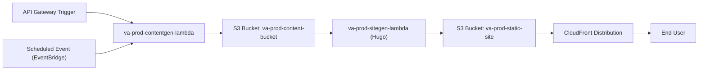

# Serverless Content Pipeline with Static Site Generator

## Purpose

This document describes the design, workflow, and AWS implementation of the fully automated, serverless pipeline for AI-generated content publishing. It covers agent orchestration, static site generation, deployment via S3/CloudFront, and future extensibility.

---

## 1. Architecture Overview
### Serverless Content Pipeline Diagram




- **Input:** Content generation agent (Lambda) produces markdown/HTML content on schedule or event
- **Pipeline:** Event-driven, all components AWS-native and managed via Terraform
- **Output:** Static website updated and deployed globally via S3 and CloudFront

**Key AWS Components:**
- Lambda (content generation)
- S3 (content bucket, website bucket)
- EventBridge (or S3 triggers for workflow)
- Static site generator (Hugo, packed as Lambda layer)
- CloudFront (CDN for web publishing)
- Route53 (public DNS)
- (Optionally) API Gateway for on-demand content triggers

---

## 2. Workflow Steps
## Terraform Configuration for S3 Event Trigger

```hcl
resource "aws_s3_bucket_notification" "content_trigger" {
  bucket = aws_s3_bucket.content_bucket.id

  lambda_function {
    lambda_function_arn = aws_lambda_function.site_generator_lambda.arn
    events              = ["s3:ObjectCreated:*"]
    filter_prefix       = "content/"
  }

  depends_on = [aws_lambda_permission.allow_bucket]
}

resource "aws_lambda_permission" "allow_bucket" {
  statement_id  = "AllowS3Invoke"
  action        = "lambda:InvokeFunction"
  function_name = aws_lambda_function.site_generator_lambda.function_name
  principal     = "s3.amazonaws.com"
  source_arn    = aws_s3_bucket.content_bucket.arn
}
```


1. **Content Generation**
    - Agentic Lambda (`va-prod-contentgen-lambda`) generates article, writes markdown file to S3 `content/` prefix in `va-prod-content-bucket`
    - S3 Put event triggers workflow

2. **Static Site Generation**
    - S3 trigger (or EventBridge) invokes static site generator Lambda (`va-prod-webmaster-lambda`)
    - Lambda loads new/updated markdown content from S3
    - Static site generator (Hugo) runs in Lambda, outputs HTML/site assets to `/tmp/`
    - Lambda uploads HTML to separate S3 bucket (`va-prod-website-bucket`) under `public/` prefix

3. **Cache Invalidation and CDN**
    - Lambda calls CloudFront API to invalidate relevant paths (or uses versioned asset URLs)
    - Site is instantly updated globally

4. **Notifications/Events**
    - Event emitted to `va-prod-content-events` SNS topic: "Content published"
    - Optional: Email/SMS notification to stakeholders or Slack

---

## 3. Static Site Generator Configuration

- **Tool:** Hugo (Go-based, fast and Lambda-compatible)
- **Packaging:** Hugo binary included as Lambda layer (built for Linux x86_64/arm64)
- **Site theme/config:** Versioned in repo, loaded at build-time; supports templates, taxonomies, tags
- **Multilingual/SEO:** Hugo supports i18n, sitemaps, and SEO features

---

## 4. AWS S3 Bucket Structure

| Bucket Name                 | Purpose              | Example Paths              |
|-----------------------------|----------------------|----------------------------|
| va-prod-content-bucket      | Content input        | `content/YYYY/MM/file.md`  |
| va-prod-website-bucket      | Site output          | `public/index.html`, `public/assets/` |

- All S3 access tightly controlled via IAM per [[Naming Conventions](../Naming_Conventions.md)](../[Naming Conventions](../Naming_Conventions.md))

---

## 5. CloudFront CDN and Route53 DNS

- **CloudFront Distribution:** Origin is `va-prod-website-bucket` (static website hosting enabled)
- **Invalidation:** Lambda triggers invalidation for new/changed paths after publish
- **DNS:** Route53 A/CNAME for e.g., `www.virtualagentics.ai` points to CloudFront distribution
- **SSL:** ACM wildcard certificate for `*.virtualagentics.ai` covers the website

---

## 6. CI/CD, Deployment, and Testing

- **IaC:** All resources provisioned via Terraform, code and config tracked in GitHub
- **Lambda deployment:** GitHub Actions build, test, and publish code/artifacts (including Hugo binary)
- **Test runs:** End-to-end test event simulates content write, verifies full pipeline, and checks S3/website output

---

## 7. Security and Compliance

- **IAM:** Least-privilege for all Lambdas and S3; content and website buckets use restricted policies
- **Logs:** All Lambda invocations and S3 events logged to CloudWatch; CloudFront access logs enabled
- **DR:** S3 versioning for content and site buckets; static site can be restored from previous versions
- **Audit:** All content publishes, code changes, and config tracked/audited in Git

---

## 8. Extensibility/Future

- **API Gateway:** For agent-triggered or external requests to publish content (future phases)
- **Multiple static sites:** Additional buckets/distributions for verticals or new agent-driven brands
- **Integrate with CMS:** Down the line, agent can push to headless CMS (Strapi, etc.) as an alternate to S3
- **A/B testing:** Hugo supports split-site config for experiments

---

## 9. References

- [[Lambda Function Implementation Details](Lambda_Function_Implementation_Details.md)]([Lambda Function Implementation Details](Lambda_Function_Implementation_Details.md))
- [Terraform_Bootstrapping_Phase1.md](Terraform_Bootstrapping_Phase1.md)
- [[Naming Conventions](../Naming_Conventions.md)](../[Naming Conventions](../Naming_Conventions.md))
- Source: "Serverless Content Pipeline with Static Site Generator.pdf"

---

*End of document*
