# Terraform Bootstrapping Guide (Phase 1): Virtual Agentics

## Purpose

This document describes the step-by-step process for bootstrapping the initial AWS infrastructure for Virtual Agentics using Terraform. It covers the remote state backend, repository setup, and all naming/addressing conventions, as well as secure automation via CI/CD.

---

## 1. Prerequisites

- **AWS root account** with billing access, organization created with Control Tower (see [[AWS Control Tower Setup](AWS_Control_Tower_Setup.md)]([AWS Control Tower Setup](AWS_Control_Tower_Setup.md)))
- **Terraform 1.5+** and AWS CLI installed locally or in CI/CD runners
- **GitHub account** (`VirtualAgentics`) and infra repo (`virtualagentics-iac`)
- **Naming and address plan**: All names, tags, and CIDRs per [[Naming Conventions](../Naming_Conventions.md)](../[Naming Conventions](../Naming_Conventions.md)) and [[AWS Addressing Plan](../AWS_Addressing_Plan.md)](../[AWS Addressing Plan](../AWS_Addressing_Plan.md))
- **Project structure**: All code and state tracked in Git, no manual console changes except break-glass

---

## 2. High-Level Bootstrapping Steps

## Phase 1 VPC Deployment Scope


## Inter-VPC Connectivity Clarification

In Phase 1, all VPCs are **isolated with no VPC peering or Transit Gateway (TGW) connections** configured. Each VPC operates independently to ensure strict network isolation and security boundaries during the initial deployment.

Future phases may introduce inter-VPC connectivity, either through direct VPC peering or via a Transit Gateway, to enable required communication between VPCs (such as access to shared services, centralized DNS, or cross-environment communication). Such implementations will be clearly documented and detailed in subsequent phases.

**Phase 1 will deploy** the following VPCs:

- `va-prod-core-vpc` (Production)
- `va-dev-core-vpc` (Development)

Other VPCs defined in the design, such as `va-prod-ai-vpc`, `va-sharedservices-vpc`, and `va-sandbox-vpc`, are **not created in Phase 1**. They are reserved explicitly for deployment in future phases, as described in the project roadmap.


## Network ACL Configuration Clarification


## Bastion Host Clarification

In Phase 1, **no bastion host** (e.g., an EC2 instance in a public subnet for SSH access) is deployed. The `va-prod-bastion-sg` security group referenced in Terraform is only a placeholder, reserved explicitly for future phases when remote access might require a bastion host.

If a bastion host becomes necessary in subsequent phases, detailed documentation will include:

- **AMI selection**: Defined according to latest AWS standard images or custom security-hardened images.
- **Instance type**: Chosen based on required performance and cost-efficiency (e.g., `t3.micro` or `t3.small` initially).
- **Access controls**: Managed through AWS SSM Session Manager or SSH keys with stringent access control.
- **Security measures**: Security groups will strictly limit inbound access, and OS will undergo thorough hardening processes.

## Application Load Balancer (ALB) Clarification

**No Application Load Balancer (ALB) is deployed in Phase 1.** References to the ALB security group (`va-prod-alb-sg`) in the Terraform configuration are placeholders, explicitly reserved for potential use in subsequent phases (e.g., Phase 2).

Future phases may involve deployment of an ALB for scalable and highly available application deployments, at which point detailed documentation will outline its exact configuration, security rules, and operational considerations.


**No Application Load Balancer (ALB) is deployed in Phase 1.** References to the ALB security group (`va-prod-alb-sg`) in the Terraform configuration are placeholders, explicitly reserved for potential use in subsequent phases (e.g., Phase 2).

Future phases may involve deployment of an ALB for scalable and highly available application deployments, at which point detailed documentation will outline its exact configuration, security rules, and operational considerations.

In Phase 1, **no bastion host** (e.g., an EC2 instance in a public subnet for SSH access) is deployed. The `va-prod-bastion-sg` security group referenced in Terraform is only a placeholder, reserved explicitly for future phases when remote access might require a bastion host.

If a bastion host becomes necessary in subsequent phases, detailed documentation will include:

- **AMI selection**: Defined according to latest AWS standard images or custom security-hardened images.
- **Instance type**: Chosen based on required performance and cost-efficiency (e.g., `t3.micro` or `t3.small` initially).
- **Access controls**: Managed through AWS SSM Session Manager or SSH keys with stringent access control.
- **Security measures**: Security groups will strictly limit inbound access, and OS will undergo thorough hardening processes.

In Phase 1, the default approach is to use AWS-provided Network ACLs (allow-all rules by default) for general subnets unless explicitly documented otherwise. However, isolated subnets have custom Network ACL rules implemented to strictly control inbound and outbound traffic:

- **Inbound rules**: Deny all except for essential services explicitly documented (e.g., SSH, HTTPS, application-specific ports).
- **Outbound rules**: Similarly, deny all except for explicitly required outbound traffic such as DNS queries, HTTPS requests to external endpoints, or internal services.

This ensures secure isolation for sensitive workloads and complies with best practices for security and compliance.


### Clarification: Control Tower Account Provisioning

- **Account and OU creation:** Managed manually through AWS Control Tower initial setup for core accounts (Management, Audit, Log Archive). Terraform currently **does not** automate these initial accounts due to Control Tower limitations.
- **Guardrails:** Can be explicitly managed via Terraform using AWS Control Tower Terraform provider (`awscc_controltower_control`), but initial baseline guardrails are currently set manually during the Control Tower setup.


1. **Prepare AWS Organization/Accounts** via Control Tower (Management, Audit, Log Archive, Prod, Dev, Shared, Sandbox)
2. **Create remote Terraform backend** (S3 bucket, DynamoDB lock table)
3. **Configure and initialize Terraform project/repository**
4. **Set up IAM roles for CI/CD and deployment**
5. **Define and apply initial network, IAM, and foundation modules**
6. **Enable automated CI/CD pipeline for Terraform**

---

## 3. Remote Backend Setup

### a) S3 Bucket (for Terraform state)

- Name: `va-prod-terraform-state`
- Region: `eu-central-1`
- Settings: Versioning **ON**, encryption **ON**

```bash
aws s3api create-bucket --bucket va-prod-terraform-state --region eu-central-1 --create-bucket-configuration LocationConstraint=eu-central-1
aws s3api put-bucket-versioning --bucket va-prod-terraform-state --versioning-configuration Status=Enabled
aws s3api put-bucket-encryption --bucket va-prod-terraform-state --server-side-encryption-configuration '{"Rules":[{"ApplyServerSideEncryptionByDefault":{"SSEAlgorithm":"AES256"}}]}'
```

### b) DynamoDB Table (for lock/state)

- Name: `va-prod-terraform-lock`
- Primary key: `LockID` (string)
- Billing: On-demand

```bash
aws dynamodb create-table --table-name va-prod-terraform-lock   --attribute-definitions AttributeName=LockID,AttributeType=S   --key-schema AttributeName=LockID,KeyType=HASH   --billing-mode PAY_PER_REQUEST
```

### c) Terraform Backend Block

In your root `main.tf` or `backend.tf`:

```hcl
terraform {
  backend "s3" {
    bucket         = "va-prod-terraform-state"
    key            = "prod/terraform.tfstate"
    region         = "eu-central-1"
    dynamodb_table = "va-prod-terraform-lock"
    encrypt        = true
  }
}
```

---

## 4. Project Repository and Structure

### Comprehensive Network Topology Diagram

```mermaid
graph TB;
    subgraph "va-prod-core-vpc (10.0.0.0/16)"
        PUB_A["Public Subnet AZ-A (10.0.1.0/24)"]
        PUB_B["Public Subnet AZ-B (10.0.2.0/24)"]
        PRIV_A["Private Subnet AZ-A (10.0.10.0/24)"]
        PRIV_B["Private Subnet AZ-B (10.0.11.0/24)"]
        ISO_A["Isolated Subnet AZ-A (10.0.20.0/24)"]
        ISO_B["Isolated Subnet AZ-B (10.0.21.0/24)"]
    end
    subgraph "va-dev-core-vpc (10.2.0.0/16)"
        DEV_PUB_A["Public Subnet AZ-A (10.2.1.0/24)"]
        DEV_PRIV_A["Private Subnet AZ-A (10.2.10.0/24)"]
    end
    subgraph "va-shared-infra-vpc (10.4.0.0/16)"
        SHARED_PUB_A["Public Subnet AZ-A (10.4.1.0/24)"]
        SHARED_PRIV_A["Private Subnet AZ-A (10.4.10.0/24)"]
    end
    INTERNET["Internet Gateway"]
    INTERNET --> PUB_A
    INTERNET --> PUB_B
    INTERNET --> DEV_PUB_A
    INTERNET --> SHARED_PUB_A
    PUB_A --> NAT_GW_A["NAT Gateway AZ-A"]
    PUB_B --> NAT_GW_B["NAT Gateway AZ-B"]
    DEV_PUB_A --> DEV_NAT["Dev NAT Gateway"]
    SHARED_PUB_A --> SHARED_NAT["Shared NAT Gateway"]
    PRIV_A --> NAT_GW_A
    PRIV_B --> NAT_GW_B
    DEV_PRIV_A --> DEV_NAT
    SHARED_PRIV_A --> SHARED_NAT
```



### Terraform Modules Overview

Explicitly managed Terraform modules in the `virtualagentics-iac` repository:

- **VA-VPC Module** (`modules/va-vpc`): Defines foundational VPC and subnet layout.
- **VA-IAM Module** (`modules/va-iam`): Centralized IAM roles and policies.
- **VA-Lambda Module** (`modules/va-lambda`): Standardized Lambda function deployment.
- **VA-Route53 Module** (`modules/va-route53`): DNS configurations for primary and subdomains.
- **VA-WorkMail Module** (`modules/va-workmail`): Email configuration and alias management.
- **VA-Security Module** (`modules/va-security`): Baseline security groups and rules.
- **VA-S3 Module** (`modules/va-s3`): Standard bucket setups for Terraform state and application data.


- Repo: `virtualagentics-iac` on GitHub
- Branching: `main` (protected), `dev` (optional), PR reviews required
- Directory layout:
  - `/modules/` (for reusable VPC, IAM, Lambda modules, etc.)
  - `/environments/prod/` (prod root, backend config, main.tf)
  - `/environments/dev/` (for later expansion)

- README and comments must reference [[Naming Conventions](../Naming_Conventions.md)](../[Naming Conventions](../Naming_Conventions.md)), [[AWS Addressing Plan](../AWS_Addressing_Plan.md)](../[AWS Addressing Plan](../AWS_Addressing_Plan.md))

---

## 5. Initial IAM Roles and OIDC Integration

### Example Terraform Resource Definition: IAM Role for Terraform CI/CD

```hcl
resource "aws_iam_role" "terraform_ci_cd_role" {
  name = "va-prod-core-terraform-iam-role"

  assume_role_policy = jsonencode({
    Version = "2012-10-17",
    Statement = [{
      Effect = "Allow",
      Principal = {
        Federated = "arn:aws:iam::<ACCOUNT_ID>:oidc-provider/token.actions.githubusercontent.com"
      },
      Action = "sts:AssumeRoleWithWebIdentity",
      Condition = {
        StringEquals = {
          "token.actions.githubusercontent.com:sub": "repo:VirtualAgentics/virtualagentics-iac:*"
        }
      }
    }]
  })

  inline_policy {
    name = "TerraformCIPermissions"
    policy = jsonencode({
      Version = "2012-10-17",
      Statement = [{
        Effect = "Allow",
        Action = "*",
        Resource = "*"
      }]
    })
  }

  tags = {
    Name        = "va-prod-core-terraform-iam-role"
    Environment = "prod"
    Project     = "VirtualAgentics"
  }
}
```


- **Terraform CI/CD Role:** `va-prod-core-terraform-iam-role`
  - Trusted via GitHub OIDC provider (`token.actions.githubusercontent.com`)
  - Permissions: Admin for bootstrap, then reduced to least-privilege for ongoing changes

**Trust Policy Example:**
```json
{
  "Version": "2012-10-17",
  "Statement": [
    {
      "Effect": "Allow",
      "Principal": {
        "Federated": "arn:aws:iam::<ACCOUNT_ID>:oidc-provider/token.actions.githubusercontent.com"
      },
      "Action": "sts:AssumeRoleWithWebIdentity",
      "Condition": {
        "StringEquals": {
          "token.actions.githubusercontent.com:sub": "repo:VirtualAgentics/virtualagentics-iac:*"
        }
      }
    }
  ]
}
```

---

## 6. Example Minimal `main.tf` for Phase 1

```hcl
provider "aws" {
  region = "eu-central-1"
}

module "vpc" {
  source     = "./modules/vpc"
  vpc_name   = "va-prod-core-vpc"
  cidr_block = "10.0.0.0/16"
  # ...other variables per address plan
}

# IAM, DynamoDB, S3, Lambda, etc. modules instantiated here
```

---

## 7. Bootstrapping and Apply

**First-time apply:**
```bash
cd environments/prod
terraform init
terraform plan
terraform apply
```

- After first apply, all state is in S3, locking is managed by DynamoDB.
- **Never modify state manually!** All changes must be made via Terraform and PR.

---

## 8. Enforcing Naming, Tagging, and Policy

- Every resource in Terraform **must** use variables or templates for `Name`, `Environment`, `Owner`, `Purpose`, `Project`
- Example tag block for all resources:
```hcl
tags = {
  Name        = var.name
  Environment = var.env
  Owner       = var.owner
  Purpose     = var.purpose
  Project     = "VirtualAgentics"
}
```

---

## 9. CI/CD Integration

- **GitHub Actions** workflow (`.github/workflows/terraform.yml`) configured to:
  - Use OIDC to assume `va-prod-core-terraform-iam-role`
  - Run `terraform fmt`, `terraform plan`, and `terraform apply` on PR/merge to `main`
  - Output plan as PR comment for review/approval
- No static AWS credentials in repo or runners

---

## 10. References and Linked Documents

- [[AWS Control Tower Setup](AWS_Control_Tower_Setup.md)]([AWS Control Tower Setup](AWS_Control_Tower_Setup.md))
- [[Naming Conventions](../Naming_Conventions.md)](../[Naming Conventions](../Naming_Conventions.md))
- [[AWS Addressing Plan](../AWS_Addressing_Plan.md)](../[AWS Addressing Plan](../AWS_Addressing_Plan.md))
- [[GitHub Repository Structure](../GitHub_Repository_Structure.md)](../[GitHub Repository Structure](../GitHub_Repository_Structure.md))
- Source: "Virtual Agentics Phase 1 Terraform Bootstrapping.pdf"

---

*End of document*

## Appendix: Networking Security Details (Phase 1)

### Security Groups

| Security Group Name | Purpose                        | Inbound Rules                     | Outbound Rules                     |
|---------------------|--------------------------------|-----------------------------------|------------------------------------|
| va-prod-lambda-sg   | Lambda Functions               | None                              | HTTPS (443) to 0.0.0.0/0 only      |
| va-prod-bastion-sg  | Bastion Host                   | SSH (22) from authorized ranges   | HTTPS (443), SSH (22)              |
| va-prod-alb-sg      | Application Load Balancer      | HTTP (80), HTTPS (443)            | All outbound                       |

### Network ACL (NACL) Configurations

- **Public Subnets:**
  - Default NACL allowing all inbound/outbound traffic.

- **Private Subnets:**
  - Allow inbound from Public Subnets/NAT Gateways.
  - Allow outbound HTTPS (443) to any IP.

- **Isolated Subnets:**
  - Deny all inbound except explicitly allowed internal traffic.
  - Deny outbound to all except essential internal services (DNS, management).

### VPC Endpoints (Recommended)

- **Secrets Manager Endpoint:** For secure secret retrieval without internet access.
- **DynamoDB Endpoint:** Ensures secure, internal access to DynamoDB.
- **S3 Endpoint:** Secure internal S3 interactions without public internet routing.

## VPC Endpoints Configuration (Phase 1 Enhancement)

To enhance security and optimize costs, explicitly create VPC endpoints for the following AWS services:

### Required VPC Endpoints:

- **Secrets Manager**
- **DynamoDB**
- **S3**

### Terraform Configuration Example:

```hcl
resource "aws_vpc_endpoint" "secrets_manager" {
  vpc_id            = aws_vpc.main.id
  service_name      = "com.amazonaws.eu-west-1.secretsmanager"
  vpc_endpoint_type = "Interface"

  subnet_ids        = aws_subnet.private.*.id
  security_group_ids = [aws_security_group.vpc_endpoint_sg.id]

  private_dns_enabled = true
}

resource "aws_vpc_endpoint" "dynamodb" {
  vpc_id       = aws_vpc.main.id
  service_name = "com.amazonaws.eu-west-1.dynamodb"
  vpc_endpoint_type = "Gateway"

  route_table_ids = aws_route_table.private.*.id
}

resource "aws_vpc_endpoint" "s3" {
  vpc_id       = aws_vpc.main.id
  service_name = "com.amazonaws.eu-west-1.s3"
  vpc_endpoint_type = "Gateway"

  route_table_ids = aws_route_table.private.*.id
}
```

### Route Table Updates:

Ensure that the private subnet route tables have explicit routes to these gateway endpoints. For DynamoDB and S3 Gateway Endpoints, this is done implicitly by associating the endpoints with the route tables.

### Security and Cost Optimization Benefits:

- **Security:** Limits access to AWS services through private network traffic, reducing exposure to public internet.
- **Cost Efficiency:** Eliminates the need for a NAT Gateway for Lambda functions in private subnets, significantly reducing AWS usage charges.

Ensure to replace `eu-west-1` with the actual AWS region for your deployment.
