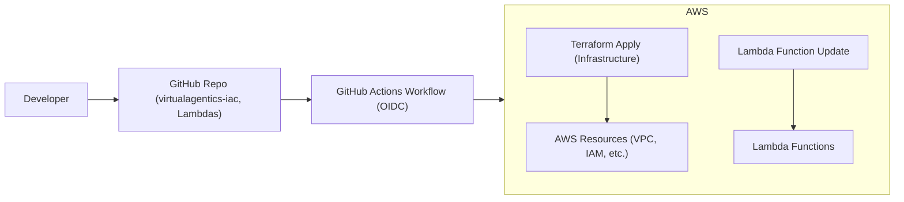

# GitHub Repository Structure: Virtual Agentics

## Purpose

This document defines the structure, branching strategy, and review practices for all code and documentation repositories in the Virtual Agentics project. It ensures clear separation of concerns, traceable change control, and consistent project organization.

---

## 1. Repository Overview

All code, configuration, and documentation are versioned in GitHub under the `VirtualAgentics` organization. Repositories are separated by functional domain:

| Repository Name               | Purpose                                            | Example Contents                     |
|-------------------------------|---------------------------------------------------|--------------------------------------|
| virtualagentics-iac           | Infrastructure-as-Code (Terraform, modules)       | VPC, IAM, S3, Lambda, DNS IaC        |
| virtualagentics-lambdas       | Lambda & agent source code                        | Lambda Python code, requirements.txt |
| virtualagentics-documents     | All documentation (md files, diagrams, guides)    | All docs, policies, specs            |
| virtualagentics-<feature>     | (Future/optional) Dedicated feature repos         | e.g. trading agent, SaaS, R&D        |

---

## 2. Repository Conventions

- **All repositories:**
  - Must include a `README.md` describing purpose, branch structure, and contribution rules
  - Should include a `LICENSE` file as appropriate
  - Must reference project [Naming_Conventions.md](../Naming_Conventions.md) and relevant standards

---

## 3. Directory and File Structure

### a) virtualagentics-iac

```
/
  modules/
    vpc/
    iam/
    lambda/
    ...
  environments/
    prod/
      main.tf
      variables.tf
      ...
    dev/
      ...
  .github/
    workflows/
      terraform.yml
  README.md
  ...
```

### b) virtualagentics-lambdas

```
/
  content_generator_lambda/
    app.py
    requirements.txt
    tests/
  affiliate_link_lambda/
  email_template_lambda/
  workflow_orchestrator_lambda/
  .github/
    workflows/
      lambda-deploy.yml
  README.md
  ...
```

### c) virtualagentics-documents

```
/
  Vision.md
  Technical_Specification_v1.md
  High-Level_Framework.md
  Naming_Conventions.md
  ...
  Phase1/
    Phase1_Overview.md
    ...
  Phase2/
    Phase2_Overview.md
    ...
  images/
    (architecture diagrams, referenced in docs)
```

---

## 4. Branching Strategy

- **Default branch:** `main` (protected; only reviewed PRs can merge)
- **Development/integration branch:** `dev` (optional, for features/testing)
- **Feature branches:** `feature/<description>`
- **Bugfix branches:** `bugfix/<description>`
- **Hotfixes:** `hotfix/<description>`
- **Pull requests:** Required for all changes to `main`; reviewed by another team member

---

## 5. Code Review and Contribution

- **All changes to `main` require PR and code review**
- **Required reviewers:** At least one for infra/app, at least two for docs or security/policy
- **CI/CD checks:** Must pass on PR before merge (Terraform plan/apply, Lambda tests, linting, etc.)
- **Commit messages:** Must reference issue/ticket or document rationale for traceability

---

## 6. Automation and Integrations
### CI/CD Pipeline Workflow Diagram




- **GitHub Actions workflows** for CI/CD (see [Terraform_Bootstrapping_Phase1.md](Terraform_Bootstrapping_Phase1.md))
- **Branch protections:** No force-pushes; required status checks; PR review enforced
- **Issue templates:** Provided for bug, feature, and doc updates

---

## 7. Security and Auditability

- **No secrets or credentials in any repository**
- **All sensitive info loaded via environment variables or AWS Secrets Manager**
- **Audit log:** All merges, review comments, and change history retained for 3+ years

---

## 8. References

- [Naming_Conventions.md](../Naming_Conventions.md)
- [Technical_Specification_v1.md](../Technical_Specification_v1.md)
- [Terraform_Bootstrapping_Phase1.md](Terraform_Bootstrapping_Phase1.md)
- Source: "GitHub Repository Structure.pdf"

---

*End of document*
